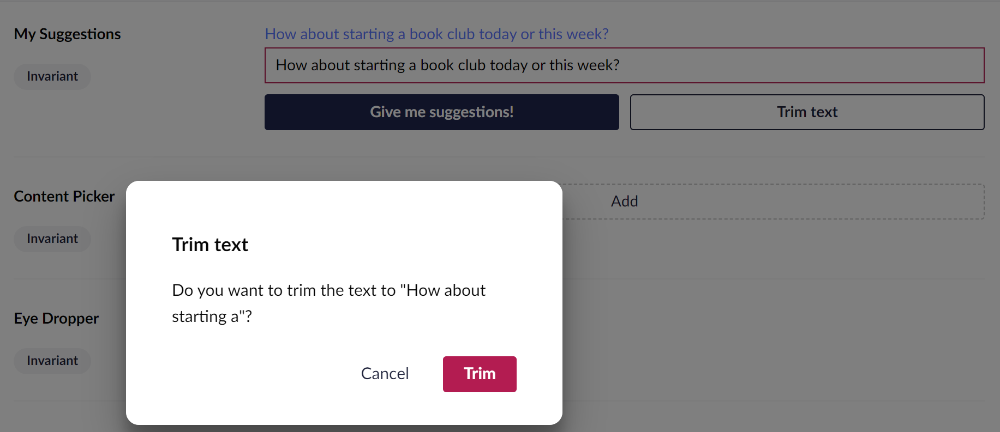

# Integrating services with a property editor


This page is a work in progress. It will be updated as the software evolves.


### Overview

This is step 3 in the Property Editor tutorial. In this part, we will integrate one of the built-in Umbraco Contexts. For this sample, we will use the `UmbNotificationContext` for some pop-ups and the `UmbModalManagerContext`. This is to show a dialog when clicking the Trim button and the textbox's input length is longer than the maxChars configuration.

The steps we will go through in part 4 are:

* [Setting up and using the contexts](integrating-services-with-a-property-editor.md#setting-up-and-using-the-contexts)

### Setting up and using the contexts

1. Update the class to extend from `UmbElementMixin`. This allows us to consume the contexts that we need. After, we can create the constructor where we can consume the contexts.

```typescript
import { UmbElementMixin } from "@umbraco-cms/backoffice/element-api";
```

```typescript
export class MySuggestionsPropertyEditorUIElement
  extends UmbElementMixin(LitElement)
  implements UmbPropertyEditorExtensionElement
```

Let's start with the notification context.

2. Import the things we need and consume the contexts in the constructor:

```typescript
import {
    UMB_NOTIFICATION_CONTEXT,
    UmbNotificationDefaultData,
} from "@umbraco-cms/backoffice/notification";
```

```typescript
  #notificationContext?: typeof UMB_NOTIFICATION_CONTEXT.TYPE;

  constructor() {
    super();
    this.consumeContext(UMB_NOTIFICATION_CONTEXT, (instance) => {
      this.#notificationContext = instance;
    });
  }
```

Now we can use the notification context when the trim text button is being clicked.

We want to check if the length of our input is smaller or equal to our `maxChars` configuration. If it is, we have nothing to trim and will send a notification saying there is nothing to trim if the user clicks the button. Here we can use the NotificationContext's peek method. It has two parameters `UmbNotificationColor` and an`UmbNotificationDefaultData` object.

3. Add a `click` event to the trim text button

```typescript
        <uui-button
          id="suggestion-trimmer"
          class="element"
          look="outline"
          label="Trim text"
          @click=${this.#onTextTrim}
        >
          Trim text
        </uui-button>
```

```typescript
#onTextTrim() {
  if (!this._maxChars) return;
  if (!this.value || (this.value as string).length <= this._maxChars) {
    const data: UmbNotificationDefaultData = {
      message: `Nothing to trim!`,
    };
    this.#notificationContext?.peek('danger', { data });
    return;
  }
}
```

Now if our input length is less or equal to our `maxChars` configuration, we will get a notification when pressing the Trim button.

<figure><figcaption><p>Trim Button Notification</p></figcaption></figure>

Let's continue to add more logic. If the length is more than the `maxChars` configuration, we want to show a dialog for the user to confirm the trim. Here we use the `ModalManagerContext` which has an open method to show a dialog.&#x20;

Like the notification context, we need to import it and consume it in the constructor.

4. Import the `UMB_MODAL_MANAGER_CONTEXT, UMB_CONFIRM_MODAL` from `@umbraco-cms/backoffice/modal`

```typescript
import {
    UMB_MODAL_MANAGER_CONTEXT,
    UMB_CONFIRM_MODAL,
} from "@umbraco-cms/backoffice/modal";
```

5. Consume the `UMB_MODAL_MANAGER_CONTEXT, UMB_CONFIRM_MODAL`

```typescript
 #modalManagerContext?: typeof UMB_MODAL_MANAGER_CONTEXT.TYPE;
 #notificationContext?: typeof UMB_NOTIFICATION_CONTEXT.TYPE;

 constructor() {
    super();
    this.consumeContext(UMB_MODAL_MANAGER_CONTEXT, (instance) => {
      this.#modalManagerContext = instance;
    });

    this.consumeContext(UMB_NOTIFICATION_CONTEXT, (instance) => {
      this.#notificationContext = instance;
    });
  }
```

6. Add more logic to the `onTextTrim` method:

```typescript
#onTextTrim() {
  ...

  const trimmed = (this.value as string).substring(0, this._maxChars);
  const modalHandler = this.#modalManagerContext?.open(UMB_CONFIRM_MODAL, {
    headline: `Trim text`,
    content: `Do you want to trim the text to "${trimmed}"?`,
    color: 'danger',
    confirmLabel: 'Trim',
  });
  modalHandler?.onSubmit().then(() => {
    this.value = trimmed;
    this.#dispatchEvent();
    const data: UmbNotificationDefaultData = {
      headline: `Text trimmed`,
      message: `You trimmed the text!`,
    };
    this.#notificationContext?.peek('positive', { data });
  }, null);
}
```

Now that we have added the logic to the `onTextTrim` method, when we try to trim the text it should look like this:

<figure><figcaption><p>Trim button Text</p></figcaption></figure>

We have now created a working Property editor. Below you can see the full example of how the code for the Property Editor looks like.&#x20;

<details>

<summary>See the entire file: <code>suggestions-property-editor-ui.element.ts</code></summary>

```typescript
import { LitElement, css, html, customElement, property, state, ifDefined } from "@umbraco-cms/backoffice/external/lit";
import { type UmbPropertyEditorExtensionElement } from "@umbraco-cms/backoffice/extension-registry";
import { type UmbPropertyEditorConfigCollection } from "@umbraco-cms/backoffice/property-editor";
import { UMB_MODAL_MANAGER_CONTEXT, UMB_CONFIRM_MODAL} from "@umbraco-cms/backoffice/modal";
import { UMB_NOTIFICATION_CONTEXT, UmbNotificationDefaultData} from "@umbraco-cms/backoffice/notification";
import { UmbElementMixin } from "@umbraco-cms/backoffice/element-api";

@customElement('my-suggestions-property-editor-ui')
export class MySuggestionsPropertyEditorUIElement
    extends UmbElementMixin(LitElement)
    implements UmbPropertyEditorExtensionElement
{
    @property({ type: String })
    public value = "";

    @state()
    private _disabled?: boolean;

    @state()
    private _placeholder?: string;

    @state()
    private _maxChars?: number;

    @state()
    private _suggestions = [
        "You should take a break",
        "I suggest that you visit the Eiffel Tower",
        "How about starting a book club today or this week?",
        "Are you hungry?",
    ];

    #modalManagerContext?: typeof UMB_MODAL_MANAGER_CONTEXT.TYPE;
    #notificationContext?: typeof UMB_NOTIFICATION_CONTEXT.TYPE;

    constructor() {
        super();
        this.consumeContext(UMB_MODAL_MANAGER_CONTEXT, (instance) => {
            this.#modalManagerContext = instance;
        });

        this.consumeContext(UMB_NOTIFICATION_CONTEXT, (instance) => {
            this.#notificationContext = instance;
        });
    }

    @property({ attribute: false })
    public set config(config: UmbPropertyEditorConfigCollection) {
        this._disabled = config.getValueByAlias("disabled");
        this._placeholder = config.getValueByAlias("placeholder");
        this._maxChars = config.getValueByAlias("maxChars");
    }

    #onInput(e: InputEvent) {
        this.value = (e.target as HTMLInputElement).value;
        this.#dispatchChangeEvent();
    }

    #onSuggestion() {
        const randomIndex = (this._suggestions.length * Math.random()) | 0;
        this.value = this._suggestions[randomIndex];
        this.#dispatchChangeEvent();
    }

    #onTextTrim() {
        if (!this._maxChars) return;
        if (!this.value || (this.value as string).length <= this._maxChars) {
            const data: UmbNotificationDefaultData = {
                message: `Nothing to trim!`,
            };
            this._notificationContext?.peek("danger", { data });
            return;
        }

        const trimmed = (this.value as string).substring(0, this._maxChars);
        const modalHandler = this._modalManagerContext?.open(
            UMB_CONFIRM_MODAL,
            {
                headline: `Trim text`,
                content: `Do you want to trim the text to "${trimmed}"?`,
                color: "danger",
                confirmLabel: "Trim",
            }
        );
        modalHandler?.onSubmit().then(() => {
            this.value = trimmed;
            this.#dispatchChangeEvent();
            const data: UmbNotificationDefaultData = {
                headline: `Text trimmed`,
                message: `You trimmed the text!`,
            };
            this._notificationContext?.peek("positive", { data });
        }, null);
    }

    #dispatchChangeEvent() {
        this.dispatchEvent(new CustomEvent("property-value-change"));
    }

    render() {
        return html`
            <uui-input
                id="suggestion-input"
                class="element"
                label="text input"
                placeholder=${ifDefined(this._placeholder)}
                maxlength=${ifDefined(this._maxChars)}
                .value=${this.value || ""}
                @input=${this.#onInput}
            >
            </uui-input>
            <div id="wrapper">
                <uui-button
                    id="suggestion-button"
                    class="element"
                    look="primary"
                    label="give me suggestions"
                    ?disabled=${this._disabled}
                    @click=${this.#onSuggestion}
                >
                    Give me suggestions!
                </uui-button>
                <uui-button
                    id="suggestion-trimmer"
                    class="element"
                    look="outline"
                    label="Trim text"
                    @click=${this.#onTextTrim}
                >
                    Trim text
                </uui-button>
            </div>
        `;
    }

    static styles = [
        css`
            #wrapper {
                margin-top: 10px;
                display: flex;
                gap: 10px;
            }
            .element {
                width: 100%;
            }
        `,
    ];
}

declare global {
    interface HTMLElementTagNameMap {
        'my-suggestions-property-editor-ui': MySuggestionsPropertyEditorUIElement;
    }
}
```

</details>

### Wrap up

Over the 4 previous steps, we have:

* Created a plugin.
* Defined an editor.
* Registered the Data Type in Umbraco.
* Added configuration to the Property Editor.
* Connected the editor with `UmbNotificationContext` and `UmbModalManagerContext`.
* Looked at some of the methods from notification & modal manager contexts in action.
* Integrated one of the built-in Umbraco Contexts with the Property Editor.
