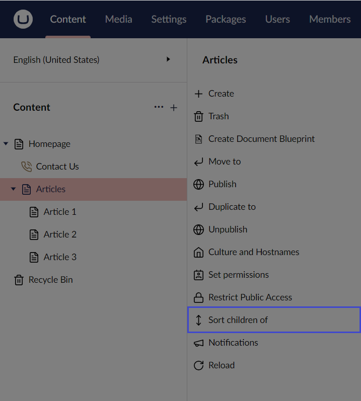
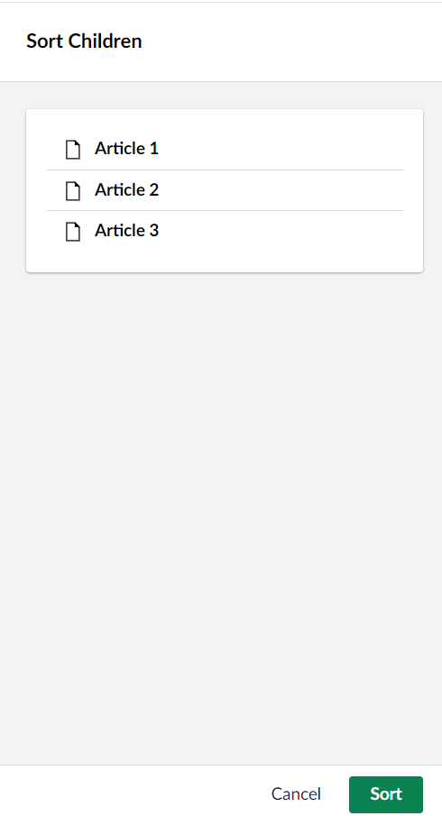
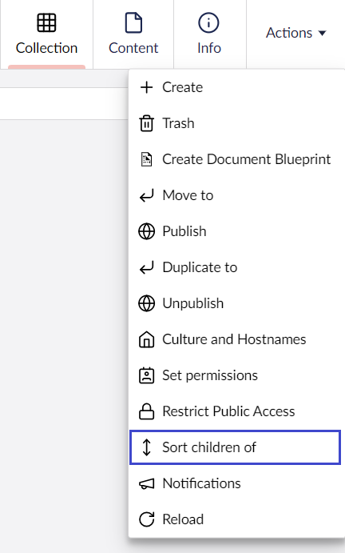

# Sorting Pages

The pages in Umbraco are placed in the tree structure according to a predefined sort order. The most recently created page is placed at the bottom of the tree structure. You can change the order of the pages by using the **Sort** function.

You can sort pages in two ways:

## Option 1

1. Go to **Content**.
2. Navigate to the parent node whose child nodes you wish to sort.
3. Click **...** next to the page you wish to sort.
4. Select **Sort children of**.

    
5. A window appears on the right-side of the screen. Here, you can arrange the child nodes in the order you want by dragging them up or down.

    
6. Click **Save** and then **Close**.

## Option 2

1. Go to **Content**.
2. Select the parent node whose child nodes you wish to sort.
3. Click **Actions** in the top-right corner of the screen.
4. Select **Sort children of** from the **Actions** drop-down menu.

    
5. A window appears on the right-side of the screen. Here, you can arrange the child nodes in the order you want by dragging them up or down.
6. Click **Save** and then **Close**.
