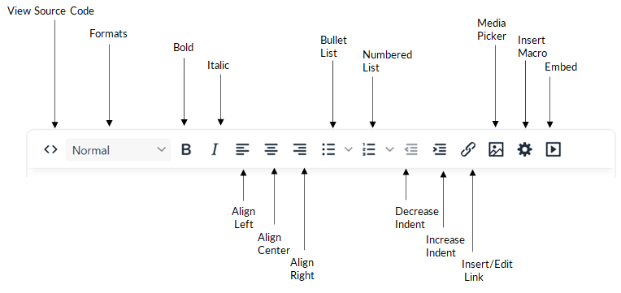
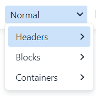
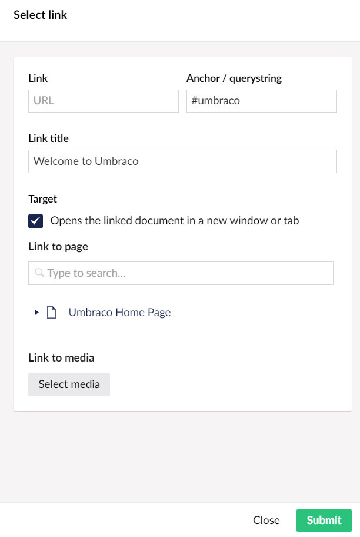
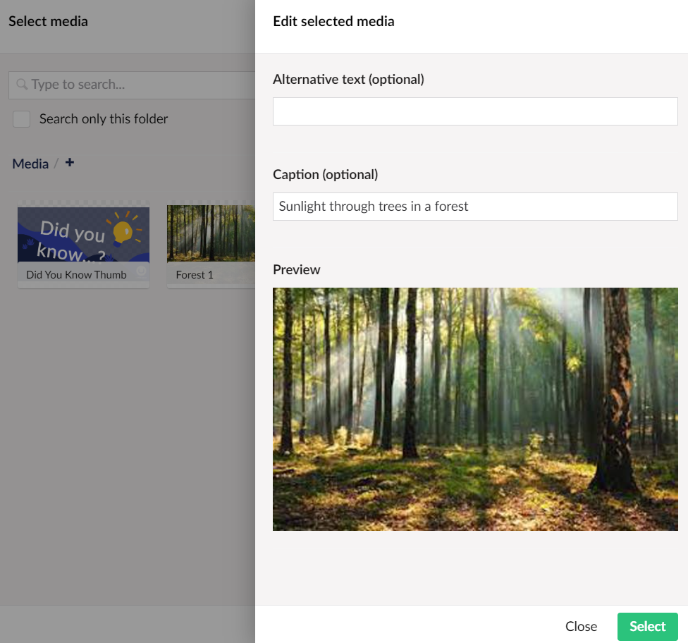
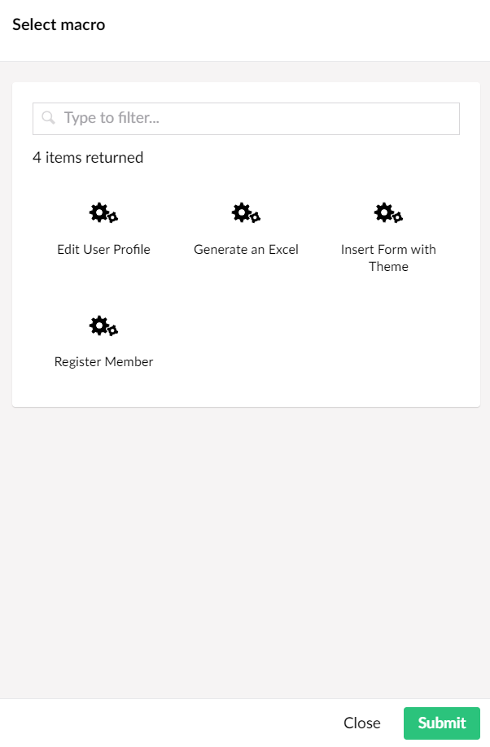
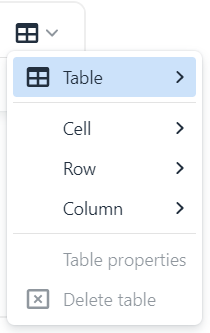
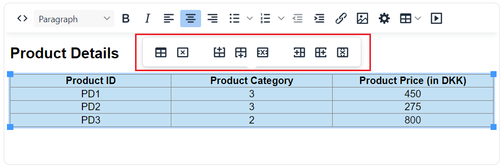

# Rich Text Editor

The Umbraco Rich Text Editor (RTE) is a field where you, as an editor, can be creative. You select how much you want to do yourself. You can work on text content, format the text, or leave it the way it is. If you want to do more, you can insert images, create tables, or create links to other pages/documents.

The functionality varies depending on how the editor is set up. Here, we describe the default editor with all the options enabled. Contact your system administrator for details regarding your editor.

## Editor Buttons

Below are the default editor buttons available. Your system administrator can determine which buttons are displayed in different templates. You could therefore have access to more or fewer buttons than those shown here.

## Paragraph Break/Line Break

The editor is like any other word-processing program. You write the text and the text wraps around when the line reaches the end. When you press `ENTER` in the editor, you get a paragraph break, which means there is space between the paragraphs. If you do not want a space, you have to make a line break instead. You do this by pressing `SHIFT+ENTER`.

## Shortcut Keys

To make your work easier, there are shortcut keys for certain editor functions. Shortcut keys let you use the keyboard to carry out certain commands.

| Shortcut | Action     |
| -------- | ---------- |
| Ctrl + A | Select all |
| Ctrl + B | Bold       |
| Ctrl + C | Copy       |
| Ctrl + I | Italic     |
| Ctrl + U | Underline  |
| Ctrl + V | Paste      |
| Ctrl + X | Cut        |
| Ctrl + Y | Redo       |
| Ctrl + Z | Undo       |

We have listed only a few keyboard shortcuts. For a detailed list of available keyboard shortcuts, see the [official TinyMCE Documentation](https://www.tiny.cloud/docs/tinymce/latest/keyboard-shortcuts/).

## View Source Code

If you are proficient in the use of HTML, you can switch to HTML mode and create your page by writing HTML code. You can also check the code and make minor adjustments to get the page exactly as you want it. Certain elements such as scripts will not be allowed and will be filtered out of the code and pasted into the RTE.

## Text Formatting

You do not normally need to spend much time formatting text because Umbraco takes care of a lot of the formatting for you. When the default formatting is not enough, however, there are a couple of options for controlling the formatting of text:

### Formats

You can apply formatting via the **Formats** drop-down list. The Formats drop-down list provides predefined styles that can be applied to text while maintaining a consistent look and feel throughout the site.

These styles incorporate advanced formatting functionality which can be applied to provide a different look for certain elements such as links, headings, and sub-headings. For example, you can use a format style to change a link into a call-to-action button.

While the styles available on your site may differ, you can apply styles:

1. Select the text you want to apply the style to.
2. Select the style to apply from the **Format** drop-down list.

For more information on how to create RTE Styles, see the [Rich Text Editor Styles](https://docs.umbraco.com/umbraco-cms/fundamentals/backoffice/property-editors/built-in-umbraco-property-editors/rich-text-editor/rte-styles) article.

### Formatting Buttons

The most basic and probably the most familiar way to control formatting are via the formatting buttons. These work the same as those found in most word-processing applications such as Microsoft Word. With these you can apply basic formatting such as Bold, Italic, Underline, altering text alignment, bulleted and numbered lists, and altering text indentations.

Regardless of the formatting being applied, you can apply a format using the formatting buttons:

1. Select the text you want to apply the formatting to.
2. Click the appropriate format button to apply the formatting you wish to add.

### Copying Content from Other Programs

When you pre-write content to copy it later into a RTE you may encounter style issues on your website. When pasting content, the original text styles will be preserved. This can lead to different font faces, sizes, and colors from what is expected when the website is viewed. It is advisable to paste the content into a markdown editor such as notepad, then copy, and paste it into your RTE.

### Remove Formatting

If you have formatted a paragraph or selection using the formatting buttons, you can remove a formatting rule:

1. Select the text you want to remove the formatting from.
2. Click the relevant formatting button to remove the formatting rule.
3. Alternatively, you can use the **Remove Format** button from the toolbar.


If you do not have the **Remove Format** button, contact your system administrator.


## Links

The **Insert/Edit Link** button is used to create links to internal pages, external pages, media files, email links, and anchors. The process for inserting a hyperlink differs depending on the type of hyperlink you wish to create:

### Link to a Page on another Website

1. Select the text that will form the hyperlink.
2. Click the **Insert/Edit Link** button to open the link properties slide-out menu.
3. Enter the URL of the web page you wish to link to in the **Link** field.
4. Enter the text that will be displayed as the link title in the **Link Title** field.
   - This is important information for everyone reading the website with different accessibility aids.
5. Select the **Target** field to open the link in a new window or tab.
6. Click **Submit**.

### Link to a Page in Umbraco

1. Select the text that will form the hyperlink.
2. Click the **Insert/Edit Link** button to open the link properties slide-out menu.
3. Select a page from the **Link to page** field.
   - This will populate the **Link** and  **Link Title** fields automatically.
4. Select the **Target** field to open the link in a new window or tab.
5. Click **Submit**.

### Link to a Media File in Umbraco

1. Select the text that will form the hyperlink.
2. Click the **Insert/Edit Link** button to open the link properties slide-out menu.
3. Select the **Link to Media** button to select the media item.
4. Click **Select**.
   - This will populate the **Link** and  **Link Title** fields automatically with the media item information.
   - By default, the **Link** field contains the media file name and cannot be edited.
5. Select the **Target** field to open the link in a new window or tab.
6. Click **Submit**.

### Link to an Email Address in Umbraco

1. Select the text that will form the hyperlink.
2. Click the **Insert/Edit Link** button to open the link properties slide-out menu.
3. Enter the text `mailto:` followed by the email address you wish to link to in the **Link** field. For example, `mailto:contact@umbraco.com`.
4. Enter the text that will be displayed as the link title in the **Link Title** field.
5. Select the **Target** field to open the link in a new window or tab.
6. Click **Submit**.

### Link to an Anchor on the Same Page

An anchor allows you to create internal page links that enable users to navigate within a page. There are two parts to setting up an anchor; the anchor itself and the link to the anchor.

### Creating an Anchor

1. Click the editor cursor where you wish to create the anchor.
2. Click the **Anchor Button** which will launch the Anchor creation dialog.
3. Enter your anchor name in the **ID** field.
   - You should avoid special characters and spaces.
4. Click **Save**.
   - You will see a small anchor icon where you previously had the editor cursor.

To delete the anchor:

1. Select the anchor icon.
2. Press your **Delete** key.

### Linking to an anchor

1. Select the text to which you wish to add the anchor link to.
2. Click the **Insert link** button to open the link properties slide-out menu.
3. Add a hash symbol (#) followed by the name of your anchor in the **Anchor/querystring** field.
4. Enter the text that will be displayed as the link title in the **Link Title** field.
5. Click **Submit**.

### Create a Link from an Image

You can make images into clickable links in Umbraco:

1. Insert an image into the RTE.
   - For more information, see the [Working with Images](#working-with-images) section.
2. Select the image that will form the hyperlink.
3. Enter the URL of the web page you wish to link to in the **Link** field.
4. Enter the text that will be displayed as the link title in the **Link Title** field.
5. Select the **Target** field to open the link in a new window or tab.
6. Click **Submit**.

### Removing a Link

To remove a link:

1. Select the link in the RTE.
   - For text links, click the cursor anywhere within the link text. For an image, click the image itself.
2. Click the **Remove Link** button which will remove the hyperlink.
3. Alternatively, you can click the **Insert/Edit Link** button and remove the link from the **Link** field.

## Working with Images

To display images on a page they must be uploaded to your Umbraco Media library. Many organizations set up a media library containing images that editors can use on their pages. Others allow their editor's free use of their images. The procedure for uploading an image varies slightly depending on which method your organization uses. Check with your system administrator about what applies to your organization.

### Inserting an Image from the Media Library

1. Place the cursor in the RTE where you want to insert your image.
2. Click the **Media Picker** button from the toolbar.
3. Select the folder in which the image is.
4. Click the thumbnail of your chosen image to open the image properties menu.
5. Enter a name/description for the image in the **Caption (optional)** field.
   - It is important to add descriptive titles to images as these are used to assist visually impaired users.
6. Click **Select**.

### Inserting an Image from your Computer

You can upload images directly from the RTE on the page you are editing. These images will be stored in the Umbraco Media library. Therefore care should be taken to ensure that the image is placed in the correct location within the library. If you click the plus icon underneath the search bar in the media picker slide-out menu you can create folders in the media library.

1. Place the cursor in the RTE where you want to insert your image.
2. Click the **Media Picker** button from the toolbar.
3. Click the **Upload** button which is located in the top right-hand corner of the menu.
4. Select the chosen image from the pop-up window.
5. Enter a name/description for the image in the **Caption (optional)** field.
6. Click **Select**.

### Deleting an Image from the Page

To delete an image from the page:

1. Select the image.
2. Press the **Delete** button on your keyboard.
   - The image disappears from the page but is not deleted from the Umbraco Media library.

## Macros

In Umbraco, macros are small building blocks of functionality that can be dropped into an editor. Each macro encompasses a piece of functionality and provides an interface to modify the macro to your requirements. A macro can be anything from a contact form to an embedded media player. The advantage of macros is that it gives editors the ability to add complex elements to a page.

The macros available differ on each system. Kindly check with your system administrator to find out which macros are available to you and what they do. The process for adding and updating a macro is as follows:

### Adding a Macro to the Page

1. Place the cursor in the RTE where you want to insert your macro.
2. Click the **Insert Macro** button from the toolbar.
3. Select a macro to insert from the macros list.
4. Click **Submit**.
   - The macro is displayed in the editor with a dotted border.

### Editing macros

You can edit values after a macro has been added to the RTE:

1. Select the macro in the RTE.
2. Click the **Insert Macro** button from the toolbar.
   - This will open the configuration menu where you can edit any values previously added.

### Removing macros

To remove a macro:

1. Select the macro in the RTE.
2. Press the **Delete** or **Backspace** button on your keyboard.

## Tables

Tables are used to format information in a grid-based structure. When you insert a table, you select how many rows and columns the table should comprise of. Additionally, you can fill in some optional formatting properties. These values can be changed later, so it is not important to know exactly what your table will look like when you create it.

### Editing an Existing Table

To edit the table after creating it, click on the table. A pop-up appears with different table properties and options. Alternatively, you can click on the **Table** button in the RTE toolbar.

Clicking on **Table Properties** gives you different options for modifying the table’s appearance. However, the developer of the website may have already created table styles for you so you may not need to adjust these settings. There are other options available for modifying cells, rows, and columns such as width, height, alignment, border, and so on.

## Configuring a RTE

The RTE in Umbraco can be configured in many different ways. For more information, see the [Rich Text Editor Configuration](https://docs.umbraco.com/umbraco-cms/fundamentals/backoffice/property-editors/built-in-umbraco-property-editors/rich-text-editor/configuration) article.
