# Member Registration and Login

Using tools available on a fresh install of Umbraco CMS, you can create a frontend-based registration and login functions and restrict access to specific areas of your site based on this system.

By the end of this tutorial, you will know how to implement a basic register/login functionality on your website, hide pages from non-logged-in members, and assign newly registered members to specific member groups.

## Install Umbraco and The Starter Kit

Make sure you have the latest [dotnet templates](../fundamentals/setup/install/install-umbraco-with-templates.md) installed.

Create an empty directory, open a terminal and run:

```bash
dotnet new umbraco
dotnet add package Umbraco.TheStarterKit
dotnet run
```

Complete the installer and login to the backoffice.

## Create partial views for Registration and Login

1. Navigate to the Settings section in the backoffice.
2. Locate the Partial Views entry under Templating in the left-hand section.
3. click the "+" to create a new partial view.

 4. Choose _New partial view from snippet..._: in the dialog that follows

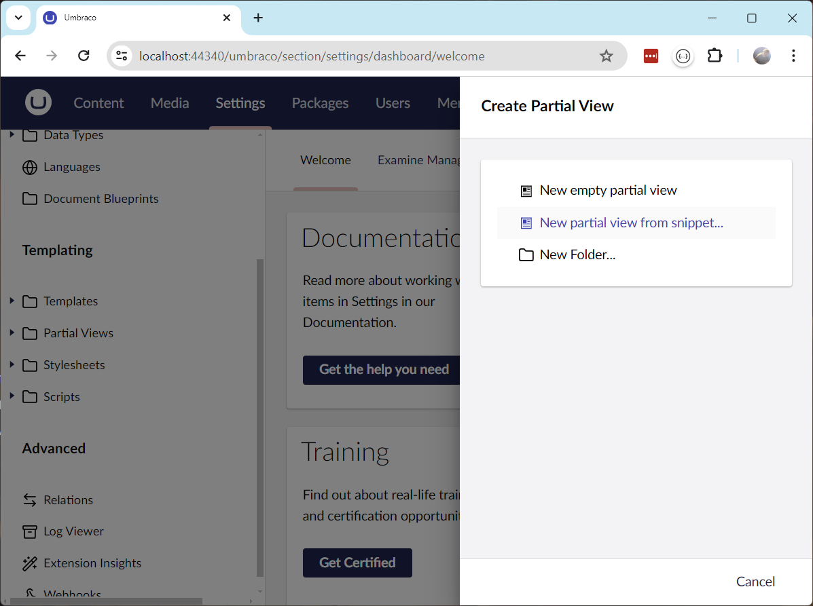

5. Pick the _Login_ snippet in the next dialog.

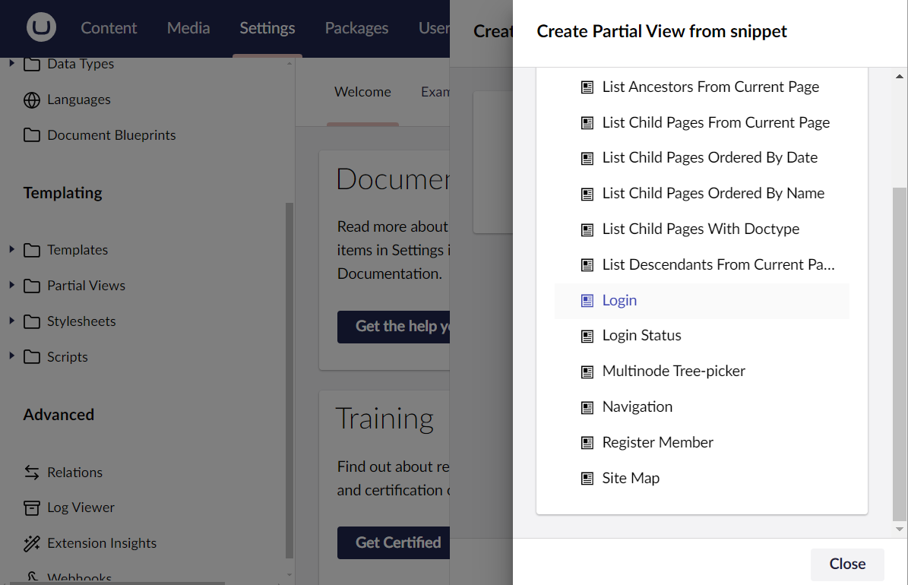

Lastly, name the partial view "Login" and save it:

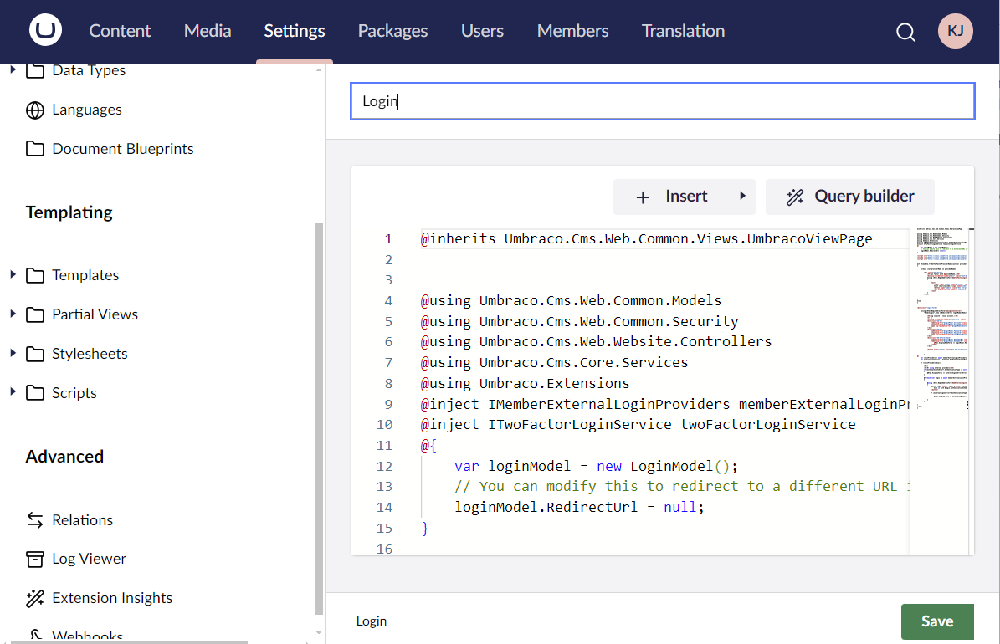

Repeat the above steps using the _Register Member_ and _Login Status_ snippets. Save the partial views as "Register" and "LoginStatus", respectively.

The Partial Views list should now look like this:

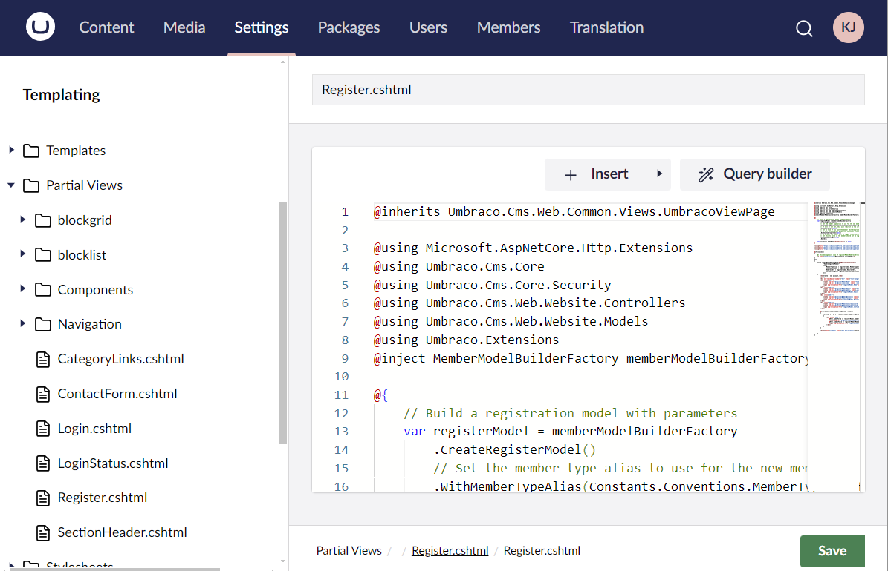

## Create a new Document Type for Registration and Login

To render these partial views, we need a new Document Type with a dedicated template (see also [Defining Content](../fundamentals/data/defining-content/README.md)):

1. Create a new Document Type with a template and name it "Login".
2. Setup the "Login" Document Type to be composed by the "Content Base" and "Navigation Base" Document Types.
3. Allow the "Login" Document Type as a child under the "Home" Document Type.

## Render the partial views in the template

Locate the newly created "Login" template, and overwrite its content with this:


```cshtml
@inherits Umbraco.Cms.Web.Common.Views.UmbracoViewPage
@{
    Layout = "master.cshtml";
}

@Html.Partial("~/Views/Partials/SectionHeader.cshtml")

<section class="section">

    <div class="container">

        <div class="col-md-3">
            <nav class="nav-bar nav-bar--list">
                @Html.Partial("~/Views/Partials/Navigation/SubNavigation.cshtml")
            </nav>
        </div>

        <div class="col-md-9">
            <article>
                @await Html.GetBlockGridHtmlAsync(Model, "bodyText")
            </article>
            <article>
                @await Html.PartialAsync("partials/loginStatus")
                @await Html.PartialAsync("partials/register")
                @await Html.PartialAsync("partials/login")
            </article>
        </div>
    </div>

</section>

<link rel="stylesheet" href="@Url.Content("~/css/umbraco-starterkit-blockgrid.css")" />
```


## Create the Register/Login page

Halfway there!

Next, navigate to the Content section. Under the _Home_ node, create a new page based on the "Login" Document Type:

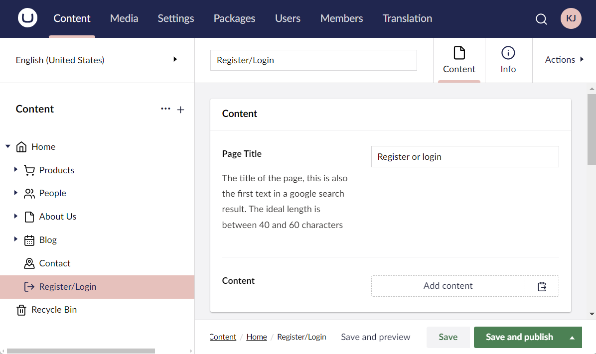

Save and publish the page. The Register and Login functionality is rendered by the "Login" template:

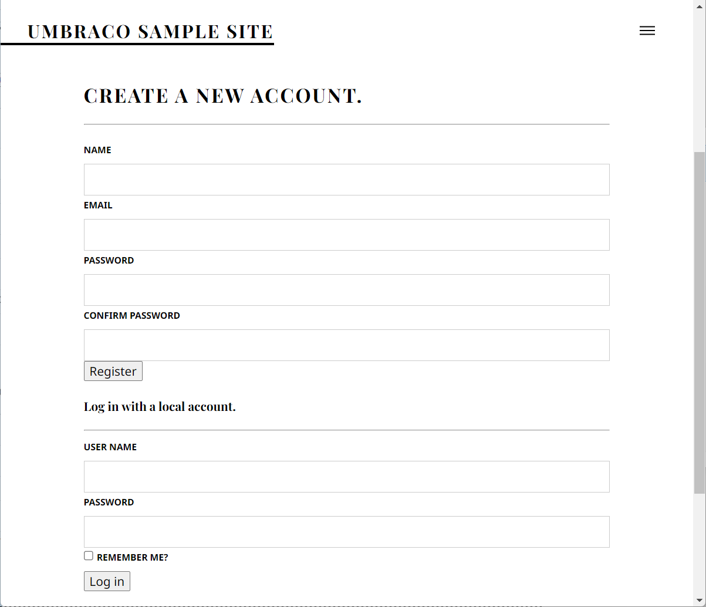

You can now use the page to register new Members. Every registered person will show up in the Members section in the backoffice:

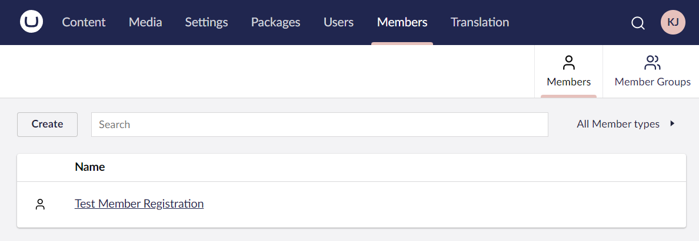

The "LoginStatus" partial view comes into play after registering as a new Member (or logging in as an existing Member). It will render a welcome message and a "log out" button:

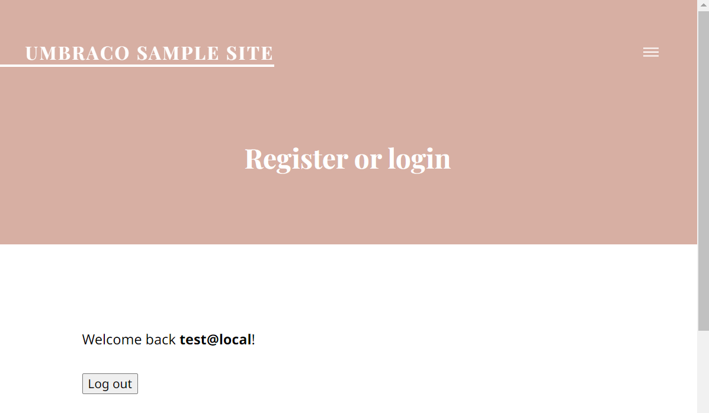


In a real-life scenario, you probably don't want all this functionality on a single page. However, you can still use the partial views as a basis for your own implementation.


## Member-only pages/Restricted access


If you are on Umbraco Cloud you need to do the following steps to be able to restrict access for your users:

1. Go to the Users section in the Backoffice.
2. Select your User.
3. Add the "Sensitive Data" Group. 

Once you have added the "Sensitive Data" group go to the Members section in the backoffice. In the Members section you need to select each member and approve them by toggling the Approved button.


Once the users have been approved, you can go ahead and continue the tutorial.


Now that we have the options to:

* Register a member
* Log in as a member
* Check the current login status
* Log out a member

We can take this a bit further and specify which parts of our website should be accessible to logged-in members. To do this, head on over to the Member section in the Backoffice, and create a new Member Group.

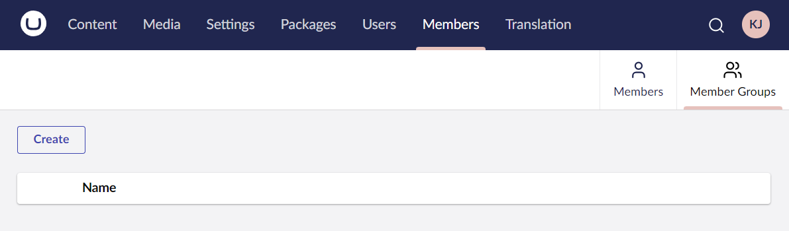

Give the group a name and save it:

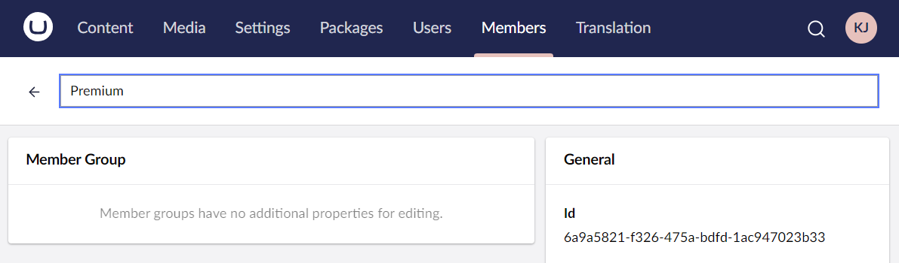

Next, navigate back to the created Member. Assign the newly created Member Group and save the member:

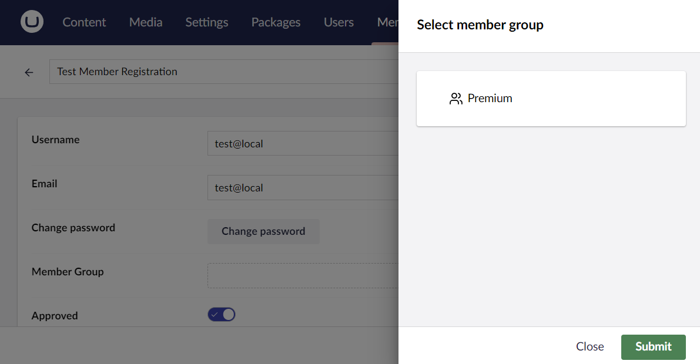

Almost there!

Now navigate to the Content section. Create a new page that should only be visible to "Premium" members.

Once created, click the menu icon (•••) to bring up the page options, and pick "Restrict Public Access":

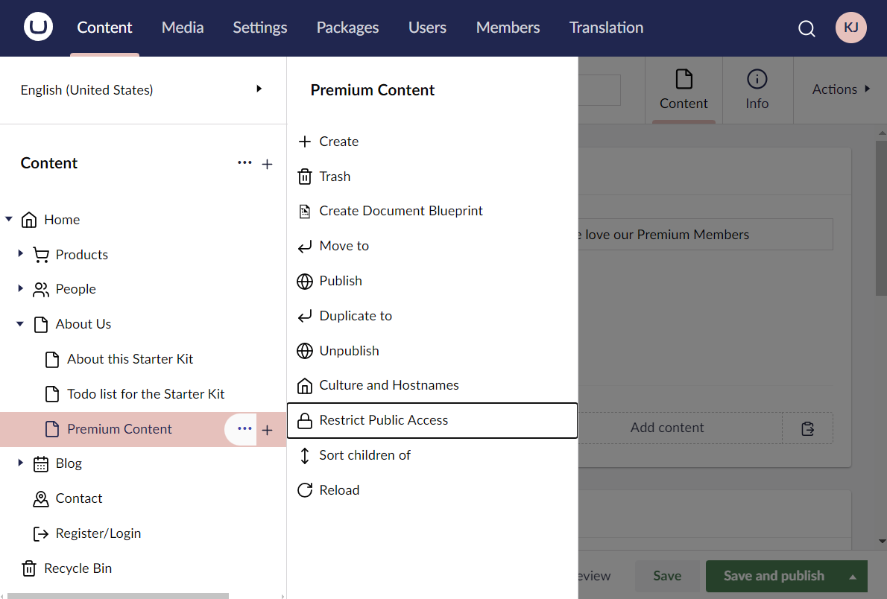

You will be able to restrict access to a specific member, or a specific group. Choose the latter option. In the dialog that follows you must define:

- The group(s) that will have access to the page.
- The page with the login form.
- The page to display if the content page is inaccessible to the logged-in member.

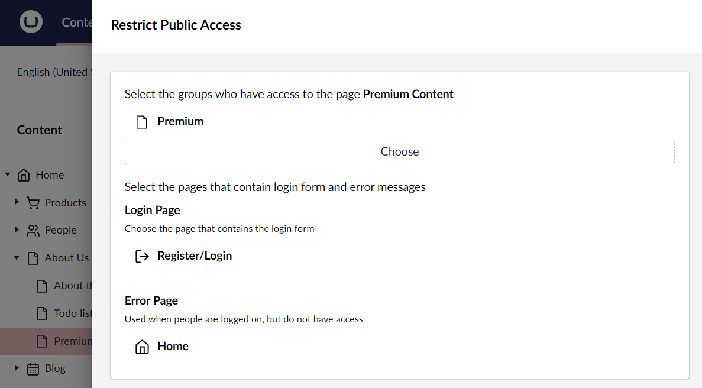


It is recommended to have a dedicated page for the "No access" page - though you can use any page you have.


Congratulations! With all of that setup, the "Premium Content" page is only accessible to logged-in "Premium" Members. When not logged in, the website visitors will automatically be redirected to the "Register/Login" page.

However, with the above approach, members will not be assigned to any group automatically. For this to happen, we would need to write a bit of custom code.

## Assigning new members to groups automatically

We can leverage the [built-in Notifications](../reference/notifications/README.md) to handle the automatic Member Group assignment. Specifically the `MemberSavedNotification`, which is triggered whenever a Member is saved.


This notification is triggered when _any_ Member is saved. Make sure test its usage carefully.


The following code automatically assigns Members to the "Premium" Member Group.


```csharp
using Umbraco.Cms.Core.Events;
using Umbraco.Cms.Core.Models;
using Umbraco.Cms.Core.Notifications;
using Umbraco.Cms.Core.Services;

namespace UmbracoDocs.Samples;

public class AssignMembersToPremiumRoleHandler : INotificationHandler<MemberSavedNotification>
{
    private const string RoleName = "Premium";

    private readonly IMemberService _memberService;
    private readonly ILogger<AssignMembersToPremiumRoleHandler> _logger;

    public AssignMembersToPremiumRoleHandler(
        IMemberService memberService,
        ILogger<AssignMembersToPremiumRoleHandler> logger)
    {
        _memberService = memberService;
        _logger = logger;
    }

    public void Handle(MemberSavedNotification notification)
    {
        foreach (IMember member in notification.SavedEntities)
        {
            if (_memberService.GetAllRoles(member.Id).Contains(RoleName))
            {
                continue;
            }
            _logger.LogInformation("Automatically assigning member with ID: {memberId} to role: {roleName}", member.Id, RoleName);
            _memberService.AssignRole(member.Id, RoleName);
        }
    }
}
```



Member Groups are also referred to as "Roles" in the service layers.


To enable the notification handler, we also need a composer:


```csharp
using Umbraco.Cms.Core.Composing;
using Umbraco.Cms.Core.Notifications;

namespace UmbracoDocs.Samples;

public class AssignMembersToPremiumRoleComposer : IComposer
{
    public void Compose(IUmbracoBuilder builder)
        => builder.AddNotificationHandler<MemberSavedNotification, AssignMembersToPremiumRoleHandler>();
}
```

