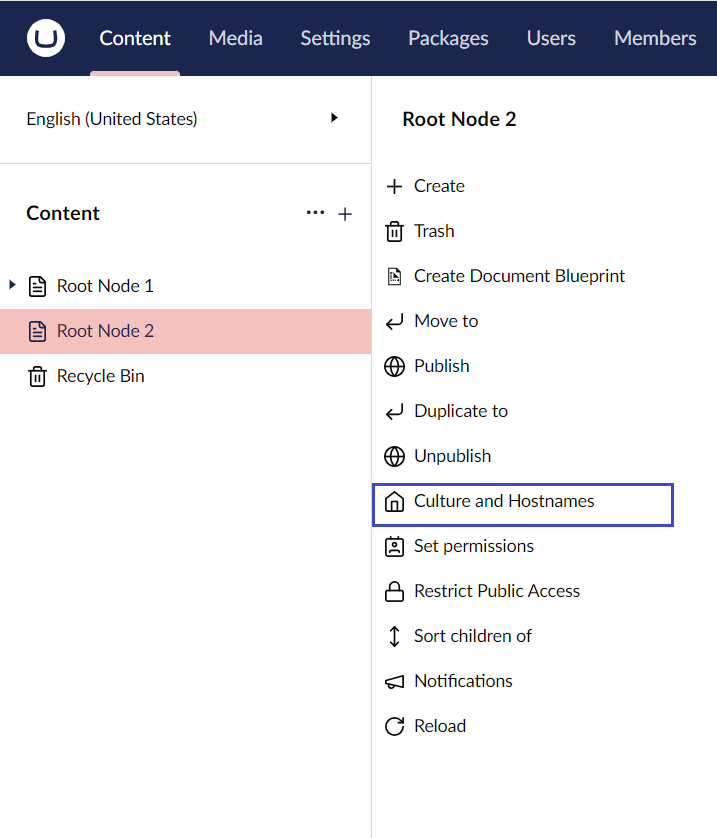
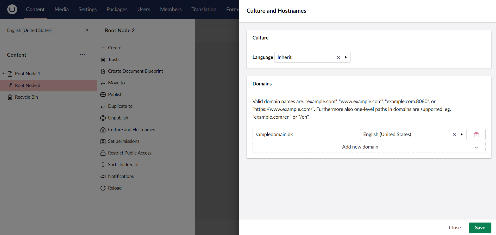

# Multisite Setup

This tutorial explains how to host multiple sites from one project/installation of Umbraco. For practical reasons, we recommend using [Baselines](https://docs.umbraco.com/umbraco-cloud/getting-started/baselines) on Umbraco Cloud projects.


When using Baselines on Umbraco Cloud for a multisite solution, you would not need to worry about [Usage](https://docs.umbraco.com/umbraco-cloud/set-up/project-settings/usage) limits, and could see better performance compared to having multiple websites in one project.


If you are planning to create a multilingual site, please take a look at the [Multilanguage Setup](multilanguage-setup.md) tutorial instead.

## Structuring your website

The best way to handle a multisite solution is to have multiple root nodes in the Content section, where each root node would act as a separate website.

All the websites in your solution will use the same schema. In most cases, this would mean that your content pages on website A will use the same properties as on website B.


If your site is hosted on Umbraco Cloud, you will need to map your sites' hostnames to the project.

Before you can map your hostnames to individual websites in the solution, you should add them in the Hostnames page on the Cloud portal to ensure they are secured with TLS.


Keep in mind the [hostnames have to be configured in a specific way.](https://docs.umbraco.com/umbraco-cloud/set-up/project-settings/manage-hostnames)

## Mapping the hostnames to individual websites/root nodes

At this point, you will have multiple root nodes, each acting as a separate website. To map the hostnames to individual root nodes:

1. Go to the **Content** section.
2. Click **...** next to the root node you wish to assign the hostname.
3. Select **Culture and Hostnames**.

    
4. In the **Domains** pane, click **Add new Domain**.
5. Enter the domain in the **Domain** field and select the language from the **Language** drop-down list. If you have a multilanguage solution, you can map different hostnames to specific languages.

    

6. Click Save.
7. Repeat steps 2-6 for each root node in the Content structure.

The sites are now available under the domains you provided.

 

## Best practices

While such a setup might be handy, it also comes with drawbacks. It is important to keep in mind that having multiple sites on one Umbraco project:

* Might increase resource usage.
* Could interfere with editors' workflows, especially if there are multiple people working on both websites at once. That is because the solution will still use one database for both websites.
* Limit your options in regards to developing new features and making schema changes.
* If the project has any issues, this will affect all websites.

On Umbraco Cloud-hosted sites we recommend using the [Baseline](https://docs.umbraco.com/umbraco-cloud/getting-started/baselines) functionality - which comes with added benefits, and offers increased stability compared to the multisite solution in a single project.
