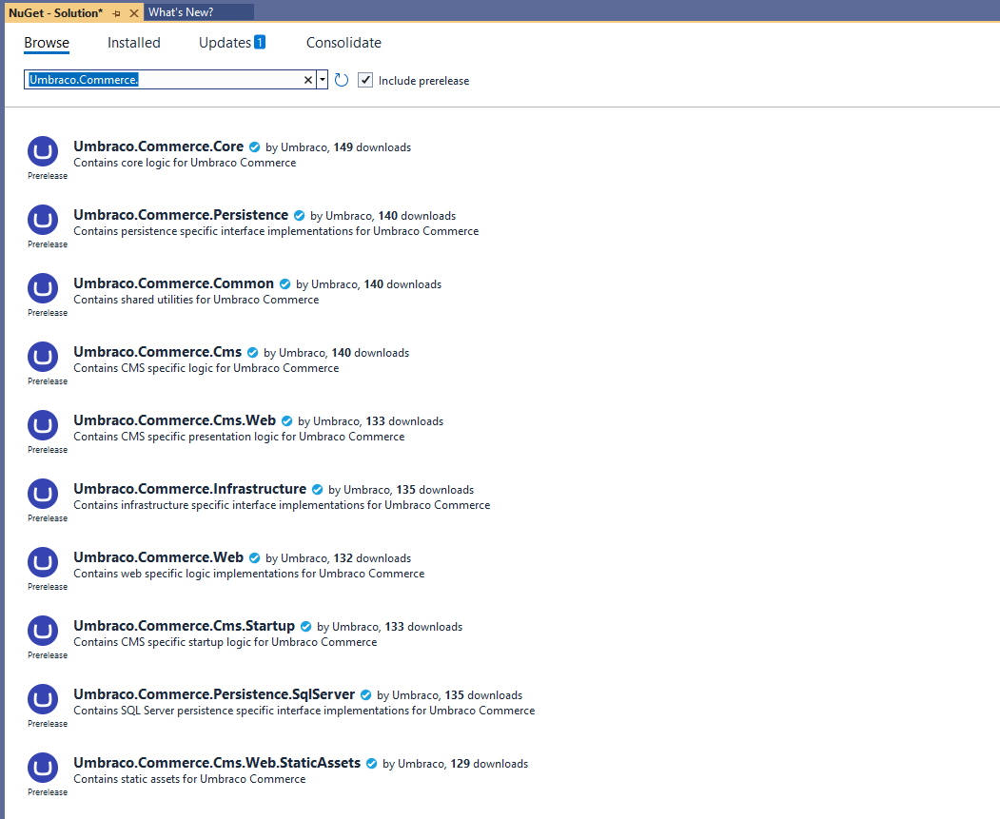

# Installation

In this article, you will learn how to install Umbraco Commerce into your Umbraco CMS implementation.

You can also find information about how to upgrade, install, and activate your Umbraco Commerce license.

## NuGet Package Installation

Umbraco Commerce is available via [NuGet.Org](https://www.nuget.org/packages/Umbraco.Commerce/).

To install Umbraco Commerce via NuGet, run the following command directly in the NuGet Manager Console window:

```bash
dotnet add package Umbraco.Commerce
```

Alternatively, you can also find and install the NuGet package via the NuGet Package Manager in Visual Studio. You will see a number of packages available, however, you will want to install the main **Umbraco Commerce** package.



For most sites using a single solution, the above will be all you need to install Umbraco Commerce into your project. When you have a more complex solution structure consisting of multiple projects, Umbraco Commerce is available in multiple sub-packages with varying dependencies.

<table>
   <thead>
      <tr>
         <th width="282">Sub-package</th>
         <th>Description</th>
      </tr>
   </thead>
   <tbody>
      <tr>
         <td><strong>Umbraco.Commerce.Common</strong></td>
         <td>A shared project of common, non-Commerce-specific patterns and helpers.</td>
      </tr>
      <tr>
         <td><strong>Umbraco.Commerce.Core</strong></td>
         <td>Core Commerce functionality that doesn't require any infrastructure-specific dependencies.</td>
      </tr>
      <tr>
         <td><strong>Umbraco.Commerce.Infrastructure</strong></td>
         <td>Infrastructure-specific project containing implementations of core Commerce functionality.</td>
      </tr>
      <tr>
         <td><strong>Umbraco.Commerce.Persistence.SqlServer</strong></td>
         <td>Persistence-specific project containing implementations of core Commerce persistence functionality for SQL Server.</td>
      </tr>
      <tr>
         <td><strong>Umbraco.Commerce.Persistence.Sqllite</strong></td>
         <td>Persistence-specific project containing implementations of core Commerce persistence functionality for SQLite.</td>
      </tr>
      <tr>
         <td><strong>Umbraco.Commerce.Web</strong></td>
         <td>Core Commerce functionality that requires a web context.</td>
      </tr>
      <tr>
         <td><strong>Umbraco.Commerce.Cms</strong></td>
         <td>Core Commerce functionality that requires an Umbraco dependency.</td>
      </tr>
      <tr>
         <td><strong>Umbraco.Commerce.Cms.Web</strong></td>
         <td>The Commerce functionality for the Umbraco presentation layer.</td>
      </tr>
      <tr>
         <td><strong>Umbraco.Commerce.Cms.Web.Api</strong></td>
         <td>A shared project of common API specific functionality.</td>
      </tr>
      <tr>
         <td><strong>Umbraco.Commerce.Cms.Web.Api.Management</strong></td>
         <td>The backoffice Management API layer.</td>
      </tr>
      <tr>
         <td><strong>Umbraco.Commerce.Cms.Web.Api.Payment</strong></td>
         <td>The Payment handling API layer.</td>
      </tr>
      <tr>
         <td><strong>Umbraco.Commerce.Cms.Web.Api.Storefront</strong></td>
         <td>The frontend Storefront API layer.</td>
      </tr>
      <tr>
         <td><strong>Umbraco.Commerce.Cms.Web.UI</strong></td>
         <td>The static Commerce assets for the Umbraco presentation layer.</td>
      </tr>
      <tr>
         <td><strong>Umbraco.Commerce.Cms.Startup</strong></td>
         <td>The Commerce functionality for registering Commerce with Umbraco.</td>
      </tr>
      <tr>
         <td><strong>Umbraco.Commerce</strong></td>
         <td>The main Commerce package entry point package.</td>
      </tr>
   </tbody>
</table>


If you encounter an SQLite error after installing Umbraco Commerce, you may need to enable SQLite support. For more information, see the [Configure SQLite support](https://docs.umbraco.com/umbraco-commerce/how-to-guides/configure-sqlite-support) article.


## Installing a License

See the [Licensing page](the-licensing-model.md#installing-your-license) for details on how to install a license.
