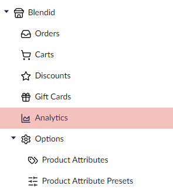

# Store Menu Item

Store Menu Items allow you to display custom menu items inside a Store tree, either in the Settings or Commerce sections.



## Registering a Store Menu Item

```typescript
import { UcManifestStoreMenuItem } from "@umbraco-commerce/backoffice";

export const manifests : UcManifestStoreMenuItem[] = [
    {
        type: 'ucStoreMenuItem',
        alias: 'analytics',
        name: 'Analytics',
        meta: {
            label: '#ucMenus_analytics',
            menus: [ 'Uc.Menu.StoreManagement' ],
            entityType: 'uc:analtics',
            icon: 'icon-chart-curve'
        },
        weight: 100
    }
];

extensionRegistry.register(manifests);
```

Each entry must have a type of `ucStoreMenuItem` along with a unique `alias` and `name`.

A `meta` entry provides configuration options for the menu item

| Name | Description |
| -- | -- |
| `label` | A label for this menu item (supports the `#` prefix localization string syntax) |
| `icon` | An icon to display in the menu item |
| `menus` | An array of menu aliases under which this menu items should be added. Can be one or both of `Uc.Menu.StoreManagement` or `Uc.Menu.StoreSettings` |
| `entityType` | Defines the `entityType` this menu item can handle |
| `childEntityTypes` | Defines the entity types of any child menu items to ensure this menu item remains highlighted if the given entity type editor is opened |
| `parentAlias` | The alias of another menu item under which this menu item should be displayed |
| `selectable` | A boolean defining whether this menu item should be selectable |

Menu items are set to navigate to the following route on click

```
section/{currentSection}/workspace/{rootEntityType}/{rootUnique}/{entityType}
```

Here:

- `{currentSection}` is the current section you are in,
- `{rootEntityType}` is the entity type of the menu this item is a child of (should be one of `uc:store-management` or `uc:store-settings`),
- `{rootUnique}` is the ID of the Store this menu is for, and
- `{entityType}` is the entity type as defined in the menu items manifest meta data.

## Handling Store Menu Item Requests

To handle requests to this endpoint, you should define a workspace manifest for the given entity type.

```typescript
const manifests: UmbExtensionManifest[] = [
    {
        type: 'workspace',
        kind: 'routable',
        alias: 'My.Workspace.MyEntity',
        name: 'My Entity Workspace',
        api: () => import('./my-workspace.context.js'),
        meta: {
            entityType: 'my:entity-type',
        }
    }
];

extensionRegistry.register(manifests);

```
