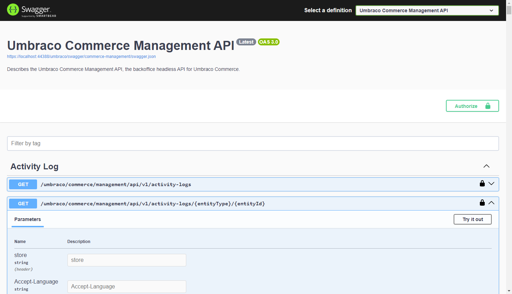

# Management API

## Management API

The Management API delivers headless management capabilities built directly into Umbraco. The Management API is used by the backoffice to communicate with the backend.

The Management API can also be used for Custom apps or Workflows with OpenID Connect.

### Swagger Documentation

Umbraco Commerce ships with Swagger to document the Management API. Swagger and the Swagger UI are based on [Swashbuckle.AspNetCore](https://github.com/domaindrivendev/Swashbuckle.AspNetCore/) and is available at `{yourdomain}/umbraco/swagger`. For security reasons, both are disabled in production environments.

The Swagger documentation allows you to select a definition and go to either Umbraco Commerce Management API or Umbraco Commerce Storefront API. 

In the Swagger Umbraco Management API, you can find a collection of available endpoints in this version of Umbraco.

### Authentication & Testing

For more details on how to authenticate and test a Management API endpoint, see the [CMS Management API](https://docs.umbraco.com/umbraco-cms/reference/management-api) article.