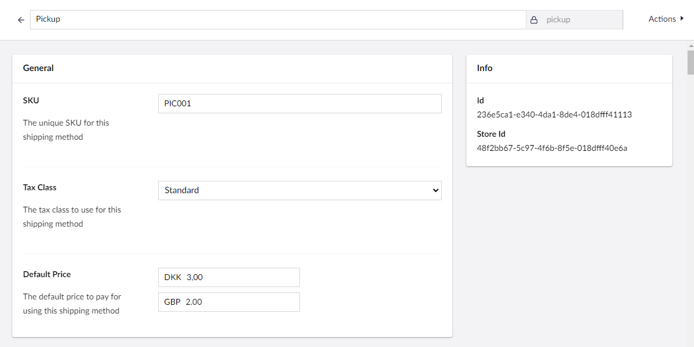
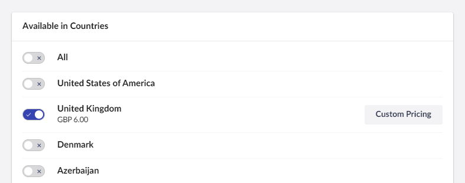
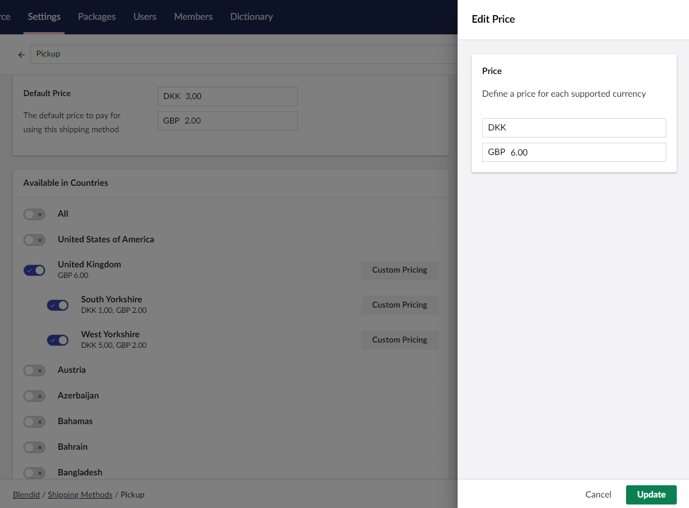

# Fixed Rate Shipping

Fixed rate shipping in Umbraco Commerce allows you to define a single, fixed shipping rate to apply to an order. This is the simplest of all the shipping calculation options, but is also the least flexible.

## Configuration

* Go to `Settings > Commerce > Stores > {Your Store} > Shipping Methods`

* Click `Create Shipping Method`
* Choose the `Basic` shipping provider

* Chose the `Fixed` calculation mode option

* Populate the shipping method name, alias, sku and optional tax rate
* Enter a fixed rate for the shipping method

* Configure the countries this shipping method should be allowed in

* Optionally define a country specific fixed rate should you wish to have different rates per country

