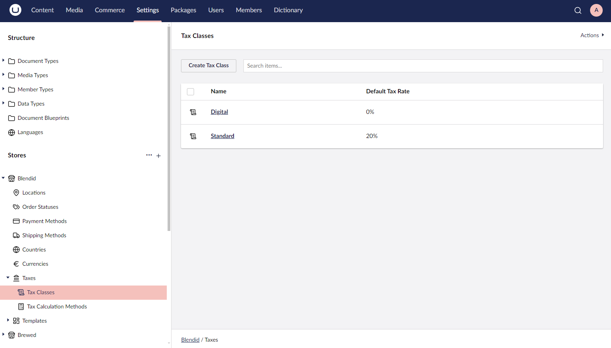
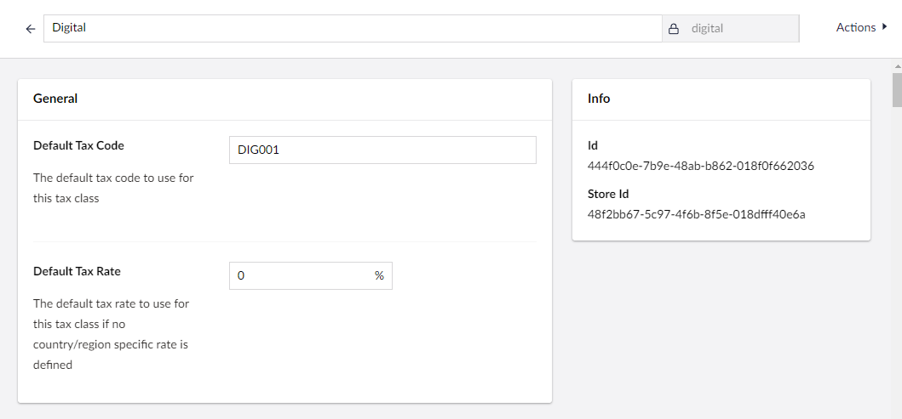
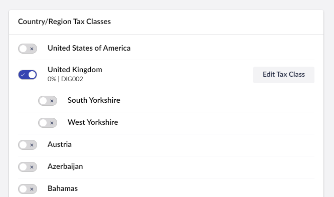
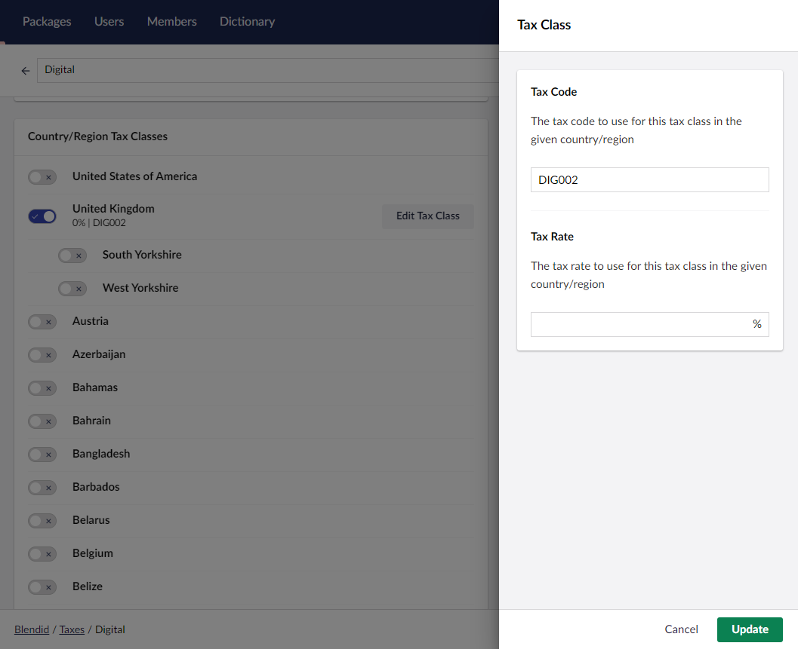
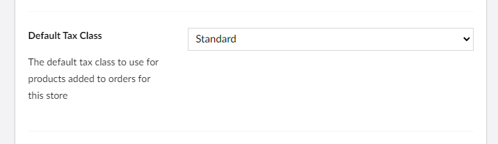
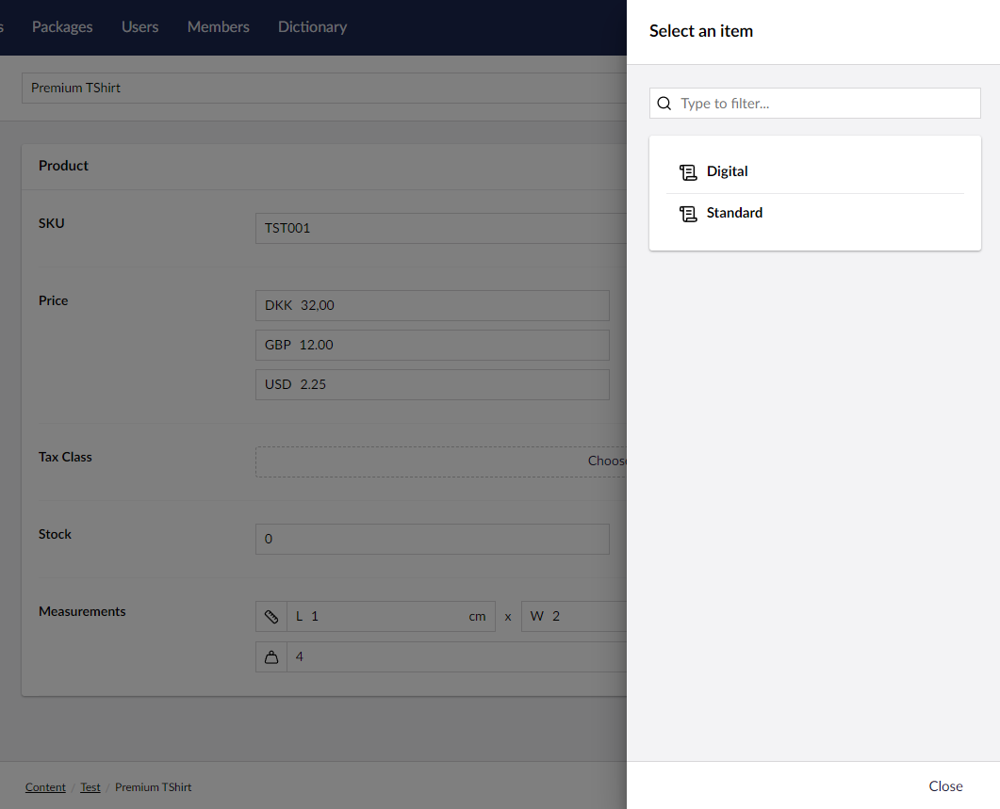

---
description: Fixed Rate Taxes in Umbraco Commerce.
---

# Fixed Tax Rates

Fixed rate taxes allows you to define a single fixed tax rate that will be applied for all products of the same type shipped to the same country. This is a simple option that is useful for countries that have a fixed tax rate (the norm in EU countries).

When using fixed-rate taxes, taxes will be calculated for each price object in the order.

Fixed-rate taxes are defined using **Tax Classes**. A tax class is a classification for a specific type of product and can be configured to have different tax rates for different countries.

## Tax Class Configuration

1. Go to **Settings > Stores > {Your Store} > Taxes > Tax Classes**.

3. Click on the **Create Tax Class** button.
4. Enter the **Tax Class Name**, **Alias**, **Default Tax Rate** and optional **Default Tax Code**.

5. Optionally, define any country-specific tax rates by toggling the checkbox in the **Country Tax Classes** for the country.

6. Click the **Edit Tax Class** button to define the country-specific tax rate/tax code.

7. Click **Save**.

## Assigning a Tax Class

There are two ways to assign a tax class to a product:

### Store Default Tax Class

In the store settings editor, set the **Default Tax Class** for the store. This will be the default tax class for all products in the store.

### Product Tax Class

In the product document type, define a **Store Entity Picker** property configured for the **Tax Class** entity type, with the property alias **taxClass**.
In the products content editor, set the **Tax Class** for the product. This will override the store default tax class for the product.

