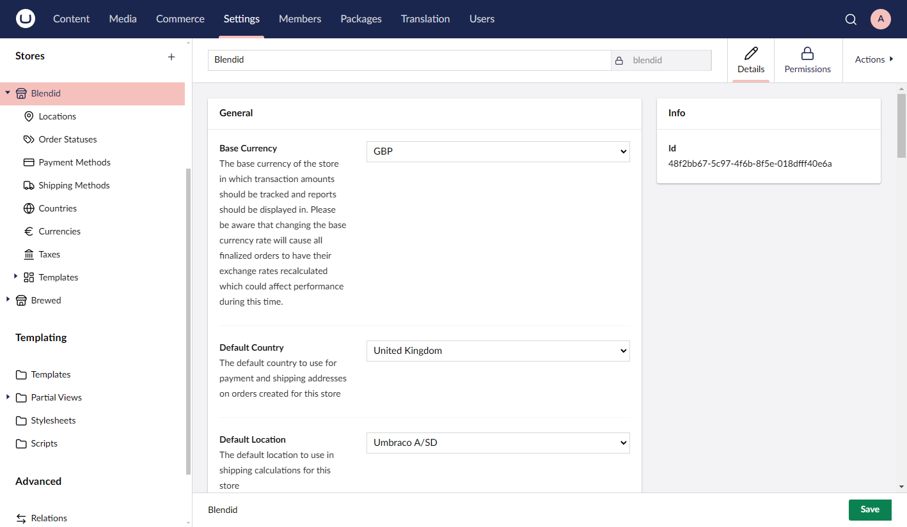

# Umbraco Commerce v14.0.0-Alpha

Umbraco Commerce v14.0.0-Alpha is the initial release of Umbraco Commerce for Umbraco CMS v14. Being an alpha, this is an early preview of the Umbraco Commerce product and as such should be considered a work in progress.

## Key Takeaways

* Contains [core functionality](#core-functionality) for store setup, order management and key property editors.
* Some [functionality / sections missing](#missing-features).
* Some [breaking changes](#breaking-changes) to be expected.
* Brand new [Management API](#management-api).
* New more flexible [UI extension points](#ui-extension-points) added.
* [Localization](#localization) support added (in progress).

## Core Functionality

The key focus of this alpha release is to provide the core functionality required to be able to setup and run a store in Umbraco Commerce allowing users to get started on v14 right away.




The key features included in this release are:

* Store Creation / Editing
* Location Creation / Editing
* Order Status Creation / Editing
* Payment Method Creation / Editing
* Shipping Method Creation / Editing
* Country & Region Creation / Editing
* Currency Creation / Editing
* Tax Class Creation / Editing
* Email Template Creation / Editing
* Print Template Creation / Editing
* Export Template Creation / Editing
* Order View / Editing
* Order / Order Line Properties Editing

## Missing Features

Within these sections there are some known missing features:

* Missing text filtering on collection views
* Missing bulk operations implementation
* Missing sort functionality
* Missing advanced order searching
* Missing order filter menus

In addition to these, there are also some complete sections currently outstanding:

* Store overview dashboard
* Cart section
* Discounts section
* Gift cards section
* Analytics section
* Product Attributes + Product Attribute Presets section

Lastly, there is also some property editors still yet to implement:

* Variants

Needless to say, these will all be implemented for the final v14 release, but in order to get a usable Umbraco Commerce product into your hands as quickly as possible, these features / sections were put at lower priorities at this stage of the conversion.

## Breaking Changes

With the new backoffice UI, there has inevitably been the need to change some functionalities and use such breaking changes couldn't be avoided. These have tried to be minimized as much as possible, whilst also ensuring we embrace the new front end architecture to it's fullest.

The key breaking changes to expect are:

* **UI Config Files Remove**

  In previous versions of Umbraco Commerce it was possible to configure the back office order list view, order editor and analytics dashboards using JSON UI config files. These have now all been updated to use the new manifests pattern in Umbraco v14. See the [UI Extension Points](#ui-extension-points) section bellow for more details.

  In addition to this, the UI Config Files were also used in the backoffice to extract key order properties for things like extracting the shipping address in order to calculate shipping rates. This functionality has now been split such that this mapping functionality has now moved to a new server based configuration API.

  ```
  builder.WithOrderPropertyConfigs()
    .Add("myStoreAlias", b => b
        .For(x => x.Customer.FirstName).MapFrom("firstName")
        .For(x => x.Customer.LastName).MapFrom("lastName")
        ...
    );
  ```

* **Web Notification Events Removed**

  The following notifications are no longer being fired.

  * `AnalyticsDashboardConfigParsingNotification`
  * `CartEditorConfigParsingNotification`
  * `OrderEditorConfigParsingNotification`
  * `StoreActionsRenderingNotification`
  * `ActivityLogEntriesRenderingNotification`

* **Web Controllers / Models Removed**

  With the new Management API this does mean any controllers / models that previously lived in the `Umbraco.Commerce.Cms.Web` will now have been removed. Please use the Management API instead.

  The only exception to this is the `PaymentController` which is used as a callback for payment gateways. This is currently kept at the same URL to prevent breakages. We will be reviewing this to see if some other endpoint location makes more sense.

## UI Extension Points

With the new backoffice comes a new extensions system for the UI and we have tried to use this to the maximum. These means converting the old UI configs system to using the new manifests system.

With the new extension points it is possible to:

* Change the properties used by the order editor.
* Add properties to the order line properties editor.
* Add properties to the Notes, Additional Info and Customer Details modals.
* Add properties to the order collection view.
* Add analytics widgets (still in progress)
* Define custom views for properties to control value rendering.

Here is an example of how you would configure such properties

```javascript
export const manifests : Array<UcManifestOrderLineProperty> = [
    {
        type: 'ucOrderLineProperty',
        alias: 'Uc.OrderLineProperty.Color',
        name: 'Order Line Color',
        weight: 100,
        meta: {
            propertyAlias: 'color',
            editorUiAlias: 'Umb.PropertyEditorUi.EyeDropper',
            labelElementName: 'uc-mini-color-swatch'
        }
    },
    {
        type: 'ucOrderLineProperty',
        alias: 'Uc.OrderLineProperty.GiftMessage',
        name: 'Order Line Gift Message',
        weight: 100,
        meta: {
            propertyAlias: 'giftMessage',
            editorUiAlias: 'Umb.PropertyEditorUi.TextArea',
            summaryStyle: 'table'
        }
    }
];
```

With these extension points, the Umbraco Commerce order editor is now more flexible than it has ever been before.


We are yet to launch an Umbraco Commerce NPM module so these points are not yet currently available to use externally but we wanted to give you a heads up of what is coming so you can prepare.


## Management API

As with the CMS, with the new UI comes a whole new API layer.


With the Umbraco Commerce API we have aimed to keep it aligned with the Storefront API with support for filtering an expansion where possible.

I key thought whilst developing this API has been to ensure external developers might use this to build other UI's for Umbraco Commerce such as a dedicated mobile app and so we've tried to ensure there are no "special" endpoints just for the Umbraco CMS UI.

## Localization

One of the things that has been on the Umbraco Commerce TODO list for a while is to add backoffice localization support. Given the fresh start it was only logical that we take the time to ensure that everything we built fully supported localization so this will be included in this release.

We haven't quite caught everything yet, but we'll be sure to do a full check before the final release to ensure all hard coded strings are fully configurable.

With this update, we'll also be making some changes to things like payment and shipping providers, and other CSharp extension points where we define properties. These will no longer require hard coded labels / descriptions and instead will look these values up from the localization file.

## Add-on Updates

We are still yet to tackle adding v14 support to the **Umbraco.Commerce.Deploy** and **Umbraco.Commerce.Checkout** add-ons so these are currently unavailable. These will likely be made available after the initial v14 release.

## What to Test and How to Give Feedback

We would welcome feedback on any installation / upgrade issues along with bugs found in any of the completed sections as detailed above.

Issues can be raised on the Umbraco Commerce issue tracker at [https://github.com/umbraco/Umbraco.Commerce.Issues/issues](https://github.com/umbraco/Umbraco.Commerce.Issues/issues).
