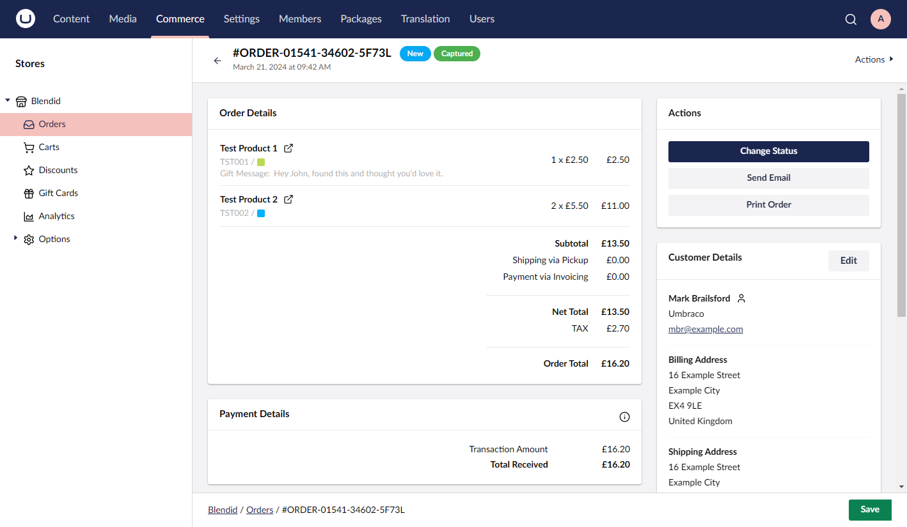
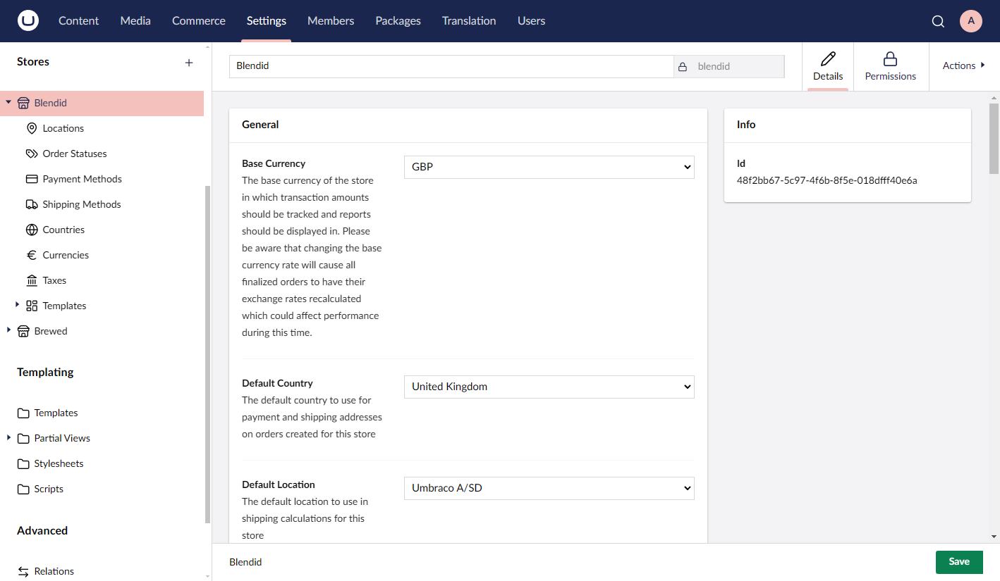
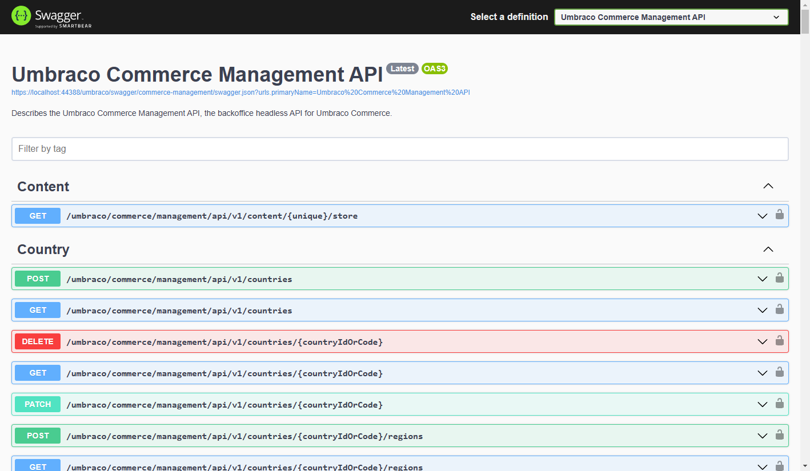

# Umbraco Commerce v14.0.0

This release marks the v14 build of Umbraco Commerce, now feature complete and ready for developers to start using it.

## Key Takeaways

* [New backoffice UI](#new-backoffice-ui) build with web-components.
* Some [breaking changes](#breaking-changes) to be expected.
* New more flexible [UI extension points](#ui-extension-points) added.
* New [Management API](#management-api) added.
* [Localization](#localization) support added (in progress).

## New Backoffice UI

As with everything v14, this is a complete rebuild of the backoffice UI using web components. This ensures Umbraco Commerce is set for the future and creates a solid foundation to develop new features and functionality.





## Breaking Changes

With the new backoffice UI, there has inevitably been the need to change some functionalities, and as such breaking changes could not be avoided. These have tried to be minimized as much as possible, whilst also ensuring we embrace the new front-end architecture to its fullest.

The key breaking changes to expect are:

* **UI Config Files Removed**

Previously, in Umbraco Commerce, it was possible to configure the backoffice order list view, order editor, and analytics dashboards using JSON UI config files. These have now all been updated to use the new manifests pattern in Umbraco v14. For more details, see the [UI Extension Points](#ui-extension-points) section below.

In addition to this, the UI config files were also used in the backoffice to extract key order properties. For example, extracting the shipping address to calculate shipping rates. This functionality has now been split, and the mapping functionality has been moved to a new server-based configuration API.

  ```
  builder.WithOrderPropertyConfigs()
    .Add("myStoreAlias", b => b
        .For(x => x.Customer.FirstName).MapFrom("firstName")
        .For(x => x.Customer.LastName).MapFrom("lastName")
        ...
    );
  ```

* **Web Notification Events Removed**

  The following notifications are no longer being fired:

  * `AnalyticsDashboardConfigParsingNotification`
  * `CartEditorConfigParsingNotification`
  * `OrderEditorConfigParsingNotification`
  * `StoreActionsRenderingNotification`
  * `ActivityLogEntriesRenderingNotification`

* **Web Controllers/Models Removed**

 With the new Management API, any controllers or models previously located in `Umbraco.Commerce.Cms.Web` have been removed. Please use the **Management API** instead.

The only exception to this rule is the `PaymentController`, which serves as a callback for payment gateways. It is currently located at the same URL to avoid disrupting existing transaction communications. However, all new integrations should communicate with a new Payments API.

## UI Extension Points

With the new backoffice comes a new extensions system for the UI, and we have tried to maximize its use. This means converting the old UI configs system to use the new manifests system.

With the new extension points it is possible to:

* Change the properties used by the order editor.
* Add properties to the order line properties editor.
* Add properties to the Notes, Additional Info, and Customer Details modals.
* Add properties to the order collection view.
* Add analytics widgets (still in progress)
* Define custom views for properties to control value rendering.

Here is an example of how you would configure these properties:

```javascript
export const manifests : Array<UcManifestOrderLineProperty> = [
    {
        type: 'ucOrderLineProperty',
        alias: 'Uc.OrderLineProperty.Color',
        name: 'Order Line Color',
        weight: 100,
        meta: {
            propertyAlias: 'color',
            editorUiAlias: 'Umb.PropertyEditorUi.EyeDropper',
            labelElementName: 'uc-mini-color-swatch'
        }
    },
    {
        type: 'ucOrderLineProperty',
        alias: 'Uc.OrderLineProperty.GiftMessage',
        name: 'Order Line Gift Message',
        weight: 100,
        meta: {
            propertyAlias: 'giftMessage',
            editorUiAlias: 'Umb.PropertyEditorUi.TextArea',
            summaryStyle: 'table'
        }
    }
];
```

With these extension points, the Umbraco Commerce order editor is now more flexible than it has ever been before.


We are yet to launch an Umbraco Commerce NPM module, so these functionalities are not currently available for external use. However, we wanted to give you a heads-up about what is coming so you can prepare.


## Management API

With the new UI, a new API layer is also introduced, similar to the CMS.



With the Umbraco Commerce API, we have aimed to keep it aligned with the Storefront API with support for filtering and expansion where possible.

We developed this API for external developers who can use it to create different UIs for Umbraco Commerce, such as a dedicated mobile app. We have made sure that there are no "special" endpoints exclusively for the Umbraco CMS UI.

## Localization

Given the fresh start, we made sure that everything we built fully supports localization, so this will be included in this release.

In this update, we have made some changes to payment and shipping providers, as well as other CSharp extension points where properties are defined. These changes mean that labels and descriptions will no longer be hard-coded; instead, the values will be looked up from the localization file.
