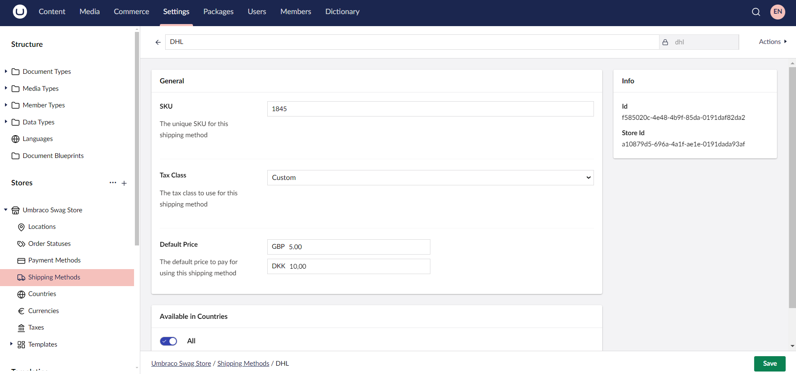

# Creating a Basic Webstore using Umbraco Commerce

This tutorial is based and tested on the latest version of **Umbraco CMS version 14** and **Umbraco Commerce version 14**.

## Introduction

Below is a step-by-step tutorial on how to create an eCommerce site using Umbraco CMS with Umbraco Commerce. This guide assumes you have a basic understanding of .NET development and Umbraco.

## Prerequisites

* Visual Studio Code (or any preferred IDE)
* SQL Server (LocalDB or any SQL server)
* [Umraco CMS Requirements](../../umbraco-cms/fundamentals/setup/requirements.md)
* [Umbraco CMS Installation](../../umbraco-cms/fundamentals/setup/install/README.md)
* [Umbraco Commerce package](../getting-started/install.md)
* Umbraco Starter Kit

## Setting Up an Umbraco Project

To set up an Umbraco project, see the [Installation](../../umbraco-cms/fundamentals/setup/install/README.md) article. Once the project is set up, install the Umbraco Starter Kit to give us a basic site for our tutorial.

## Installing Umbraco Commerce

After your Umbraco site and starter kit is set up, you need to [install the Umbraco Commerce package](../getting-started/install.md).


If you encounter an SQLite error after installing Umbraco Commerce, you may need to enable SQLite support. For more information, see the [Configure SQLite support](../how-to-guides/configure-sqlite-support.md) article.


## Configuring Umbraco Commerce

To gain access to the Commerce section additional configuration is needed. For more information, see the [Configuration](../getting-started/umbraco-configuration.md) article.

## Accessing the Umbraco Backoffice

Log in to the Umbraco backoffice by adding `/umbraco` at the end of your website URL. For example: `https://mywebsite.com/umbraco`.

## Setting Up a Store

1. Navigate to the **Settings** section.
2. Click **+** next to **Stores**.
3. Enter a **Name** for the Store. For this tutorial, I'll call it *Products*.
4. Click **Create**.
5. Configure the **General**, **Notification**, **Order**, **Product**, and **Gift Card Settings** in the **Details** tab.
6. Select the **User Roles** and **Users** that must have access to manage the Store in the **Permissions** tab.

    
7. Click **Save**.

### Setting up a Location

1. Navigate to the **Settings** section.
2. Go to **Locations** under the Store.
3. Click **Create Location**.
4. Enter the **Name** for the Location. For example: *Denmark*
5. Provide the necessary address details.

    
6. Click **Save**.

### Setting up Order Status

When you first set up Umbraco Commerce, it comes with a set of predefined order statuses to help manage the order lifecycle. These statuses usually include: New, Completed, Cancelled, and Error. These statuses can be customized depending on your specific business requirements.

To create an order status:

1. Navigate to the **Settings** section.
2. Go to **Order Statuses** under the Store.
3. Click **Create Order Status**.
4. Enter a **Name** for the order status. For Example: *Processing*
5. Select a **Color** for the order status.

    
6. Click **Save**.

### Setting up Payment Methods

By default, Umbraco Commerce comes with the Invoicing and Zero Value Payment Providers. These built-in payment providers are useful for getting started. Umbraco Commerce also supports the integration of different third-party payment gateways. For more information, see the [Umbraco Commerce Payment Providers Documentation](../../../commerce-add-ons/payment-providers/README.md).

To create a payment method:

1. Navigate to the **Settings** section.
2. Go to **Payment Methods** under the Store.
3. Click **Create Payment Method**.
4. Select a payment provider from the list. For Example: *Zero Value*.
5. Enter a **Name** for the payment method. For example: *Zero Payment*.
6. Configure the payment method as per your requirements.

    
7. Click **Save**.

### Setting up Shipping Methods

By default, Umbraco Commerce comes with the basic Pickup option. For more information on the integration for different providers, see the [Umbraco Commerce Shipping providers Documentation](../../../commerce-add-ons/shipping-providers/README.md).

To create a shipping method:

1. Navigate to the **Settings** section.
2. Go to **Shipping Methods** under the Store.
3. Click **Create Shipping Method**.
4. Choose the shipping provider from the list. For Example: *DHL*.
5. Enter a **Name** for the shipping method. For example: *DHL*.
6. Configure the shipping method as per your requirements.

    
7. Click **Save**.

### Setting up a Country

1. Navigate to the **Settings** section.
2. Go to **Countries** under the Store.
3. Click **Create Country**.
4. Choose an item from the list. For Example: *Create Country from ISO 3166 preset*.
5. Select a country from the list. For example: *Denmark*.
6. Configure the country details as per your requirements.

    
7. Click **Save**.

### Setting up a Currency

1. Navigate to the **Settings** section.
2. Go to **Currencies** under the Store.
3. Click **Create Currency**.
4. Enter a **Name** for the currency. For Example: *DKK*.
5. Configure the currency details as per your requirements.

    
6. Click **Save**.

### Setting up Taxes

1. Navigate to the **Settings** section.
2. Go to **Taxes** under the Store.
3. Click **Create Tax Class**.
4. Enter a **Name** for the tax class. For Example: *Custom*.
5. Configure the tax rates as per your requirements.

    
6. Click **Save**.

## Create Document Types for Your Store

Create custom Document Types in Umbraco for your product pages, category pages, and cart pages. Use these Document Types to structure your site’s content. For example:

* Product Listing Page: List all products within a category.
* Product Detail Page: Display individual product details.
* Cart Page: Display items in the user's shopping cart.
* Checkout Page: Process the user’s purchase.

Since we are using the Starter Kit for this tutorial, we already have the Document Types for product listing and product detail pages. Let's create Document Types for the cart and checkout pages.

**Cart Document Type**

Here’s what the Document Type for a Cart Page might include:

| Property             | Data Type            |
|----------------------|----------------------|
| Title                | Textstring           |
| Introduction Text    | Richtext editor      |
| Empty Cart Message   | Textstring           |
| Checkout Button Text | Textstring           |
| Related Products     | Multinode Treepicker |

**Permissions:** Choose **Cart** under the **Allowed child node types** of your Parent Node Type.

**Content:** Add Cart as a content node under the Parent Node and fill in the required details.

**Template:** The Cart template could contain the following code:
