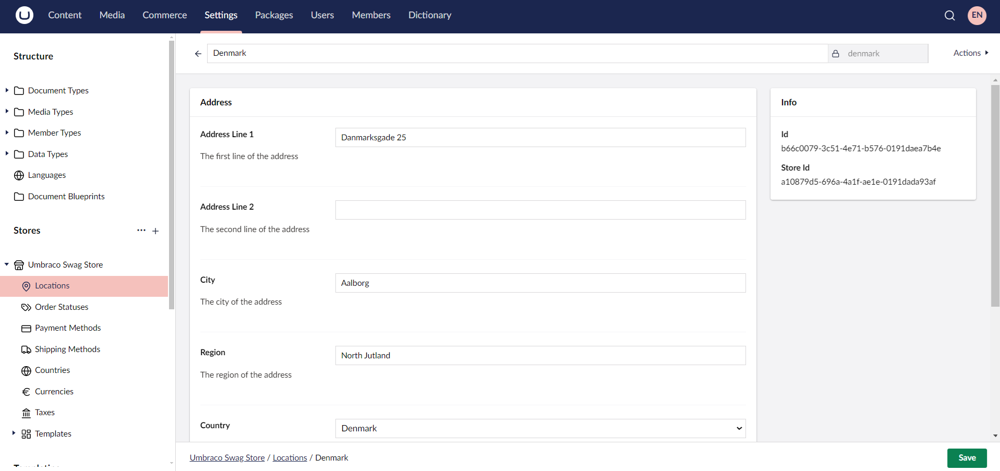
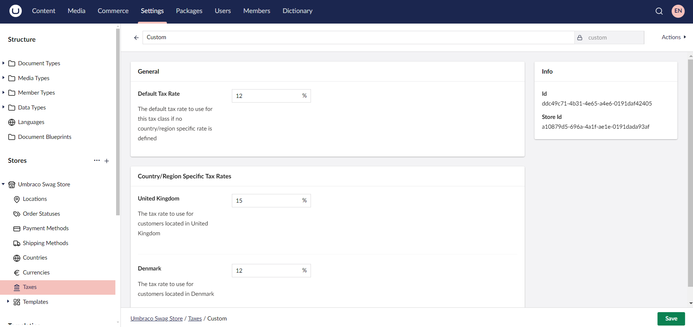

# A Beginner's Guide to Umbraco Commerce

This tutorial is based and tested on the latest version of **Umbraco CMS version 14** and **Umbraco Commerce version 14**.

## Introduction

Umbraco Commerce is an eCommerce platform that integrates with Umbraco CMS. It offers features such as product management, order processing, and payment integrations. This guide will walk you through setting up Umbraco Commerce.

## Prerequisites

* Visual Studio Code or any preferred IDE
* SQL Database (LocalDB or any SQL server)
* [Umraco CMS Requirements](../../umbraco-cms/fundamentals/setup/requirements.md)
* [Umbraco CMS Installation](../../umbraco-cms/fundamentals/setup/install/README.md)
* [Umbraco Commerce package](../getting-started/install.md)

## Setting Up an Umbraco Project

To set up an Umbraco project, see the [Installation](../../umbraco-cms/fundamentals/setup/install/README.md) article.

## Installing Umbraco Commerce

After your Umbraco site is set up, you need to [install the Umbraco Commerce package](../getting-started/install.md).

If you have installed Umbraco CMS with an SQLite database, you might encounter issues or errors after installing Umbraco Commerce.

To resolve these issues, follow the steps mentioned in the [Configure SQLite support](../how-to-guides/configure-sqlite-support.md) article.

## Configuring Umbraco Commerce

To gain access to the **Commerce** section, additional configuration is needed. For more information, see the [Configuration](../getting-started/umbraco-configuration.md) article.

## Accessing the Umbraco Backoffice

Log in to the Umbraco backoffice by adding `/umbraco` at the end of your website URL. For example: `https://mywebsite.com/umbraco`.

## Setting Up a Store

1. Navigate to the **Settings** section.
2. Click **+** next to **Stores**.
3. Enter a **Name** for the Store. For this tutorial, I'll call it *Products*.

    
4. Click **Create**.
5. Configure the **General**, **Notification**, **Order**, **Product**, and **Gift Card Settings** in the **Details** tab.
6. Select the **User Roles** and **Users** that must have access to manage the Store in the **Permissions** tab.

    
7. Click **Save**.

### Setting up a Location

1. Navigate to the **Settings** section.
2. Go to **Locations** under the Store.
3. Click **Create Location**.
4. Enter the **Name** for the Location. For example: *Denmark*
5. Provide the necessary address details.

    
6. Click **Save**.

### Setting up Order Status

When you first set up Umbraco Commerce, it comes with predefined order statuses to help manage the order lifecycle. These statuses include New, Completed, Cancelled, and Error. These statuses can be customized depending on your specific business requirements.

To create an order status:

1. Navigate to the **Settings** section.
2. Go to **Order Statuses** under the Store.
3. Click **Create Order Status**.
4. Enter a **Name** for the order status. For Example: *Processing*
5. Select a **Color** for the order status.

    
6. Click **Save**.

### Setting up Payment Methods

By default, Umbraco Commerce comes with the Invoicing and Zero Value Payment Providers. These built-in payment providers are useful for getting started. Umbraco Commerce also supports the integration of different third-party payment gateways. For more information, see the [Umbraco Commerce Payment Providers Documentation](../../../commerce-add-ons/payment-providers/README.md).

To create a payment method:

1. Navigate to the **Settings** section.
2. Go to **Payment Methods** under the Store.
3. Click **Create Payment Method**.
4. Select a payment provider from the list. For example: *Zero Value*.
5. Enter a **Name** for the payment method. For example: *Zero Payment*.
6. Configure the payment method as per your requirements.

    
7. Click **Save**.

### Setting up Shipping Methods

By default, Umbraco Commerce comes with the basic Pickup option. For more information on the integration for different providers, see the [Umbraco Commerce Shipping providers Documentation](../../../commerce-add-ons/shipping-providers/README.md).

To create a shipping method:

1. Navigate to the **Settings** section.
2. Go to **Shipping Methods** under the Store.
3. Click **Create Shipping Method**.
4. Choose the shipping provider from the list. For Example: *DHL*.
5. Enter a **Name** for the shipping method. For example: *DHL*.
6. Configure the shipping method as per your requirements.

    
7. Click **Save**.

### Setting up a Country

1. Navigate to the **Settings** section.
2. Go to **Countries** under the Store.
3. Click **Create Country**.
4. Choose an item from the list. For Example: *Create Country from ISO 3166 preset*.
5. Select a country from the list. For example: *Denmark*.
6. Configure the country details as per your requirements.

    
7. Click **Save**.

### Setting up a Currency

1. Navigate to the **Settings** section.
2. Go to **Currencies** under the Store.
3. Click **Create Currency**.
4. Enter a **Name** for the currency. For Example: *DKK*.
5. Configure the currency details as per your requirements.

    
6. Click **Save**.

### Setting up Taxes

1. Navigate to the **Settings** section.
2. Go to **Taxes** under the Store.
3. Click **Create Tax Class**.
4. Enter a **Name** for the tax class. For Example: *Custom*.
5. Configure the tax rates as per your requirements.

    
6. Click **Save**.

## Built-in Property Editors

Umbraco Commerce comes with some default built-in property editors that help manage and configure eCommerce functionalities within the Umbraco backoffice.

Some of the property editors include:

* **Price:** Used to manage and define product pricing.
* **Store Picker:** Allows selection of a specific store for products or configurations.
* **Store Entity Picker:** Used for selecting entities like products or categories within a store.
* **Stock:** Helps manage stock levels for products.
* **Measurements:** Allows the configuration of product dimensions and weight.
* **Variants Editor:** Used for managing product variants, such as sizes or colors.

## Accessing Store Permissions in Umbraco Commerce

When editing a store in Umbraco Commerce, the **Permissions** tab allows you to control who can access the store's management interface. This ensures that only authorized individuals or user groups can make changes or view store data.

The Permissions tab contain the following options:

* **User Groups:** You can assign permissions to entire user groups. A toggle is provided to either allow or deny access to specific user groups. This is useful for assigning store management roles to groups like "Store Managers" or "Editors" without setting permissions for individual users.

* **Users:** In addition to groups, you can assign permissions to individual users. This feature lets you grant or deny store access to specific individuals based on their role in the organization. Like the user group settings, toggle allows you to control what each user can access.


If both a user group and an individual user have conflicting permissions, the "Allow" control will always take priority. For example: "Deny" at the group level and "Allow" at the user level. This ensures that users explicitly granted access will not be denied by group-level settings.


## Conclusion

In this guide, we have covered the essential steps to set up Umbraco Commerce, from installing the package to configuring your store, products, and so on.

Umbraco Commerce provides a flexible and powerful solution for creating and managing eCommerce websites directly within the Umbraco CMS. While this tutorial helps you get started, there are many opportunities for customization and extending your store's functionality based on your business needs.
