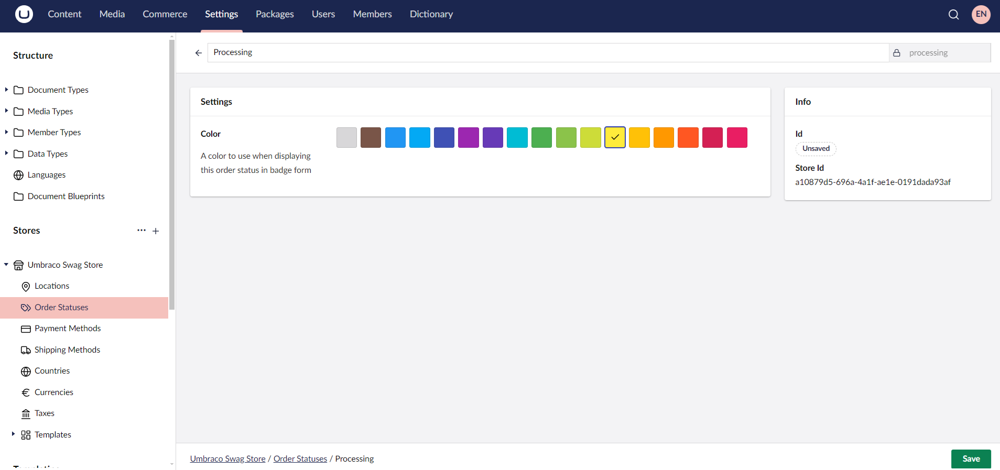
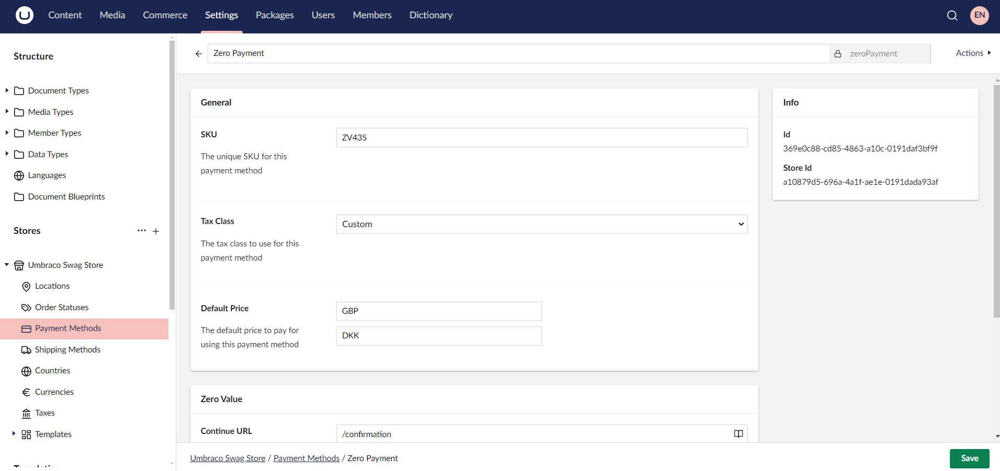
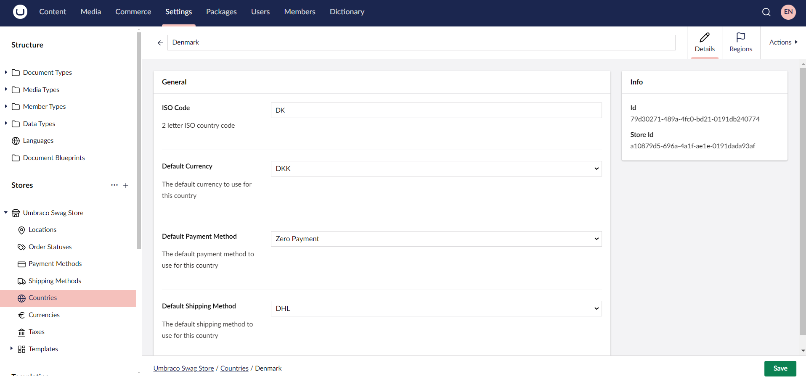
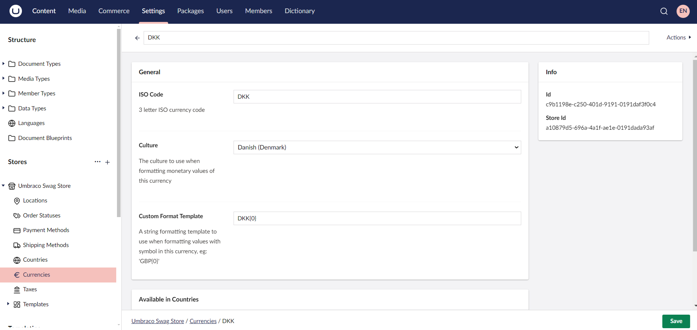

# Getting started with Umbraco Commerce: The Backoffice

This tutorial focuses exclusively on setting up Umbraco Commerce, introducing key concepts, and the configuration process in the Backoffice. It has been tested on the latest releases of **Umbraco CMS version 14** and **Umbraco Commerce version 14**.


This tutorial does not provide instructions for building a complete eCommerce website. It focuses solely on the setup through the Umbraco Backoffice.


## Introduction

Umbraco Commerce is an eCommerce platform that integrates seamlessly with Umbraco CMS. It provides features such as product management, order processing, and payment integrations. This guide will walk you through the setup of Umbraco Commerce so you can hit the ground running.

## Prerequisites

To follow this tutorial, you'll need the following:

* Visual Studio Code or your preferred IDE
* SQL Database (LocalDB or any SQL server)
* [Umraco CMS Requirements](../../umbraco-cms/fundamentals/setup/requirements.md)
* [Umbraco CMS Installation Guide](../../umbraco-cms/fundamentals/setup/install/README.md)
* [Umbraco Commerce package](../getting-started/install.md)

## Setting Up an Umbraco Project

To set up your Umbraco project, see the [Installation](../../umbraco-cms/fundamentals/setup/install/README.md) article.

## Installing Umbraco Commerce

Once your Umbraco site is up and running, you can install the [Umbraco Commerce package](../getting-started/install.md).


If you installed Umbraco CMS using an SQLite database, you may encounter errors after installing Umbraco Commerce. To resolve these, follow the instructions in the [Configure SQLite support](../how-to-guides/configure-sqlite-support.md) article.


## Configuring Umbraco Commerce

To access the **Commerce** section, additional configuration is needed. For detailed steps, see the [Configuration](../getting-started/umbraco-configuration.md) article.

## Accessing the Umbraco Backoffice

You can access the backoffice by adding `/umbraco` at the end of your website URL. For example: `https://mywebsite.com/umbraco`.

## Setting Up a Store

A store is an online platform where products or services are listed for customers to browse, purchase, and complete transactions over the internet.

Setting up a store allows you to manage both the content and commerce aspects of your site. It allows you to create a custom and scalable online shopping experience. For more information, see the [Stores](../reference/stores/README.md) article.

To set up a store:

1. Navigate to the **Settings** section.
2. Click **+** next to **Stores**.
3. Enter a **Name** for the Store (For example: *Umbraco Swag Store*).

4. Click **Create**.
5. Click **Save**.

### Setting up a Location

If your business operates in multiple regions, setting up locations helps:

* Configure stores for different locations with their own language, shipping addresses, regional offers, local regulations, and payment gateways.
* Ship products from different locations. The system can be set up to route orders to the nearest warehouse based on the customer’s location.

To set up a location:

1. Select your store from the **Stores** menu in the **Settings** section. In this case, *Umbraco Swag Store*.
2. Go to **Locations** under the Store.
3. Click **Create Location**.
4. Enter the **Name** for the Location. For example: *Denmark*
5. Provide the necessary address details.

6. Click **Save**.

### Setting up Order Status

Order status tracks the progression of an order. It helps both the store owner and customers track the progress of the order from the moment it is placed until itis delivered (or returned).

When you first set up Umbraco Commerce, it comes with predefined order statuses to help manage the order lifecycle. These statuses include New, Completed, Cancelled, and Error. These statuses can be customized based on your specific business requirements.

To create an order status:

1. Go to **Order Statuses** under the Store.
2. Click **Create Order Status**.
3. Enter a **Name** for the order status. For Example: *Processing*
4. Select a **Color** for the order status.

5. Click **Save**.

### Setting up Payment Methods

Payment Methods define the payment options available in the store. By default, Umbraco Commerce includes basic providers like **Invoicing** and **Zero Value** to get started.

Umbraco Commerce also supports the integration of different third-party payment gateways. For more information, see the [Umbraco Commerce Payment Providers Documentation](../../../commerce-add-ons/payment-providers/README.md).

To set up a payment method:

1. Go to **Payment Methods** under the Store.
2. Click **Create Payment Method**.
3. Select a payment provider from the list. For example: *Zero Value*.
4. Enter a **Name** for the payment method. For example: *Zero Payment*.
5. Configure the payment method as per your requirements.

6. Click **Save**.

### Setting up Shipping Methods

Shipping methods determine how customers receive their orders. Setting up shipping methods effectively is crucial, as it impacts customer satisfaction, fulfillment costs, and overall operational efficiency.

By default, Umbraco Commerce comes with the basic Pickup option. For more information on the integration for different providers, see the [Umbraco Commerce Shipping providers Documentation](../../../commerce-add-ons/shipping-providers/README.md).

To create a shipping method:

1. Go to **Shipping Methods** under the Store.
2. Click **Create Shipping Method**.
3. Choose the shipping provider from the list. For Example: *DHL*.
4. Enter a **Name** for the shipping method. For example: *DHL*.
5. Configure the shipping method as per your requirements.

6. Click **Save**.

### Setting up a Country

Setting up a country involves configuring settings related to shipping, payment methods, tax rates, localization, legal compliance requirements, and so on for that specific country.

To set up a country:

1. Go to **Countries** under the Store.
2. Click **Create Country**.
3. Choose an item from the list. For Example: *Create Country from ISO 3166 preset*.
4. Select a country from the list. For example: *Denmark*.
5. Configure the country details as per your requirements.

6. Click **Save**.

### Setting up a Currency

Setting up currency is essential for ensuring that prices are displayed and transactions are processed accurately. For information on configuring an exchange rate service, see the [Currency Exchange Rate Service Provider](../key-concepts/currency-exchange-rate-service-providers.md) article.

To set up a currency:

1. Go to **Currencies** under the Store.
2. Click **Create Currency**.
3. Enter a **Name** for the currency. For Example: *DKK*.
4. Configure the currency details as per your requirements.

5. Click **Save**.

### Setting up Taxes

Tax setup is crucial for compliance with local regulations and for ensuring that your pricing is accurate and transparent. You can set up tax rates for each jurisdiction where you need to collect tax. For more information, see the [Tax Sources](../key-concepts/tax-sources.md) article.

To set up taxes:

1. Go to **Taxes** under the Store.
2. Click **Create Tax Class**.
3. Enter a **Name** for the tax class. For Example: *Custom*.
4. Configure the tax rates as per your requirements.

5. Click **Save**.

### Setting up Templates

Defines the different **Email**, **Print**, and **Export** templates available for the store. These templates help maintain consistency and professionalism in communication with customers and facilitate data handling.

To create an Email Template:

1. Expand the **Templates** folder under the Store.
2. Go to **Email Templates**.
3. Click **Create Email Template**.
4. Enter a **Name** for the Email template. For Example: *Shipping Notification*.
5. Configure the email details as per your requirements.

6. Click **Save**.

Similarly, you can create custom **Print** and **Export** Templates.

## Configuring the Store Settings

You can customize your Store's currencies, countries, locations, shipping, tax calculations, and so on. Additionally, you can set Notification, Order, Product, and Gift Card Settings. For detailed settings, see the [Stores](../reference/stores/README.md) article.

## Built-in Property Editors

Umbraco Commerce includes default property editors that help manage and configure eCommerce functionalities within the Umbraco backoffice.

The available property editors include:

* **Price:** Used to manage and define product pricing.
* **Store Picker:** Allows selection of a specific store for products or configurations.
* **Store Entity Picker:** Used for selecting entities like products or categories within a store.
* **Stock:** Helps manage stock levels for products.
* **Measurements:** Allows the configuration of product dimensions and weight.
* **Variants Editor:** Used for managing product variants, such as sizes or colors.

## Accessing Store Permissions in Umbraco Commerce

When editing a store in Umbraco Commerce, the **Permissions** tab allows you to control who can access the store's management interface. This ensures that only authorized individuals or user groups can make changes or view store data.

The Permissions tab contain the following options:

* **User Groups:** You can assign permissions to entire user groups. A toggle is provided to either allow or deny access to specific user groups. This is useful for assigning store management roles to groups like "Store Managers" or "Editors" without setting permissions for individual users.

* **Users:** In addition to groups, you can assign permissions to individual users. This feature lets you grant or deny store access to specific individuals based on their role in the organization. Like the user group settings, toggle allows you to control what each user can access.


If both a user group and an individual user have conflicting permissions, the "Allow" control will always take priority. For example: "Deny" at the group level and "Allow" at the user level. This ensures that users explicitly granted access will not be denied by group-level settings.


## Conclusion

We have now covered the essential steps to set up Umbraco Commerce - from installation to store configuration.

Umbraco Commerce provides a flexible solution for creating and managing eCommerce websites directly within Umbraco CMS. While this tutorial helps you get started, feel free to explore advanced configurations to extend your store's functionality based on your business needs.
