# Creating a Form - The Basics

In this article, we'll take a look at the basic steps of creating a Form and adding the Form to your Umbraco site.

## Accessing the Forms Section

You can manage the Forms in the **Forms** section of the Umbraco backoffice. You need to have access to the section in order to see it.

If you do not see the **Forms** section, you might need to request access from the site Administrator. An Administrator can give permission to view the **Forms** section. This is done from the **Users** section of the backoffice.

## Creating a Form

To create a Form, follow these steps:

1. Navigate to the **Forms** section.
2. Click **...** next to the Forms folder.

    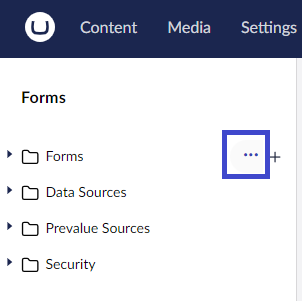
3. Select **Create** > **New Form**.

    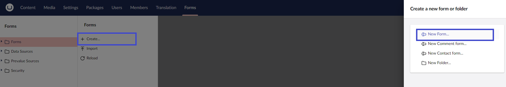
4. The Form Designer opens in the editor.

    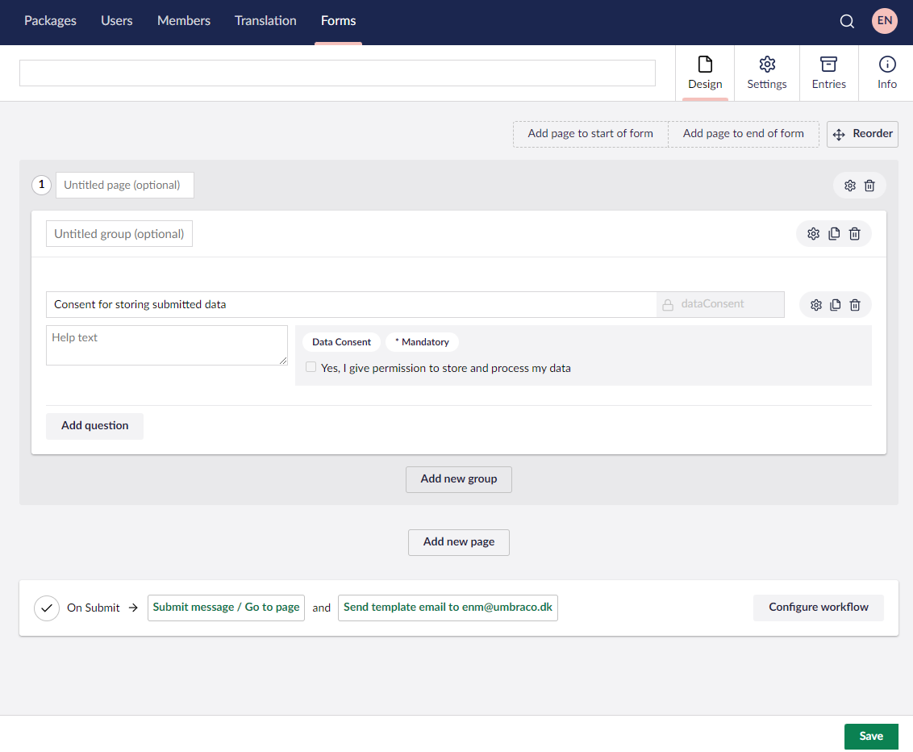
5. By default, there is a page, a fieldset, and a container available. The rest of the Form has to be added using the interface.
6. Enter a **Name** for the Form. Let's call it _Our first form_.

    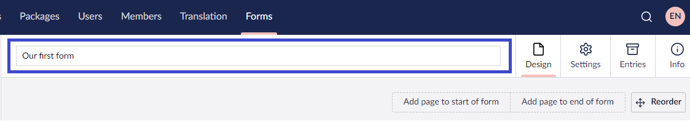
7. *[Optional]* Enter the **Page Name**. We'll call it _The first page_. Click **Add new page** at the bottom of the Forms designer to add more pages.

    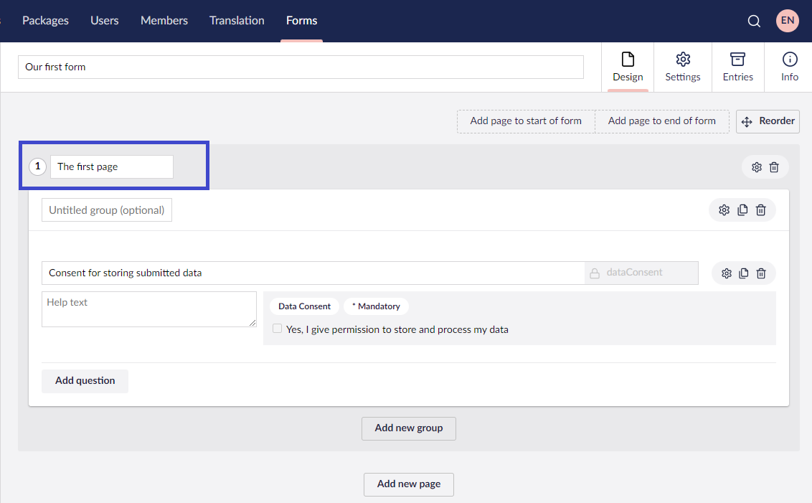
8. *[Optional]* Enter the **Group Name**. Click **Add new group** to add another group.

    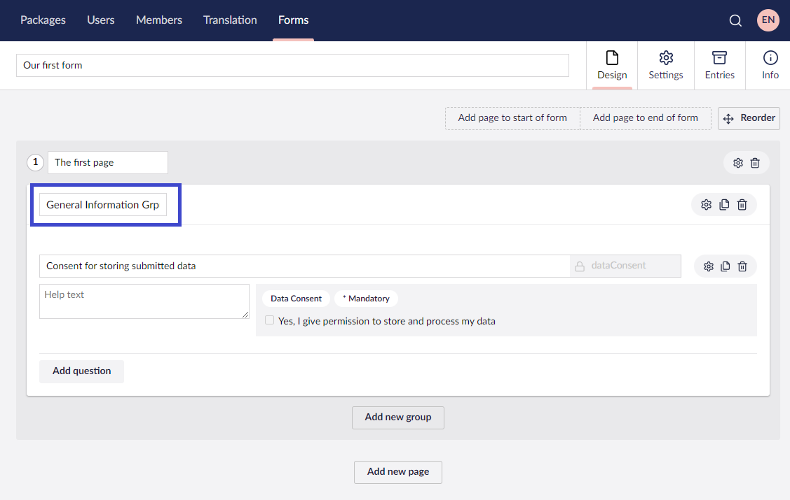
9. Click the **Add Question** button to add a new field.

    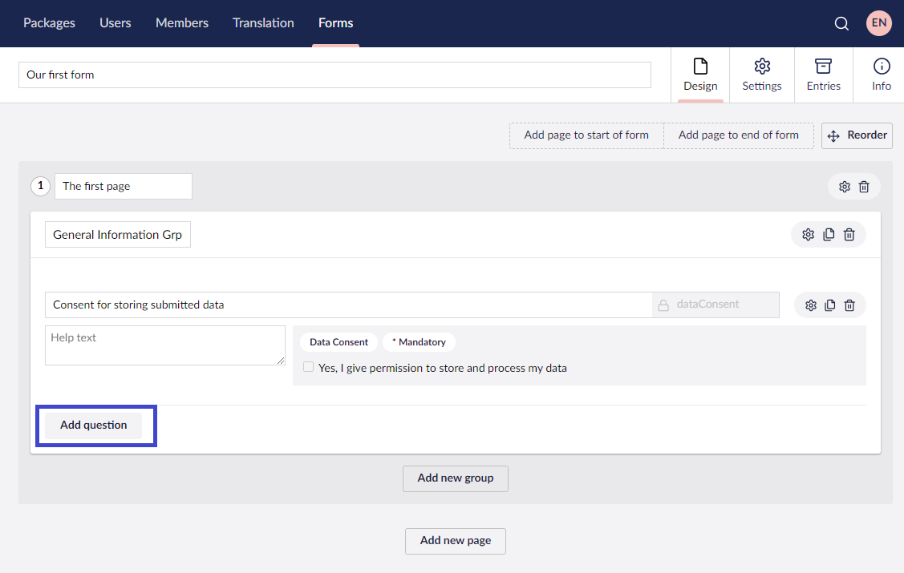
10. The **Choose field type** dialog opens.

    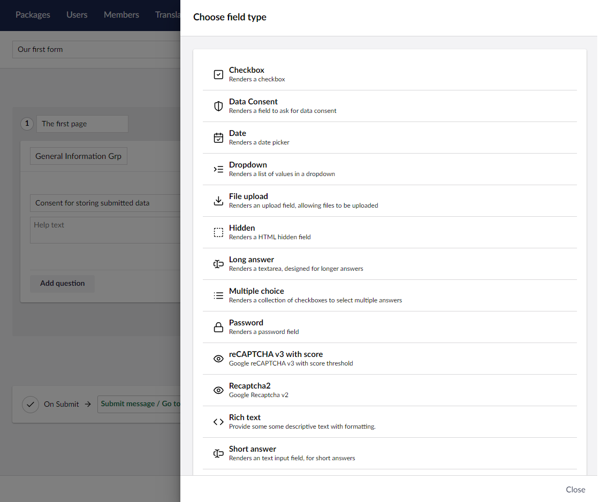
11. Select **Short Answer**. Enter the following details in the **Edit field** window:

    | Field Name         | Value                |
    | ------------------ | -------------------- |
    | Enter question     | Name                 |
    | Enter help text    | Enter your name here |
12. In the **Sensitive data** field, choose if the field stores sensitive data. Once selected, the data from this field will be prevented from being downloaded and viewed by users who do not have permission to do so. Only members of the sensitive data user group will see this option of downloading.
13. Enter a **Default Value** for the field.
14. Add a **Placeholder** to make it easier for the user to fill in the Form.
15. Select if the field is **Mandatory** and customize the message.
16. Add a **Validation** to the field. There are some predefined validations available but it is possible to add your own custom validation as well.
17. Some form fields allow you to show or hide the label that's associated with the field when it is rendered within the form on the website. The default is always to show the field, but if you prefer to hide it, untick the **Show label** option.
18. Set **Conditions** for the field. For more information on Conditions, see the [Setting-up conditional logic on fields](conditional-logic.md) article.

    Some of the additional settings are dependent on which answer type was chosen. For example, since we selected _Short Answer_ as our answer type we got two additional settings (Default Value and Placeholder).
19. Once the configuration is completed, click **Submit**. You will see that the field has been added to the Form designer.

    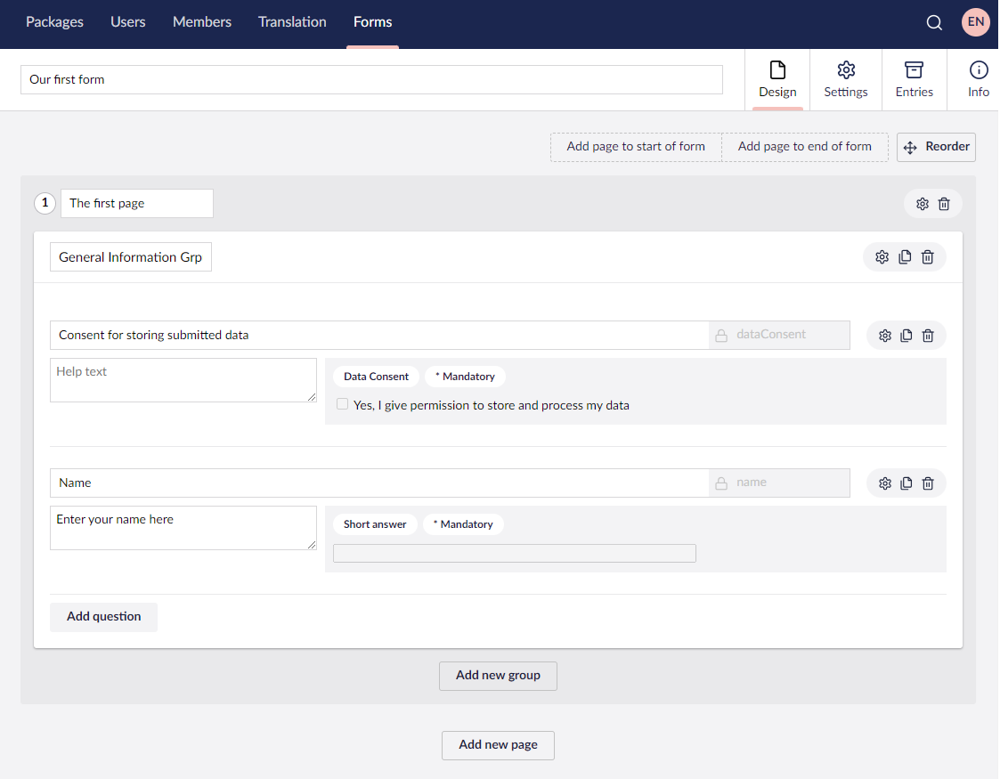

To edit a field, click the **cog** icon next to the field to open the dialog. To copy the field and its properties, click the **copy** icon. To delete a field or a group, click the **Recycle Bin** icon.

### Structuring the Form

#### Ordering Fields

Once you've added a few fields to your Form, you might want to change the order of questions. To do so, click **Reorder** in the top-right corner of the Form designer.

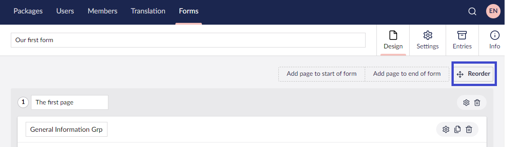

When reordering your Form, you can drag and drop the fields to make it look the way you want. Click **I am done reordering** to get back to the Form designer.

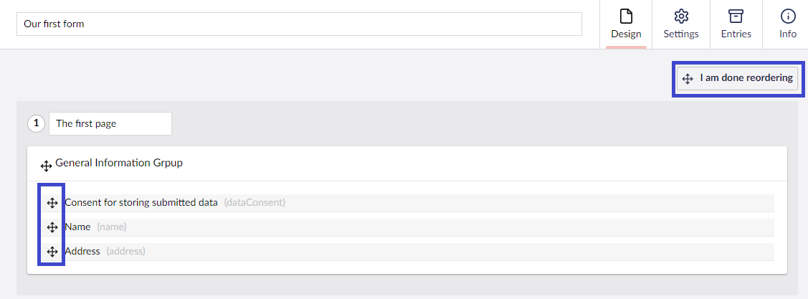

#### Form Pages

Forms can be grouped into pages. When rendered, each page will be presented one at a time to the user. They will need to complete the first page before moving onto the second and can navigate back and forth between pages.

To add a new page at the start or end of the form, use the buttons in the top right corner of the editing view.

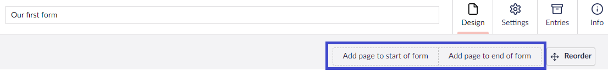

You can also add a new page directly to the bottom of the form via the **Add new page** button. This will appear below other pages when at least one exists.

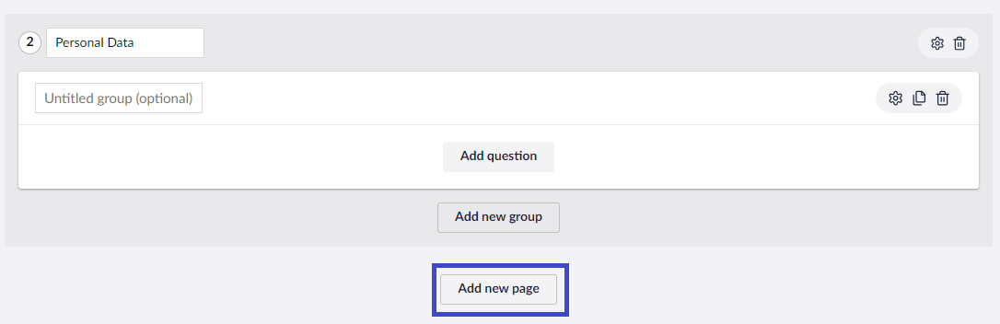

### Form Groups

With a page, form fields can be arranged into groups. These will display all together on a single page but can be styled so the fields are appropriately grouped in fieldsets.

New groups are added via the **Add new group** button.

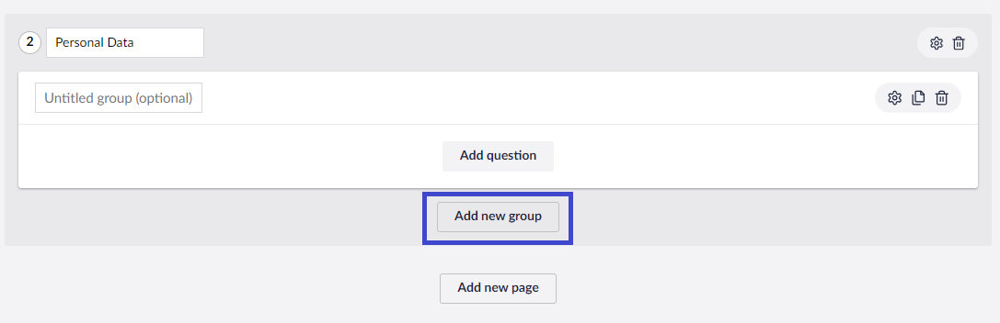

## Form Columns

The last level of structure are columns that can be created within a group. To set the number of columns, click the **cog** icon next to the Group Name.  You can now add or move fields to the new columns created.

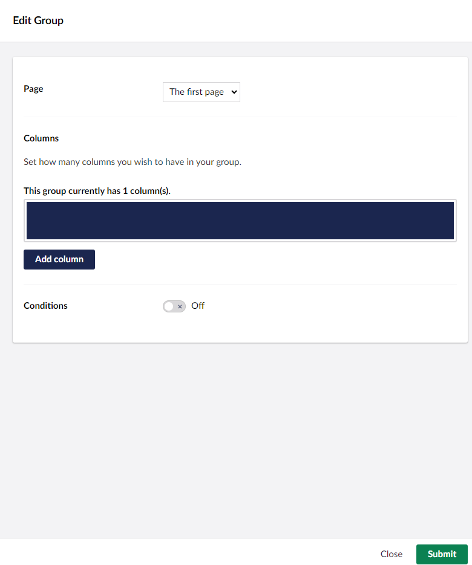

## Saving the Form

Once have created the Form, save the design by clicking the **Save** button.

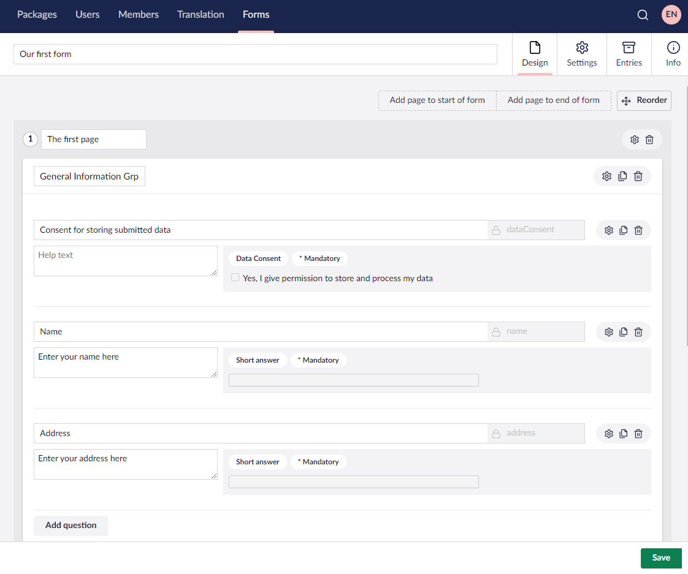

## Importing a Form

**Import Form Definition** allows you to import a form into your Umbraco site using a predefined JSON file. This file contains the form’s structure, fields, validations, workflows, and settings.

When you import a form definition, Umbraco uses the JSON structure to recreate the form as it was defined, enabling you to:

- Reuse existing forms across multiple projects or environments.
- Migrate forms between development, testing, and production environments.
- Restore forms from backups or previously exported definitions.

Using the **Import Form Definition** option, you can manage your forms without having to recreate them.

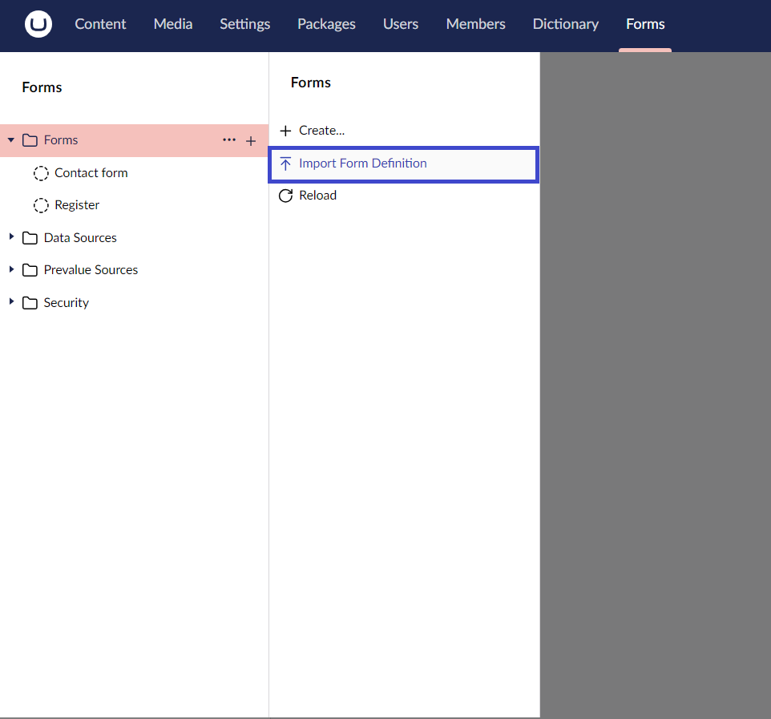

## Organizing Forms in Folders

If the product installation is set up to store form definitions in the database, you will be able to store forms within folders. This can help with organization and makes it easier to locate the forms for modification, especially if you plan to create many Forms.

To create a folder:

1. Go to the **Forms** section.
2. Click ... next to Forms folder.
3. Select **Create**.
4. Select **New Folder**.

    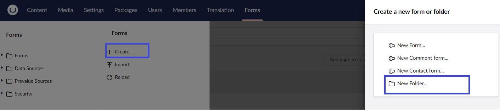
5. Enter a **Folder Name**.
6. Click **Create Folder**.

    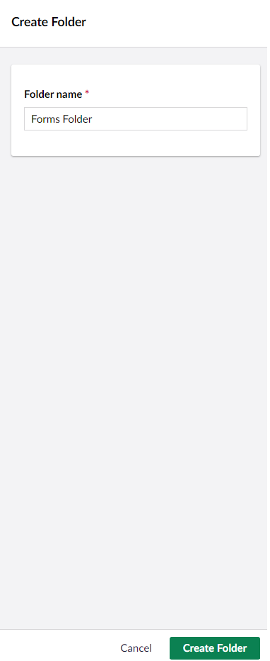

You can create folders within folders, rename, move, import folders, or delete them.

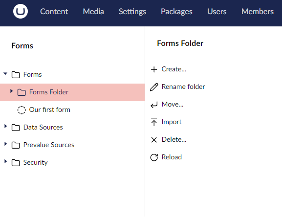

To move or copy forms into folders, click the **...** next to the Form and select **Move**.

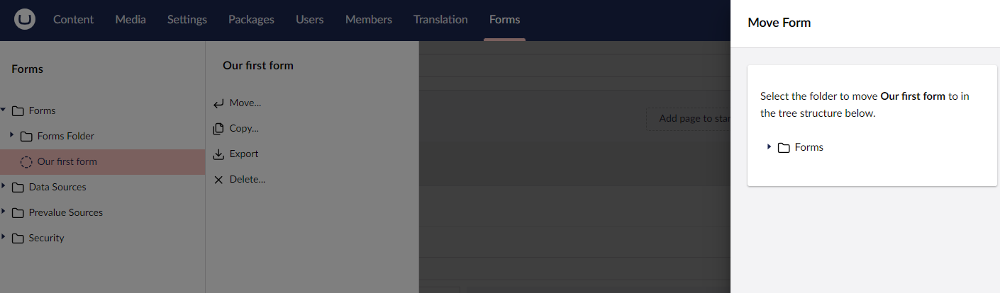

## Adding the Form to the Umbraco Site

To add the Form, follow these steps:

1. Navigate to the **Content** section of the Umbraco Backoffice.
2. Select the content page where you want to insert the Form. The page you choose should have a form picker which you can add in the **Settings** section under **Document Types**.

    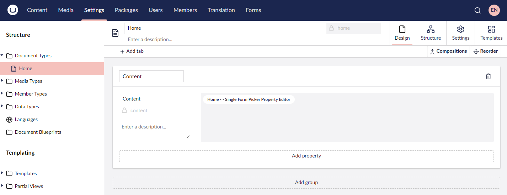
3. Click **Choose** and select the Form you want to insert. You will be able to select from the full list of forms. If available on your installation, you will also be able to select using a folder based view, which can be quicker to navigate when many forms have been prepared.

    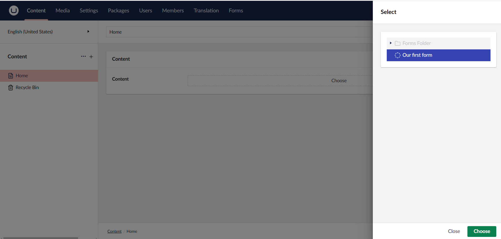
4. Click **Choose**.
5. The Form is inserted on your page. Click **Save and publish**.

    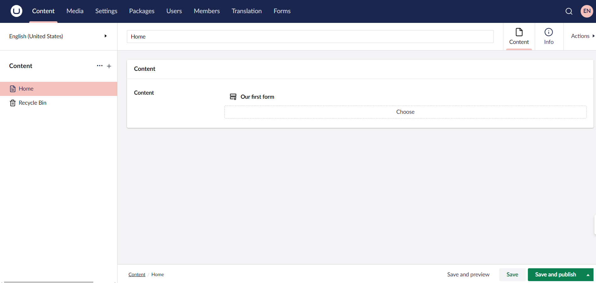
