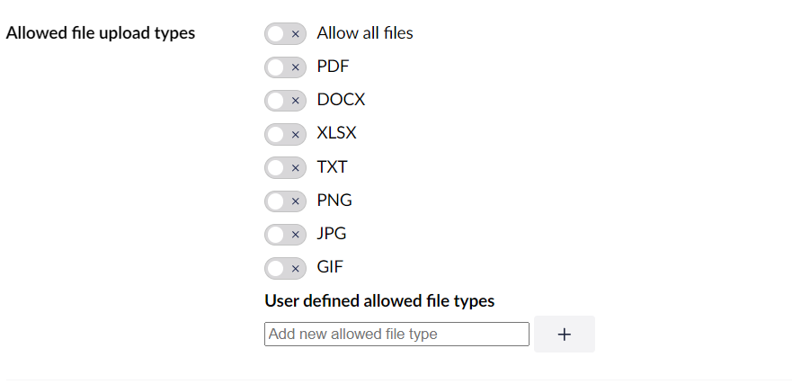

# File upload

The File Upload field allows the users to upload a file along with the Form on your website.

In this article, you will find details about the configuration options you have for the File Upload field.

## Predefined allowed File Types

You can choose to specify which files you want to allow the user to upload, when accessing the Form.

To allow only specific files:

1. Select the specific File Types the user should be able to upload.
2. Click **Submit**.


We recommend selecting only specified files, to limit malicious code to be uploaded, whenever the user is submitting the Form.


## User Defined Allowed File Types

If the list of predefined file types does not include a specific file type, you can add additional ones.

To add new file type:

1. Type a file extension name in the **User defined allowed file types** field.
2. Click **+**.
3. Click **Submit**.

## Server-side file validation

The file upload field type will verify the file contents using the registered set of `IFileStreamSecurityValidator` instances.

To read more about this feature, see [Server-side file validation](https://docs.umbraco.com/umbraco-cms/v/10.latest-lts/reference/security/serverside-file-validation) in the CMS documentation.
