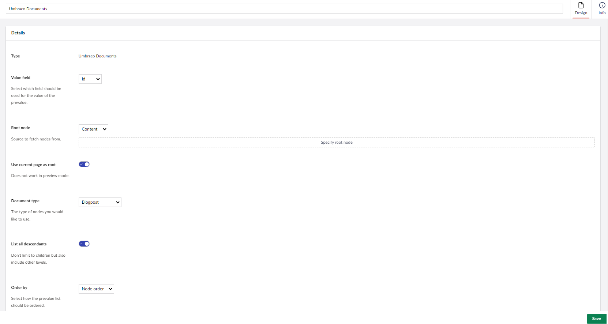
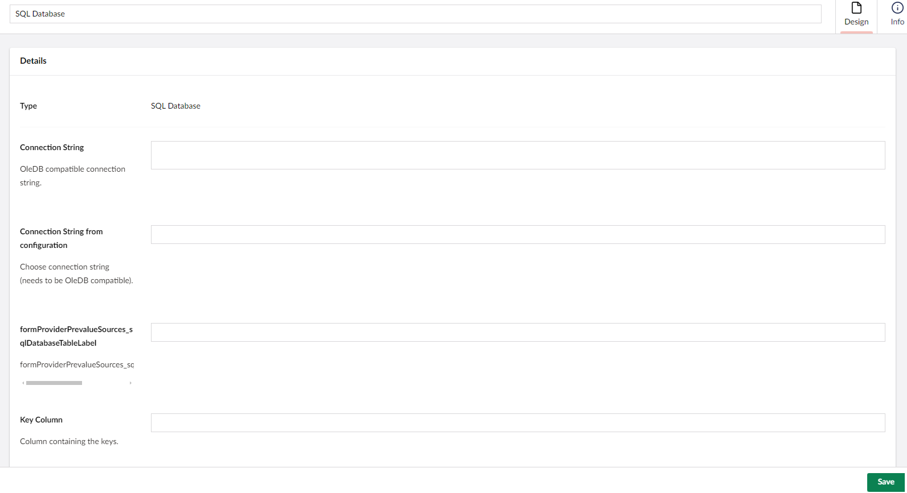
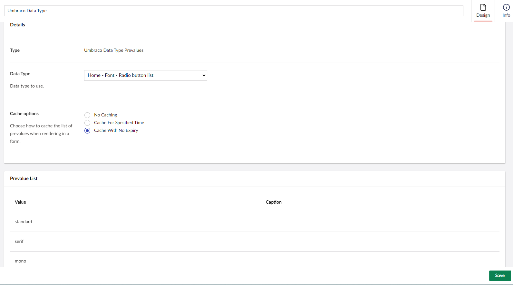

# Prevalue Source Types Overview

There are some default prevalue source types that can be used. In this article, we will give a quick overview of them:

## Get values from textfile

Upload a textfile that contains the prevalues. Each prevalue should have its own line in the file. Once the file has been uploaded, you can find it in `~/wwwroot/App_Data/UmbracoForms/Data/PreValueTextFiles/{GUID}` where the `{GUID}`is replaced with the pre-value ID.

## Umbraco Documents

Allows to use content nodes from a specific source as prevalues. You can apply the following settings in the **Details** section:

* Select which **Value field** should be used for the value of the prevalue.
* You can define the root node by either
  * Choosing a node directly from the Content tree or
  * Using XPath
* Enable **Use current page as root** instead of choosing a specific root node. _The preview is not available when this setting is enabled._
* Select a specific **Document type**, if the selected root node contains a different Document Type.
* Enable **List all Descendants** of the selected root node to list all levels of descendants.
* Select **Order by** from the drop-down list to display how the prevalue list should be ordered.
* Select your preferred **Cache option** for caching the list of prevalues when rendering in a form.

## SQL Database

You can provide the following details in the **Details** section:

Connect to a OleDB compatible database table and construct a prevalue source from it. Once selected, it will be editable from the Forms interface.

The following configurations need to be set in the **Details** section:

* Connection string (either choose one from your web.config or add another from a textfield).
* Connection String from configuration
* Table Name
* Key Column
* Value Column
* Caption Column
* Select your preferred **Cache option** for caching the list of prevalues when rendering in a form.

## Umbraco Data Type Prevalues

Choose an Umbraco Data Type to use its configured prevalue collection.

In the example below, the prevalue collection from a Data Type called `Home - Font - Radio button` is used:

