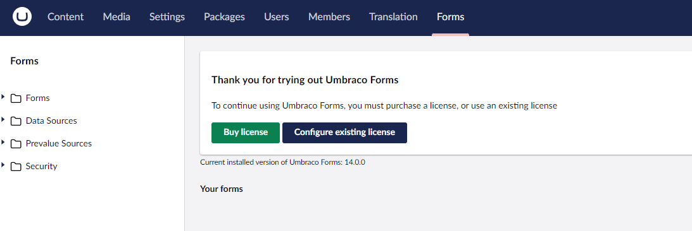

# Installing Umbraco Forms

Umbraco contains the **Forms** section, by default. You will see a similar interface, when you click on the **Forms** section in the **Umbraco Backoffice**.


## Video Tutorial



To install the Umbraco Forms package (**Umbraco.Forms**), follow these steps:

1.  Identify the Umbraco CMS version your project is running.
2.  Find a compatible version of Umbraco Forms that matches your Umbraco CMS version. A list of Umbraco Forms versions can be found on [nuget.org](https://www.nuget.org/packages/Umbraco.Forms#versions-body-tab).
3.  Run the following command on a command prompt of your choice, replacing `<version_number>` with the appropriate version identified above:

    ```cs
    dotnet add package Umbraco.Forms --version <version_number>
    ```
4.  Restart the web application using the following command:

    ```cs
     dotnet run
    ```

## Start Building Forms

Once the installation is successful, you will see a similar screen in the **Forms** section:



## Using Forms

For details on using Forms, see the [Editor Documentation](../editor/creating-a-form/README.md).
