# Creating a Multi-Page Form

In this tutorial, you will learn how to create a multi-page form using Umbraco Forms. Multi-page forms are particularly useful when you need to collect detailed information from users in a structured and user-friendly way.

Multi-page forms are ideal for use cases such as event registration, job applications, booking a meeting, and so on.

## Log in to the Umbraco Backoffice

1. Log in to the Umbraco backoffice.
2. Go to the **Forms** section.

## Create a New Form

1. Click **+** next to the Forms folder.
2. Select **New Form**.

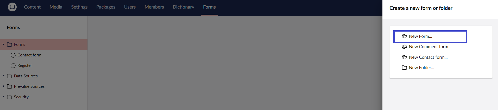
3. Enter a **Name** for the form. For example: *Book a Meeting*.
4. Click **Save**.

## Set up the First Page of the Form

Let us begin by adding some fields to the first page of the form. By default, the **Data Consent** field is already available, and we will call this group **Data Consent**.

To create a new group for personal information:

1. Click **Add new group**.
2. **Enter the Name** of the group. For example: *Personal Information*.
3. Click **Add question**.
4. Select **Short answer** as the field type.
5. **Enter a Name** for the field type. For example, *First Name*.
6. Select **Text** as the **Field Type** from the drop-down list.
7. Mark the field as **Mandatory**.
8. Click **Submit**.
9. Click **Save**.

Similarly, you can also add other relevant fields such as last name or email based on your requirements.

For this tutorial, the following fields are added with the respective specifications:

| Field Name    | Data Type    | Field Type |
|---------------|--------------|------------|
| Surname       | Short answer | text       |
| Age           | Short answer | number     |
| Country       | Short answer | text       |
| Phone number  | Short answer | tel        |
| Email address | Short answer | email      |

If you wish to reorder your fields, click **Reorder**.

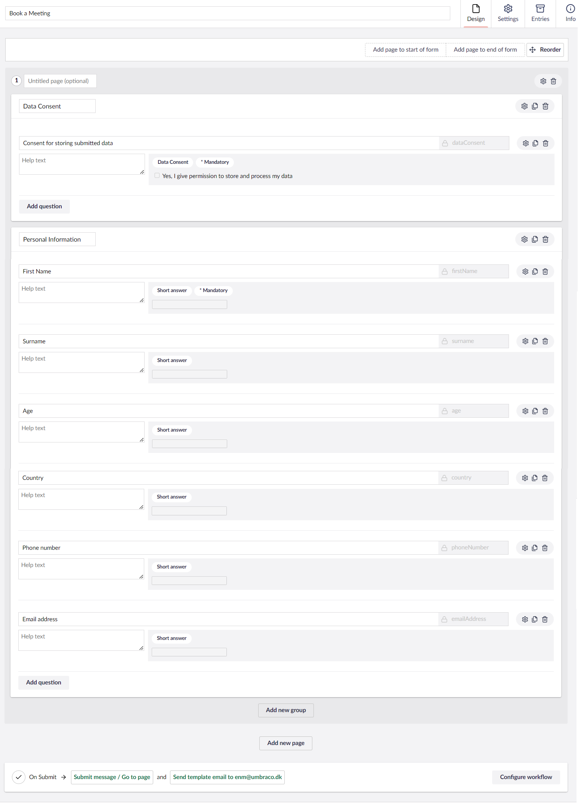

## Create the Second Page

To create a multi-page form, you need to add more pages:

1. Click **Add new page** to create the second page of your form.
2. **Enter a Name** for this page. For example: *Company Information*.
3. Click **Add question**.
4. Select **Short answer** as the field type.
5. **Enter a Name** for the field type. For example, *Company Name*.
6. Provide a **Default Value**. For example, *Enter the name of your company*.
7. Click **Submit**.
8. Click **Save**.

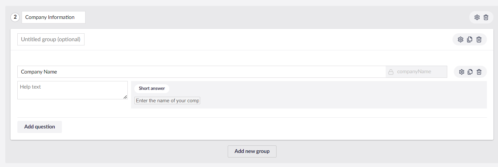

Similarly, you can also add other relevant fields based on your requirements.

### Add Conditional Logic

Umbraco Forms allows you to customize the flow of your multi-page form. You can add conditional logic to control which questions appear based on user inputs.

To add conditions, follow these steps:

1. Click **Add question**.
2. Select **Single choice** as the field type.
3. **Enter a Name** for the field type. For example, *Do you work with Umbraco*.
4. Enter the **Value** and **Caption** in the **Options** field.

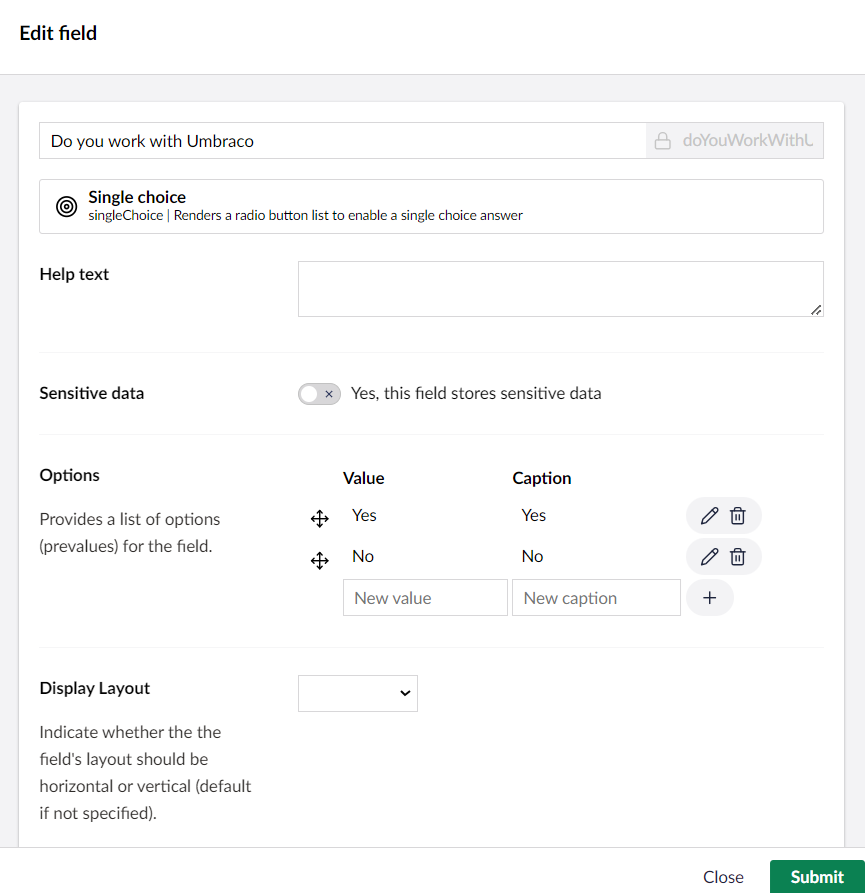

5. Mark the field as **Mandatory**.
6. Click **Submit**.
7. Click **Save**.
8. Repeat steps 1-4 to create a conditional question titled *If yes, how many years?*

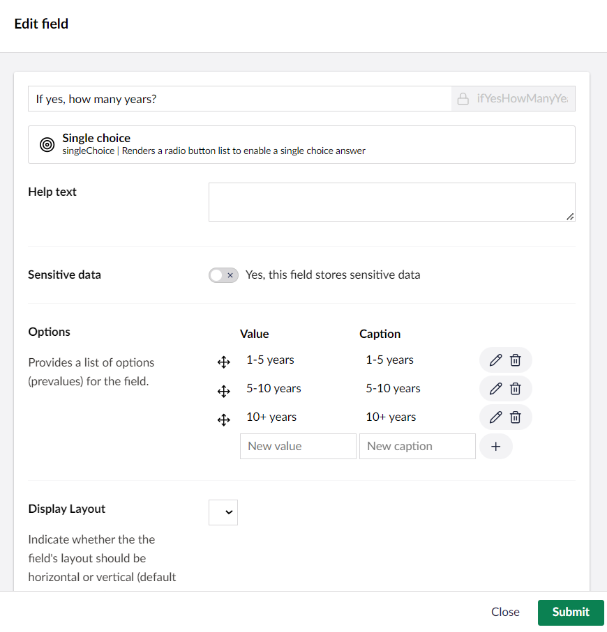

9. Enable **Conditions**.
10. Set the parameters for the condition as follows:

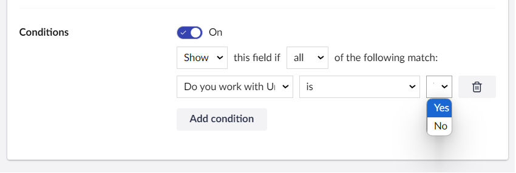

11. Click **Submit**.
12. Click **Save**.

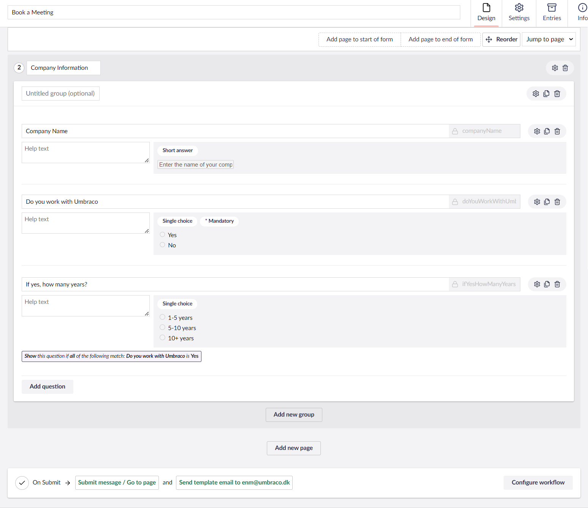

## Create the Final Page

1. Click **Add new page** to create the final page of your form.
2. **Enter a Name** for this page. For example: *Products*.
3. Click **Add question**.
4. Select **Multiple choice** as the field type.
5. **Enter a Name** for the field type. For example, *Select the products you are interested in*.
6. Enter the **Value** and **Caption** in the **Options** field.

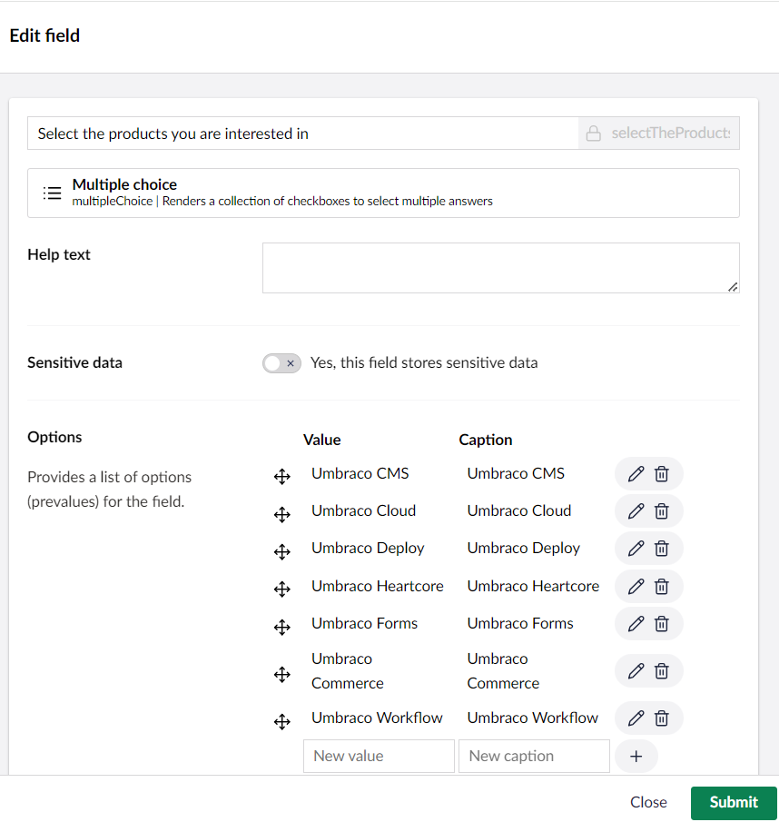

7. Click **Submit**.
8. Click **Save**.

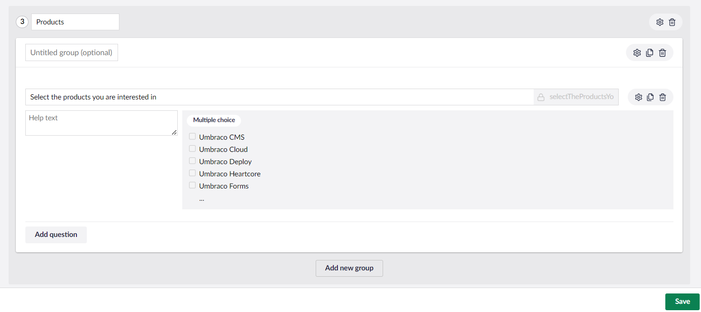

## Embed the Form on a Web Page

Once you are satisfied with your multi-page form, it is time to embed it on your website.

To display the form on the website, follow these steps:

1. Navigate to the **Content** section of Umbraco.
2. Click **+** next to the parent page of the website.
3. **Enter a Name** for the page. For example, *Book a Meeting!*
4. Select the **Book a Meeting** form using the *Form Picker*.
5. Click **Save and Publish**.

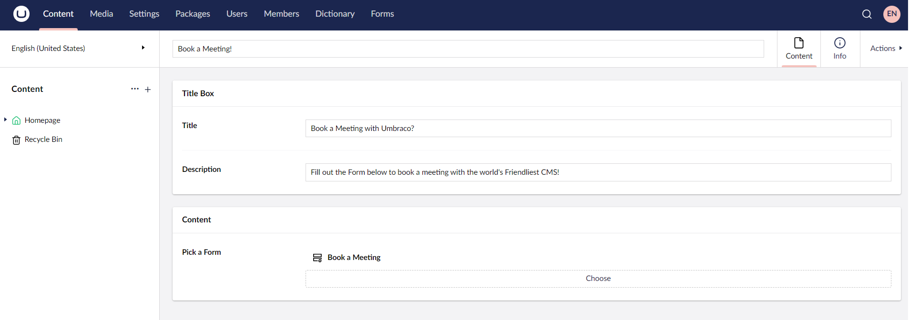

## Customize Form Settings

If you wish to customize the Form Swttings, see the [Form Settings](../editor/creating-a-form/form-settings.md) article.

## Rendering the Form on the Frontend

To render the Form on the frontend, use the following code in your template:

```cs
@await Component.InvokeAsync("RenderForm", new { formId = Guid.Parse("<form guid>"), theme = "default", includeScripts = false })
```

For more information, see the [Rendering Forms](../developer/rendering-forms.md) article.


For Umbraco Forms to work correctly, you need to include some client dependencies. For more information, see the [Preparing Your Frontend](https://docs.umbraco.com/umbraco-forms/developer/prepping-frontend) article.


## Testing the Form

1. Go to the **Info** tab of the *Book a Meeting!* page.
2. Click on the Published link in the **Links** section.
3. Fill out the form to see how it functions.
4. Submit the form to ensure it redirects to a Thank You page.
5. Go to the **Forms** section in the Backoffice.
6. Navigate to the **Book a Meeting** Form.
7. Click on the **Entries** tab and verify that the data is captured.

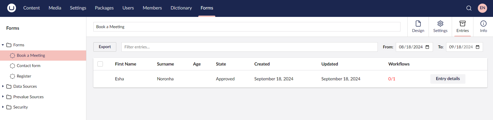

You have successfully created a multi-page form with conditional logic in Umbraco Forms. By using multi-page forms, you have made complex data entry much simpler and more user-friendly. This not only improves the experience for your users but also makes your forms more efficient and manageable.
