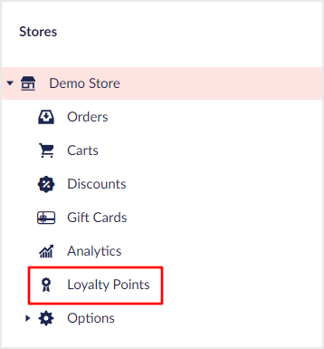

# Virtual SubTrees


This page is a work in progress and may undergo further revisions, updates, or amendments. The information contained herein is subject to change without notice.


Virtual subtrees are a powerful feature that allows you to inject an Umbraco UI Builder tree structure into another Umbraco tree at a desired location. Thus acting as child nodes to the node chosen as the injection point. With virtual subtrees it allows you to extend built in or even 3rd party package trees with additional features. An example could be developing a "loyalty point" program for your e-commerce site and injecting the related database tables into a Vendr store tree. This allows the management of the program in its most logical location.



## Defining virtual SubTrees

You define a virtual subtree by calling one of the `AddVirtualSubTree` methods of a [`WithTreeConfigBuilder`](../areas/trees.md#extending-an-existing-tree) instance.

### **AddVirtualSubTree(string sectionAlias, string treeAlias, Lambda visibilityExpression, Lambda virtualSubTreeConfig = null) : VirtualSubTreeConfigBuilder**

Adds a virtual subtree to the current tree with its visibility controlled via the visibility expression.

````csharp
// Example
withTreeConfig.AddVirtualSubTree(ctx => ctx.Source.Id == 1056, contextAppConfig => {
    ...
});
````

### **AddVirtualSubTreeBefore(string sectionAlias, string treeAlias, Lambda visibilityExpression, Lambda matchExpression, Lambda virtualSubTreeConfig = null) : VirtualSubTreeConfigBuilder**

Adds a virtual subtree to the current tree, **before** the tree node matches the match expression, with its visibility controlled via the visibility expression.

````csharp
// Example
withTreeConfig.AddVirtualSubTreeBefore(ctx => ctx.Source.Id == 1056, treeNode => treeNode.Name == "Settings", contextAppConfig => {
    ...
});
````

### **AddVirtualSubTreeAfter(string sectionAlias, string treeAlias, Lambda visibilityExpression, Lambda matchExpression, Lambda virtualSubTreeConfig = null) : VirtualSubTreeConfigBuilder**

Adds a virtual subtree to the current tree, **after** the tree node matches the match expression, with its visibility controlled via the visibility expression.

````csharp
// Example
withTreeConfig.AddVirtualSubTreeAfter(ctx => ctx.Source.Id == 1056, treeNode => treeNode.Name == "Settings", contextAppConfig => {
    ...
});
````

## Controlling where to inject the Virtual SubTrees

Controlling where a virtual subtree is injected is done via the visibility expression passed to one of the `AddVirtualSubTree` methods on the root `UIBuilderConfigBuilder` instance. Without a visibility expression, Umbraco UI Builder would inject the virtual subtree under every node in the given tree. This expression can be used to identify the exact location where our tree should go.

To help with this, the visibility expression is passed a single `VirtualSubTreeFilterContext` argument with relevant contextual information. This information is about the current node being rendered, alongside a list of the current user's user groups for permission-based visibility control. It also includes access to an `IServiceProvider` in case you need to resolve a service to determine the correct node to inject below.

````csharp
public class VirtualSubTreeFilterContext
{
    public NodeContext Source { get; }
    public IEnumerable<IReadOnlyUserGroup> UserGroups { get; }
    public IServiceProvider ServiceProvider { get; }
}

public class NodeContext
{
    public string Id { get; }
    public string TreeAlias { get; }
    public string SectionAlias { get; }
    public FormCollection QueryString { get; }
}
````

Below you can find an example of a more complex filter expression where injection is based on the Document Type of a content node:

````csharp
withTreeConfig.AddVirtualSubTree(ctx =>
    {
        using var umbracoContextRef = ctx.ServiceProvider.GetRequiredService<IUmbracoContextFactory>().EnsureUmbracoContext();

        if (!int.TryParse(ctx.Source.Id, out int id))
            return false;

        return (umbracoContextRef.UmbracoContext.Content.GetById(id)?.ContentType.Alias ?? "") == "textPage";
    },
    virtualNodeConfig => virtualNodeConfig
        ...
);
````

## Controlling the position of the injected Virtual SubTrees

The position of a virtual subtree within the child nodes of the injection node is controlled by using one of the  `AddVirtualSubTreeBefore` or `AddVirtualSubTreeAfter` methods. These methods need to be on the root level `UIBuilderConfigBuilder` instance and pass a match expression used to identify the tree node to insert before/after. This expression is passed a single `TreeNode` argument to determine the position. It also requires a `boolean` return value to indicate the relevant location has been found.

````csharp
public class TreeNode
{
    public object Id { get; }
    public object ParentId { get; }
    public string Alias { get; }
    public string Name { get; }
    public string NodeType { get; }
    public string Path { get; }
    public string RoutePath { get; }
    public IDictionary<string, object> AdditionalData { get; }
    ...
}
````

Below you can find an example of positioning a subtree after a node with the alias "settings":

````csharp
treeNode => treeNode.alias == "settings"
````

## Configuring a Virtual SubTrees

Virtual subtrees share the same API as the `Tree` config builder API including support for folders and collections. There is an exception when adding collections to a subtree where you will have an additional foreign key expression parameter to define. The foreign key expression links the entities of the collection to the parent node of the subtree. For more information check the [Core Trees Documentation](../areas/trees.md).

## Injecting Virtual SubTrees into 3rd party trees

Out of the box, Umbraco UI Builder supports injecting subtrees into the core content, media, members, and member group trees. It also includes 3rd party support for [Umbraco Commerce](../../umbraco-commerce/README.md) settings and commerce trees. In order to support additional trees to inject into, you must implement an `ITreeHelper` which is used to extract the required information. The tree helper consists of a tree alias for which the tree helper is. It includes methods to correctly identify the full parent path, a unique ID for a given node ID, and to resolve the actual entity ID. The entity ID should be used for the foreign key collection values.

````csharp
public interface ITreeHelper
{
    string TreeAlias { get; }
    string GetUniqueId(string nodeId, FormCollection queryString);
    object GetEntityId(string uniqueId);
    string GetPath(string uniqueId);
}
````

Once you have defined a tree helper, you can register the DI container in your startup class.

````csharp
builder.Services.AddSingleton<ITreeHelper, MyCustomTreeHelper>();
````

Once registered any virtual subtrees registered against the given helpers tree alias will then use your tree helper to locate the required information.
