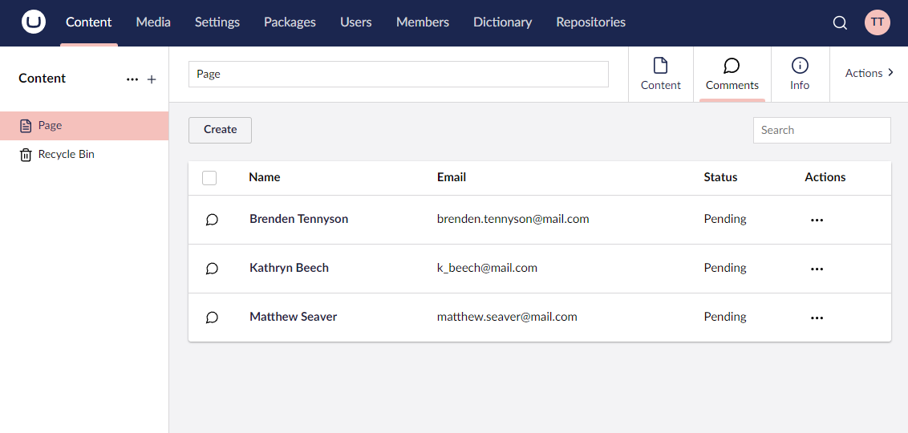

# Context Apps

Context Apps in Umbraco UI Builder are analogous to Content Apps in Umbraco. They allow you to provide contextual apps that appear in the editor UI of content. From Umbraco UI Builder's perspective, defining context apps allows you to expose collections as content apps. This is where a collection has a relation to the content in question. An example could be something like blog post comments which are linked to individual blog posts. Exposing these as a content app allows them to be managed in context next to the blog post they are linked to.



## Defining a context app

You can define a context app by calling one of the `AddContextApp` methods on a [`WithTreeConfigBuilder`](trees.md#extending-an-existing-tree) instance.

### **AddContextApp(string name, Lambda contextAppConfig = null) : ContextAppConfigBuilder**

Adds a context app with the given name and default icon.

```csharp
// Example
withTreeConfig.AddContextApp("Comments", contextAppConfig => {
    ...
});
```

### **AddContextApp(string name, string icon, Lambda contextAppConfig = null) : ContextAppConfigBuilder**

Adds a context app to the Umbraco menu with the given name and icon.

```csharp
// Example
withTreeConfig.AddContextApp("Comments", "icon-chat", contextAppConfig => {
    ...
});
```

### **AddContextAppBefore(string beforeAlias, string name, Lambda contextAppConfig = null) : ContextAppConfigBuilder**

Adds a context app with the given name and default icon **before** the context app with the given alias.

```csharp
// Example
withTreeConfig.AddContextAppBefore("umbContent", "Comments", contextAppConfig => {
    ...
});
```

### **AddContextAppBefore(string beforeAlias, string name, string icon, Lambda contextAppConfig = null) : ContextAppConfigBuilder**

Adds a context app to the Umbraco menu with the given name and icon **before** the context app with the given alias.

```csharp
// Example
withTreeConfig.AddContextAppBefore("umbContent", "Comments", "icon-chat", contextAppConfig => {
    ...
});
```

### **AddContextAppAfter(string afterAlias, string name, Lambda contextAppConfig = null) : ContextAppConfigBuilder**

Adds a context app with the given name and default icon **after** the context app with the given alias.

```csharp
// Example
withTreeConfig.AddContextAppAfter("umbContent", "Comments", contextAppConfig => {
    ...
});
```

### **AddContextAppAfter(string afterAlias, string name, string icon, Lambda contextAppConfig = null) : ContextAppConfigBuilder**

Adds a context app to the Umbraco menu with the given name and icon **after** the context app with the given alias.

```csharp
// Example
withTreeConfig.AddContextAppAfter("umbContent", "Comments", "icon-chat", contextAppConfig => {
    ...
});
```

## Changing a context app alias

### **SetAlias(string alias) : ContextAppConfigBuilder**

Sets the alias of the context app.

**Optional:** When adding a new context app, an alias is automatically generated from the supplied name for you. However, you can use the `SetAlias` method to override this if you need a specific alias.

```csharp
// Example
contextAppConfig.SetAlias("comments");
```

## Changing a context app icon color

### **SetIconColor(string color) : ContextAppConfigBuilder**

Sets the context app icon color to the given color.  Possible options are `black`, `green`, `yellow`, `orange`, `blue` or `red`.

````csharp
// Example
contextAppConfig.SetIconColor("blue");
````

## Changing when a context app should display

Changing when a context app is displayed, is controlled by a delegate method which is passed a `ContextAppVisibilityContext` instance. This method contains a `Source` property which holds a reference to the source object that the content app is being displayed on (i.e., an `IContent` instance). It also holds a reference to a `UserGroups` collection of the currently logged-in user's user groups. You can use any value from those to return a boolean result which sets whether to display the context app or not.

By default, Umbraco UI Builder will pre-filter context apps to only display on the tree it is defined in. This will be combined with the `SetVisibility` config to decide when to display the context app.

### **SetVisibility(Func&lt;ContextAppVisibilityContext, bool&gt; visibilityExpression) : ContextAppConfigBuilder**

Sets the context app visibility delegate.

````csharp
// Example
contextAppConfig.SetVisibility(appCtx => appCtx.Source is IContent content && content.ContentType.Alias == "blogPost");
````

## Adding a collection to a context app

Context apps can consist of one or more collections. If a context app contains multiple collections, the collection list views will be displayed in tabs within the context app.

### **AddCollection&lt;TEntityType&gt;(Lambda idFieldExpression, Lambda fkFieldExpression, string nameSingular, string namePlural, string description, Lambda collectionConfig = null) : ContextAppConfigBuilder**

Adds a collection to the current content app with the given names, descriptions and default icons. An ID property accessor expression is required so that Umbraco UI Builder knows which property is the ID property. A foreign key property accessor is also required so that the Umbraco UI Builder knows which property holds the Umbraco nodes UDI value. You can read more about this in the [Collections documentation](../collections/overview.md).

```csharp
// Example
contextAppConfig.AddCollection<Comment>(p => p.Id, p=> "Comment", "Comments", "A collection of comments", collectionConfig => {
    ...
});
```

### **AddCollection&lt;TEntityType&gt;(Lambda idFieldExpression, Lambda fkFieldExpression, string nameSingular, string namePlural, string description, string iconSingular, string iconPlural, Lambda collectionConfig = null) : ContextAppConfigBuilder**

Adds a collection to the current context app with the given names, description and icons. An ID property accessor expression is required so that Umbraco UI Builder knows which property is the ID property. A foreign key property accessor is also required so that Umbraco UI Builder knows which property holds the Umbraco nodes UDI value. You can read more about this in the [Collections documentation](../collections/overview.md).

```csharp
// Example
contextAppConfig.AddCollection<Comment>(p => p.Id, "Comment", "Comments", "A collection of comments", "icon-chat", "icon-chat", collectionConfig => {
    ...
});
```
