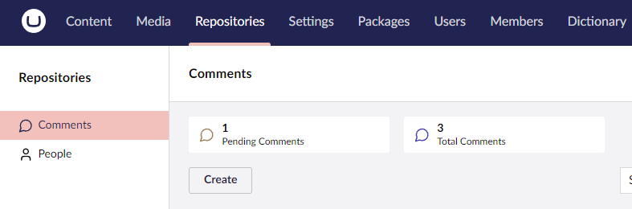

# Cards

Cards provide an API to display basic summary information in a card-based format and are useful for displaying key metrics about a collection.

Cards can be defined in one of two ways:


[Count Cards](count-cards.md)



[Custom Cards](custom-cards.md)

