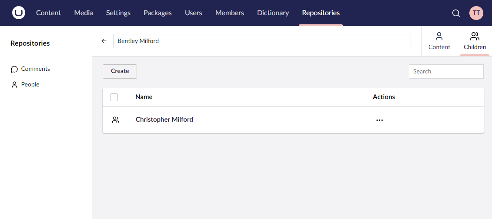

# Child Collections


This page is a work in progress and may undergo further revisions, updates, or amendments. The information contained herein is subject to change without notice.


A child collection is a container for a given data model that is tied to a parent collection data model. It shares all of the [Collections](the-basics.md) config builder API except child collections cannot contain further child collections.




**Child Collections UI:** By default, child collections will be presented in the UI as context apps in the parent models editor view. If you have multiple child collections that make the context apps area overpopulated, you can use the [Child Collection Groups API](child-collection-groups.md). By using this you can group child collections under a single context app with the inner child collections then being presented in tabs.


## Defining a child collection

You define a child collection by calling one of the `AddChildCollection` methods on a given collection config builder instance.

### **AddChildCollection&lt;TChildEntityType&gt;(Lambda idFieldExpression, Lambda fkFieldExpression, string nameSingular, string namePlural, string description, Lambda childCollectionConfig = null) : ChildCollectionConfigBuilder&lt;TEntityType&gt;**

Adds a child collection to the current collection with the given names and description and default icons. A property accessor expression is required for both the entity ID field and FK (Foreign Key) field of the entity.

```csharp
// Example
collectionConfig.AddChildCollection<Child>(c => c.Id, c => c.ParentId, "Child", "Children", "A collection of children", childCollectionConfig => {
    ...
});
```

### **AddChildCollection&lt;TChildEntityType&gt;(Lambda idFieldExpression, Lambda fkFieldExpression, string nameSingular, string namePlural, string description, string iconSingular, string iconPlural, Lambda childCollectionConfig = null) : ChildCollectionConfigBuilder&lt;TEntityType&gt;**

Adds a child collection to the current collection with the given names, description and icons. A property accessor expression is required for both the entity ID field and FK (Foreign Key) field of the entity.

```csharp
// Example
collectionConfig.AddChildCollection<Child>(c => c.Id, c => c.ParentId, "Child", "Children", "A collection of children", "icon-umb-users", "icon-umb-users", childCollectionConfig => {
    ...
});
```

## Configuring a child collection

Child collections share the same API as the `Collection` config builder API, except child collections cannot contain further child collections. For more information check the [core collections documentation](the-basics.md).
