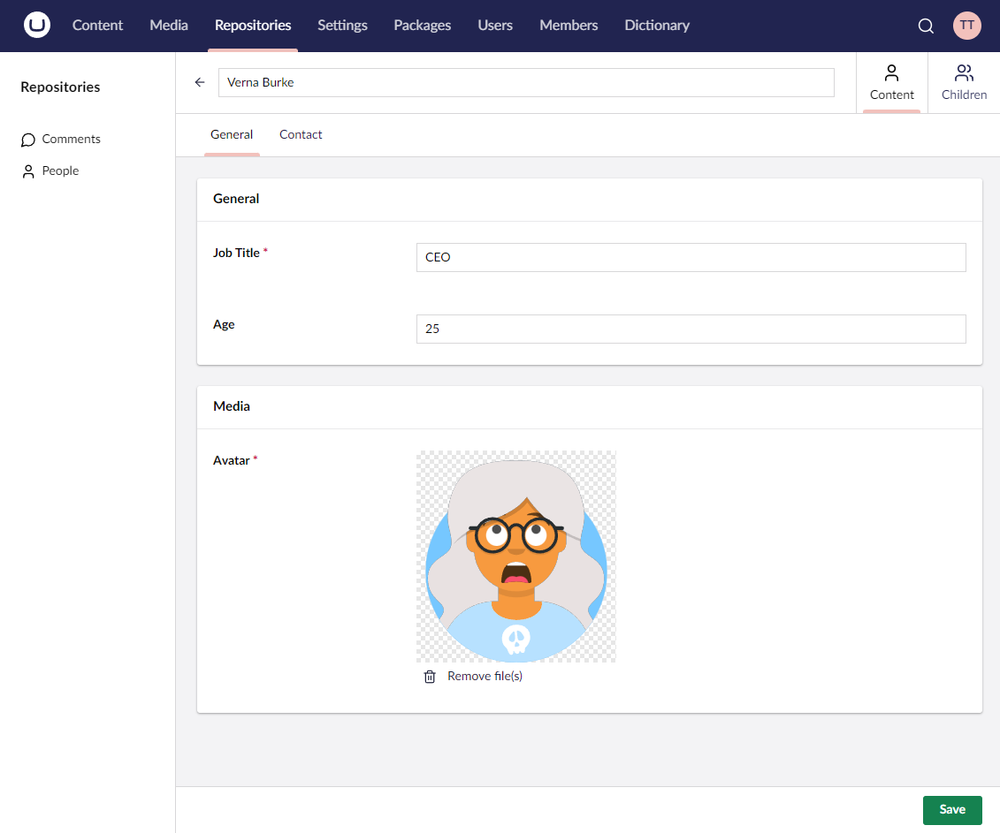

# Editors

An editor is the user interface used to edit an entity and is made up of tabs and property editors.



## Configuring an editor

The editor configuration is a sub-configuration of a [`Collection`](the-basics.md) config builder instance and is accessed via its `Editor` method.

### **Editor(Lambda editorConfig = null) : EditorConfig&lt;TEntityType&gt;**

Accesses the editor config of the given collection.

````csharp
// Example
collectionConfig.Editor(editorConfig => {
    ...
});
````

## Adding a tab to an editor

### **AddTab(string name, Lambda tabConfig = null) : EditorTabConfigBuilder&lt;TEntityType&gt;**

Adds a tab to the editor.

````csharp
// Example
editorConfig.AddTab("General", tabConfig => {
    ...
});
````

## Configuring a sidebar to a tab

A slidebar is a smaller area that is displayed to the right of the main editor. The sidebar can also contain fieldsets and fields in the same way tabs can. However, it is a much more limited display area so you'll need to choose your field types carefully. The sidebar is a great location to display entity metadata.

### **Sidebar(Lambda sidebarConfig = null) : EditorTabSidebarConfigBuilder&lt;TEntityType&gt;**

Configures the sidebar for the tab.

````csharp
// Example
tabConfig.Sidebar(sidebarConfig => {
    ...
});
````

## Setting the visibility of a tab

### **SetVisibility(Predicate&lt;EditorTabVisibilityContext&gt; visibilityExpression) : EditorTabConfigBuilder&lt;TEntityType&gt;**

Sets the runtime visibility of the tab.

````csharp
// Example
tabConfig.SetVisibility(ctx => ctx.EditorMode == EditorMode.Create);
````

## Adding a fieldset to a tab

### **AddFieldset(string name, Lambda fieldsetConfig = null) : EditorFieldsetConfigBuilder&lt;TEntityType&gt;**

Adds the given fieldset to the tab.

````csharp
// Example
tabConfig.AddFieldset("Contact", fieldsetConfig => {
    ...
});
````

## Setting the visibility of a fieldset

### **SetVisibility(Predicate&lt;EditorFieldsetVisibilityContext&gt; visibilityExpression) : EditorFieldsetConfigBuilder&lt;TEntityType&gt;**

Sets the runtime visibility of the fieldset.

````csharp
// Example
fieldsetConfig.SetVisibility(ctx => ctx.EditorMode == EditorMode.Create);
````

## Adding a field to a fieldset

### **AddField(Lambda propertyExpression, Lambda propertyConfig = null) : EditorFieldConfigBuilder&lt;TEntityType, TValueType&gt;**

Adds the given property to the editor.

````csharp
// Example
fieldsetConfig.AddField(p => p.FirstName, fieldConfig => {
    ...
});
````

## Changing the label of a field

By default, Umbraco UI Builder will build the label from the property name, including splitting camel case names into sentence cases. However, you can set an explicit label if preferred.

### **SetLabel(string label) : EditorFieldConfigBuilder&lt;TEntityType, TValueType&gt;**

Sets the label for the editor field.

````csharp
// Example
fieldConfig.SetLabel("First Name");
````

## Hiding the label of a field

Sometimes you may have a field editor that would work better in full width. You can achieve this by explicitly hiding the field label.

### **HideLabel() : EditorFieldConfigBuilder&lt;TEntityType, TValueType&gt;**

Hides the label for the editor field.

````csharp
// Example
fieldConfig.HideLabel();
````

## Adding a description to a field

### **SetDescription(string description) : EditorFieldConfigBuilder&lt;TEntityType, TValueType&gt;**

Sets the description for the editor field.

````csharp
// Example
fieldConfig.SetDescription("Enter your age in years");
````

## Changing the Data Type of a field

By default, Umbraco UI Builder will automatically choose a relevant Data Type for basic field types. However, if you wish to use an alternative Data Type then you can override this.

### **SetDataType(string dataTypeName) : EditorFieldConfigBuilder&lt;TEntityType, TValueType&gt;**

Set the Data Type of the current field to the Umbraco Data Type with the given name.

````csharp
// Example
fieldConfig.SetDataType("Richtext Editor");
````

### **SetDataType(int dataTypeId) : EditorFieldConfigBuilder&lt;TEntityType, TValueType&gt;**

Set the Data Type of the current field to the Umbraco Data Type with the given id.

````csharp
// Example
fieldConfig.SetDataType(-88);
````

## Setting the default value of a field

### **SetDefaultValue(TValueType defaultValue) : EditorFieldConfigBuilder&lt;TEntityType, TValueType&gt;**

Sets the default value to a known constant.

````csharp
// Example
fieldConfig.SetDefaultValue(10);
````

### **SetDefaultValue(Func<TValueType> defaultValueFunc) : EditorFieldConfigBuilder&lt;TEntityType, TValueType&gt;**

Sets the default value via a function that gets evaluated at time of entity creation.

````csharp
// Example
fieldConfig.SetDefaultValue(() => DateTime.Now);
````

## Making a field required

### **MakeRequired() : EditorFieldConfigBuilder&lt;TEntityType, TValueType&gt;**

Makes the given field required.

````csharp
// Example
fieldConfig.MakeRequired();
````

## Validating a field

### **SetValidationRegex(string regex) : EditorFieldConfigBuilder&lt;TEntityType, TValueType&gt;**

Defines the regular expression to use when validating the field.

````csharp
// Example
fieldConfig.SetValidationRegex("[A-Z0-9._%+-]+@[A-Z0-9.-]+\\.[A-Z]{2,4}");
````

## Making a field read-only

### **MakeReadOnly() : EditorFieldConfigBuilder&lt;TEntityType, TValueType&gt;**

Makes the current field read-only disabling editing in the UI.

````csharp
// Example
fieldConfig.MakeReadOnly();
````

### **MakeReadOnly(Func&lt;TValueType, string&gt; format) : EditorFieldConfigBuilder&lt;TEntityType, TValueType&gt;**

Makes the current field read-only disabling editing in the UI. Provides a custom formatting expression to use when rendering the value as a string.

````csharp
// Example
fieldConfig.MakeReadOnly(distanceProp => $"{distanceProp:## 'km'}");
````

### **MakeReadOnly(object dataTypeNameOrId) : EditorFieldConfigBuilder&lt;TEntityType, TValueType&gt;**

Makes the current field read-only disabling editing in the UI. Provides the name or id of a datatype to use when in read-only mode.

````csharp
// Example
fieldConfig.MakeReadOnly("myReadOnlyEditor");
````

### **MakeReadOnly(Predicate&lt;EditorFieldReadOnlyContext&gt; readOnlyExp) : EditorFieldConfigBuilder&lt;TEntityType, TValueType&gt;**

Makes the current field read-only disabling editing in the UI if the given runtime predicate is true.

````csharp
// Example
fieldConfig.MakeReadOnly(ctx => ctx.EditorMode == EditorMode.Create);
````

### **MakeReadOnly(Predicate&lt;EditorFieldReadOnlyContext&gt; readOnlyExp, Func&lt;TValueType, string&gt; format) : EditorFieldConfigBuilder&lt;TEntityType, TValueType&gt;**

Makes the current field read-only disabling editing in the UI if the given runtime predicate is true. Provides a custom formatting expression to use when rendering the value as a string.

````csharp
// Example
fieldConfig.MakeReadOnly(ctx => ctx.EditorMode == EditorMode.Create, distanceProp => $"{distanceProp:## 'km'}");
````

### **MakeReadOnly(Predicate&lt;EditorFieldReadOnlyContext&gt; readOnlyExp, object dataTypeNameOrId) : EditorFieldConfigBuilder&lt;TEntityType, TValueType&gt;**

Makes the current field read-only disabling editing in the UI if the given runtime predicate is true. Provides the name or id of a datatype to use when in read-only mode.

````csharp
// Example
fieldConfig.MakeReadOnly(ctx => ctx.EditorMode == EditorMode.Create, "myReadOnlyEditor");
````

## Setting the visibility of a field

### **SetVisibility(Predicate&lt;EditorFieldVisibilityContext&gt; visibilityExpression) : EditorFieldConfigBuilder&lt;TEntityType, TValueType&gt;**

Sets the runtime visibility of the field.

````csharp
// Example
fieldConfig.SetVisibility(ctx => ctx.EditorMode == EditorMode.Create);
````
