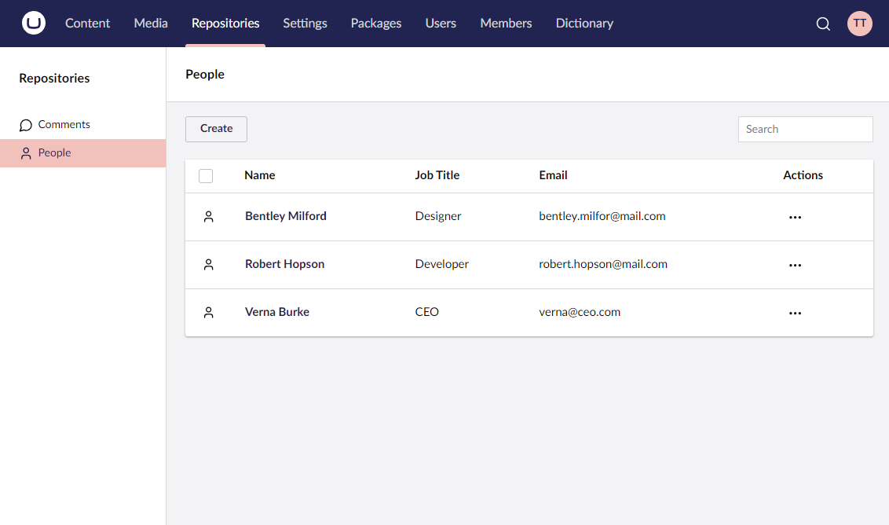

# Collections

A collection is the cornerstone Umbraco UI Builder config and it represents a collection of entities for a given data model. From this config object, you can configure everything about how this collection integrates into the UI. You can also configure how it should display in a list view as well as how it should be edited.

Get started by reviewing the basics of collection configuration.


[the-basics.md](the-basics.md)

