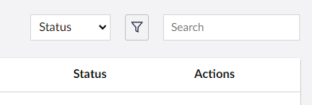

# Searching

Beyond listing collection entities, if you need to be able to locate specific entities within a collection then Umbraco UI Builder provides a search API.

Get started by reviewing how to define searchable properties.


[searchable-properties.md](searchable-properties.md)

