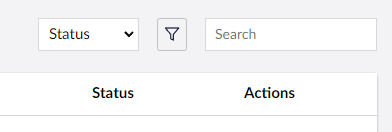

# Searchable Properties

Searchable properties allow you to define any `String` based properties on a model. They will be searchable via Umbraco UI Builder's list view and entity picker search controls.

You can also use any `String` based property of nested objects of a model, as long as the parent object is not null.



## Defining searchable properties

### **AddSearchableProperty(Lambda searchablePropertyExpression) : CollectionConfigBuilder&lt;TEntityType&gt;**

Adds the given property to the searchable properties collection.

````csharp
// Example
collectionConfig.AddSearchableProperty(p => p.FirstName);
collectionConfig.AddSearchableProperty(p => p.Address.Street);
````

## Search Expression Pattern

Up to version 14.0.1, the search was performed using the `StartsWith` method call.
From 14.0.1 and up, search operations can be performed using the `Contains` method call.

````csharp
// Example
collectionConfig.AddSearchableProperty(p => p.FirstName); // will search for keywords that start with.
collectionConfig.AddSearchableProperty(p => p.FirstName, SearchExpressionPattern.Contains); // will search for keywords that are contained.
````
