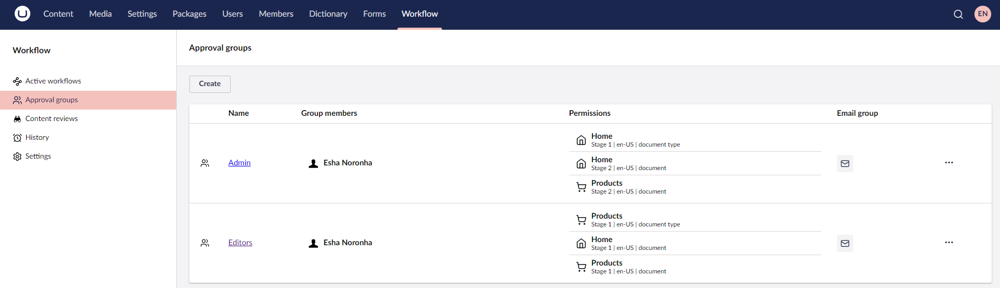
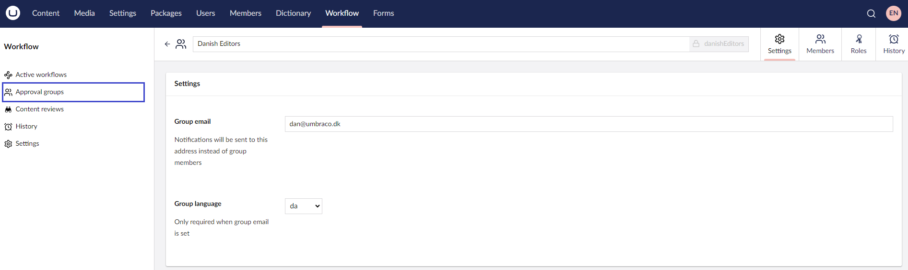
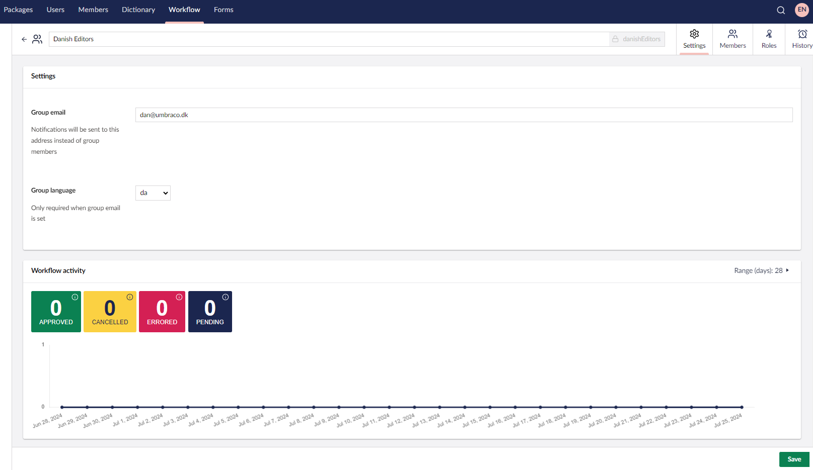
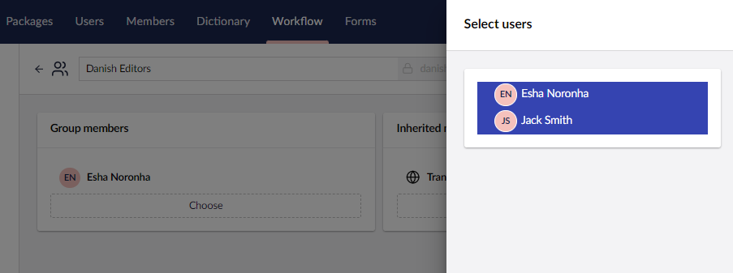
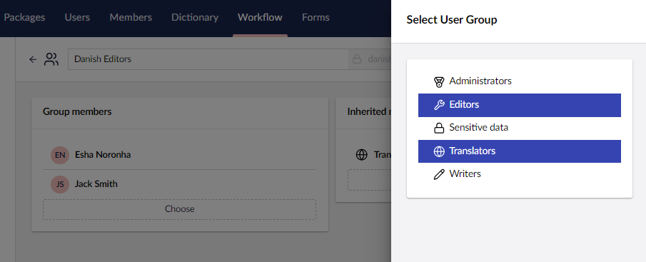
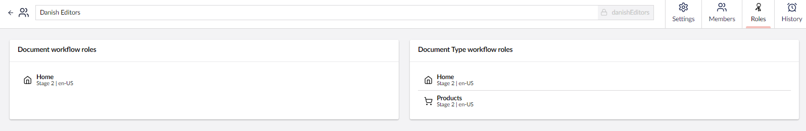
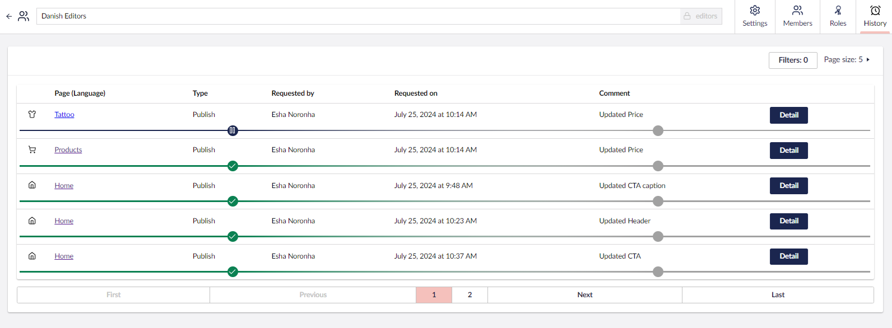
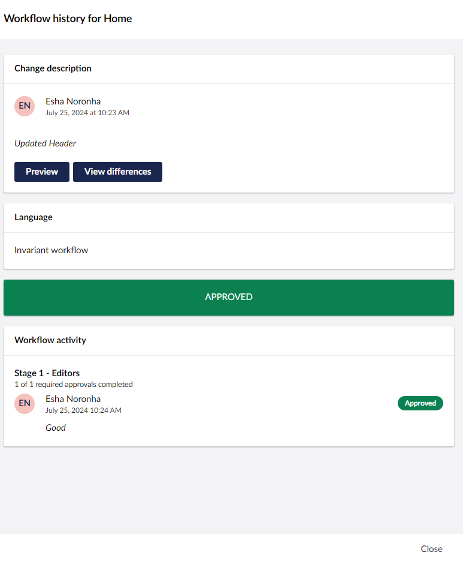

# Approval Groups

The **Approval groups** view in the **Workflow** section lists the active groups name, group members, their permissions, and a quick link to email the group.

To add an approval group, follow these steps:

1. Go to the **Workflow** section.
2. Click on **Approval groups**.
3. Click **Create**.
4. Enter a **Name** for the Approval Group. For example: Danish Editors.
5. Enter the **Group Email** address in the **Settings** section to which the notifications will be sent.
6. Select the **Group Language** from the drop-down list in the **Settings** section.
7. Click **Save**.

    


You can create a total of 5 groups on unlicensed installations. The paid license removes this restriction.


You can search for a specific group using the Search bar. Select a group from the list to edit its Settings, Roles, Members, and view the group's History.

## Approval Groups Settings

The **Settings** tab consists of the following fields:

* **Group Email:** Workflow notifications are sent to a generic inbox (a group's email address) rather than the individual group members.
* **Group Language:** Select a language variant for the email.
* **Workflow Activity:** Provides a chart displaying an overview of the workflow activity such as approved, cancelled, rejected, or pending approvals for the current group.

## Members

The **Members** tab manages the membership for the given user group. Add members to approval groups to determine which member will be responsible for approving content changes. Group Members can be explicitly added to the group or can inherit group membership from an existing Umbraco group. Ideally, group members are set explicitly to ensure changes made to Umbraco groups do not cause unexpected changes to workflow permissions.

To add a Group member, follow these steps:

1. Go to the **Workflow** section.
2. Click on **Approval groups**.
3. Select a group from the list to edit its Members.
4. Go to the **Members** tab.
5. Click **Choose** in the **Group members** section.
6. Select the **Users** you want to add to the approval group.

    
7. Click **Submit**.
8. Click **Save**.

To remove a Group member, click **Remove**.

To inherit an existing Umbraco group membership, follow these steps:

1. Go to the **Workflow** section.
2. Click on **Approval groups**.
3. Select a group from the list to edit its Members.
4. Go to the **Members** tab.
5. Click **Choose** in the **Inherited group membership** section.
6. Select the **User groups** you want to add to the approval group.

    
7. Click **Submit**.
8. Click **Save**.

To remove a Group membership, click **Remove**.

## Roles

The **Roles** tab provides an overview of the current workflow roles for the Group:

* **Node-based approvals**: This workflow applies only to the specified node.
* **Document-type approvals**: This workflow applies to all the nodes of a given Document Type.

You can set these **Roles** in the Workflow **Settings** section. For more information, see the [Workflow Settings](workflow-settings.md) article.

## History

The History tab provides an overview of the workflow activity for the current group. It displays a table containing the following details:

* Page name with the Language variant
* Type of Publish
* Workflow requested by
* Date the workflow was requested on
* Comment describing the changes

You can also **Filter** the records based on the Document Type, Requested by, Created date, Completed date, Page Language, Workflow Type, and Workflow Status. Additionally, you can adjust the total number of records displayed on a page.

The **Detail** button at the end of the record displays an overlay with content similar to the [Active workflow](../getting-started/workflow-content-app.md#active-workflow) sub-section.

