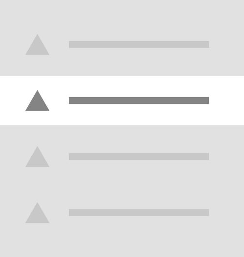

# Menu


This page is a work in progress and may undergo further revisions, updates, or amendments. The information contained herein is subject to change without notice.


<figure><figcaption><p>Menu</p></figcaption></figure>

## Creating a custom menu

In this section, you can learn how to register and create a custom Menu for the Umbraco backoffice.

### Manifest

The manifest file can be created using either JSON or TypeScript. Both methods are shown below.





We can create the manifest using JSON in the `umbraco-package.json`.

```json
{
 "type": "menu",
 "alias": "My.Menu",
 "name": "My Menu"
}
```




The manifest can also be written in TypeScript.

For this TypeScript example we used a [Backoffice Entry Point](../../extending-overview/extension-types/backoffice-entry-point.md) extension to register the manifests.

```typescript
import { ManifestMenu } from "@umbraco-cms/backoffice/extension-registry";

const menuManifest: Array<ManifestMenu> = [
    {
        type: 'menu',
        alias: 'My.Menu',
        name: 'My Menu'
    }
];
```





# Menu Item

<figure><figcaption><p>Menu Item</p></figcaption></figure>

Menu items are the items that appear in the menu. 

## Creating a custom menu items

In this section, you can learn how to add custom Menu Items to your Umbraco backoffice Menu.

### Manifest

To add custom menu items, you can define a single MenuItem manifest and link an element to it. In this element, you can fetch the data and render as many menu items as you want based on that data.

The code snippets below show how to declare a new menu item using JSON or TypeScript.





We can create the manifest using JSON in the `umbraco-package.json`.

```json
{
 "type": "menuItem",
 "alias": "My.MenuItem",
 "name": "My Menu Item",
 "element": "./menu-items.ts",
 "meta": {
  "label": "My Menu Item",
  "menus": ["My.Menu"]
 }
}
```





The manifest can also be written in TypeScript.

For this TypeScript example we used a [Backoffice Entry Point](../../extending-overview/extension-types/backoffice-entry-point) extension to register the manifests.


```typescript
const menuItemManifest: Array<ManifestMenuItem> = [
    {
        type: 'menuItem',
        alias: 'My.MenuItem',
        name: 'My Menu Item',
        meta: {
            label: 'My Menu Item',
            menus: ["My.Menu"]
        },
        element: () => import('./menu-items.ts')
    }
];
```







### The UI Element

#### Rendering menu items with Umbraco's UI menu item component

To render your menu items in Umbraco, you can use the [Umbraco UI Menu Item component](https://uui.umbraco.com/?path=/docs/uui-menu-item--docs). This component allows you to create nested menu structures with a few lines of code.

By default, you can set the `has-children` attribute to display the caret icon indicating nested items. It will look like this: `?has-children=${bool}`.

**Example:**

```tsx
<uui-menu-item label="Menu Item 1" has-children>
    <uui-menu-item label="Nested Menu Item 1"></uui-menu-item>
    <uui-menu-item label="Nested Menu Item 2"></uui-menu-item>
</uui-menu-item>
```

#### Custom menu item element example

You can fetch the data and render the menu items using the Lit element above. By putting the result of the fetch in a `@state()`, we can trigger a re-render of the component when the data is fetched.


```typescript
import { UmbMenuItemElement } from '@umbraco-cms/backoffice/extension-registry';
import { UmbLitElement } from '@umbraco-cms/backoffice/lit-element';
import { html, TemplateResult } from 'lit';
import { customElement, state } from 'lit/decorators.js';
import { MyMenuItemResponseModel, MyMenuResource } from '../../../api';

const elementName = 'my-menu-item';

@customElement(elementName)
class MyMenuItems extends UmbLitElement implements UmbMenuItemElement {
    @state()
    private _items: MyMenuItemResponseModel[] = []; // Store fetched items
    @state()
    private _loading: boolean = true; // Track loading state
    @state()
    private _error: string | null = null; // Track any errors

    constructor() {
        super();
        this.fetchInitialItems(); // Start fetching on component load
    }

    // Fetch initial items
    async fetchInitialItems() {
        try {
            this._loading = true;
            this._items = ((await MyMenuResource.getMenuApiV1()).items); // Fetch root-level items
        } catch (e) {
            this._error = 'Error fetching items';
        } finally {
            this._loading = false;
        }
    }

    // Render items
    renderItems(items: MyMenuItemResponseModel[]): TemplateResult {
        return html`
            ${items.map(element => html`
                <uui-menu-item label="${element.name}" ?has-children=${element.hasChildren}>
                ${element.type === 1 
                ? html`<uui-icon slot="icon" name="icon-folder"></uui-icon>` 
                : html`<uui-icon slot="icon" name="icon-autofill"></uui-icon>`}
                    <!-- recursively render children -->
                    ${element.hasChildren ? this.renderItems(element.children) : ''}
                </uui-menu-item>
            `)}
        `;
    }

    // Main render function
    render() {
        if (this._loading) {
            return html`<uui-loader></uui-loader>`;
        }

        if (this._error) {
            return html`<uui-menu-item active disabled label="Could not load form tree!">
        </uui-menu-item>`;
        }

        // Render items if loading is done and no error occurred
        return html`${this.renderItems(this._items)}`;
    }
}

export { MyMenuItems as element };

declare global {
    interface HTMLElementTagNameMap {
        [elementName]: MyMenuItems;
    }
}

```	



## Tree Menu Item

### Manifest

```typescript
// it will be something like this
{
 "type": "menuItem",
 "kind": "tree",
 "alias": "My.TreeMenuItem",
 "name": "My Tree Menu Item",
 "meta": {
  "label": "My Tree Menu Item",
  "menus": ["My.Menu"]
 }
}
```

#### Default Element

```typescript
// get interface
interface UmbTreeMenuItemElement {}
```

### Adding menu items to an existing menu

The backoffice comes with a couple of menus.

* Content, Media, Settings, Templating, Dictionary, etc.

To add a menu item to an existing menu, you can use the `meta.menus` property.

```typescript
{
 "type": "menuItem",
 "alias": "My.MenuItem",
 "name": "My Menu Item",
 "meta": {
  "label": "My Menu Item",
  "menus": ["Umb.Menu.Content"]
 }
}
```
