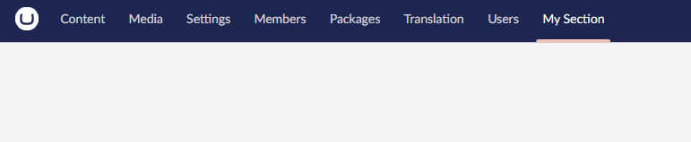

# Sections


This page is a work in progress and may undergo further revisions, updates, or amendments. The information contained herein is subject to change without notice.


The Umbraco backoffice consists of Sections. Section is the main division shown in the top navigation.

For example, when you load the backoffice, you'll see the 'Content' section, 'Settings' section, and so on.

You can create your own sections to extend Umbraco with room for more features.

<figure><figcaption><p>Section</p></figcaption></figure>

## **Creating a section**

### **Manifests**

When creating a new section it's recommended to use a [Entry Point](../backoffice-entry-point.md)-extension in your [Umbraco Package Manifest](../../../umbraco-package.md). This is to get better control over all the additional extensions required for the new section.

Create a section by defining a manifest for it:

```typescript
{
 "type": "section",
 "alias": "My.Section",
 "name": "My Section",
 "meta": {
  "label": "My.Section",
  "pathname": "my-section"
 }
}
```

Once registered, you will be able to select this action for your User Group Permissions. Once that is permitted, you can view your section.

<figure><figcaption><p>Section</p></figcaption></figure>

#### **Extend with Sidebar, Dashboards and more**

Once a section is registered, it can be extended like any other section.

Here is a list of appropriate extensions to append to your section:

* [Creating a Custom Dashboard](../../../../tutorials/creating-a-custom-dashboard/)
* [Section Sidebar](section-sidebar.md)
* [Section View](section-view.md)

#### **Manifest with empty element**

If you prefer full control over the content of your section you can choose to define an element for the content of your section.


This is not recommended as it limits the content of your section to this element. Instead, it is recommended to use a single Dashboard or Section View.


If you like to have full control, you can define an element like this:

```typescript
const section : UmbExtensionManifest = {
    type: "section",
    alias: "Empty.Section",
    name : 'Empty Section',
    element : () => import('./empty-section.element.js'),
    meta : {
        label : 'Empty Section',
        pathname : 'empty-section'
    }
}
```

The element file must have an `element` or `default` export, or specify the element name in the `elementName` field.
