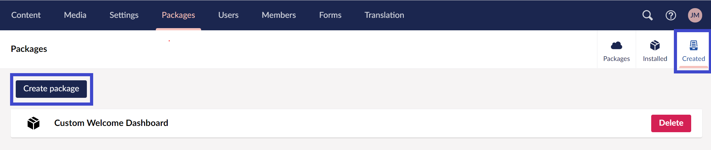
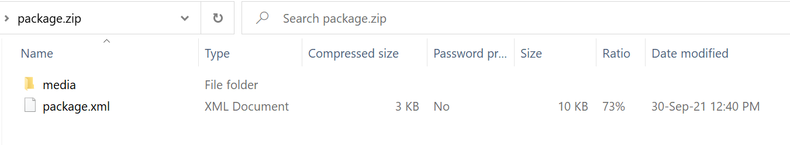
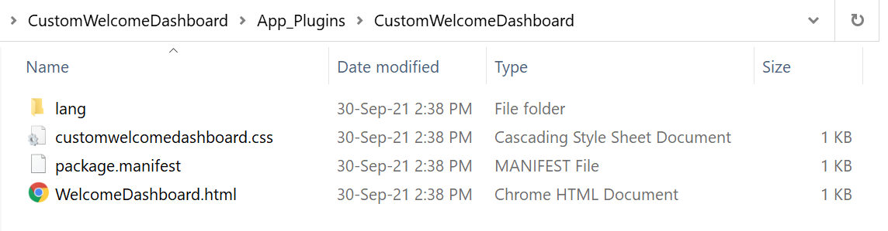
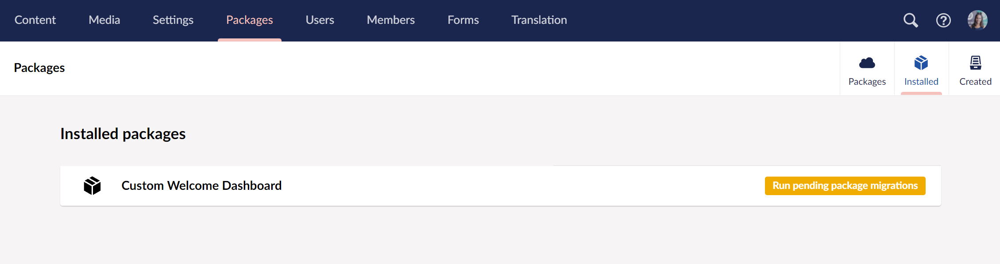

# Creating a Package

The goal of this tutorial is to extend Umbraco and create a package. The tutorial's starting point is to create a package out of the dashboard from the [Creating a Custom Dashboard tutorial](../../tutorials/creating-a-custom-dashboard/). The process is the same for most packages so feel free to follow along with something else.

## Creating a package schema in the backoffice

To create a package, you first need to create a package schema through the Umbraco backoffice:

1. Go to the `Packages` section.
2. Select `Created` in the top-right corner of the screen.
3.  Select the `Create package` button.

    
4. On the `Create package` page, there are fields that you can use to construct the contents of your package that are based on items from the backoffice.
5. Enter the package name at the top - we will call our dashboard the same as in the mentioned [Tutorial](../../tutorials/creating-a-custom-dashboard/): `Custom Welcome Dashboard`.

We will now take a look at the different information that can be filled in:

### Package Content section

These values are used to determine which backoffice items the package should contain. We will fill in the following things:

| Property       | Value   | Note                                                                                                                                                                                                   |
| -------------- | ------- | ------------------------------------------------------------------------------------------------------------------------------------------------------------------------------------------------------ |
| Content        | _Empty_ | Here, you can include content - e.g. if you want to create a starter kit. Not relevant for this package though.                                                                                        |
| Media          | _Empty_ | Here, you can include media - e.g. if you want to add media to the starter kit. Not relevant for this package though.                                                                                  |
| Document Types | _Empty_ | Similar to the Content picker above. It is important to note that if you include content, you will need to also pick all its dependencies in this and the next steps for them to be packaged together! |
| Media Types    | _Empty_ | Similar to the Media picker above. It is important to note that if you include media, you will need to also pick all its dependencies in this and the next steps for them to be packaged together!     |
| Languages      | _Empty_ | See `Document Types` above - all text is hardcoded or within our own lang folder in this package, so this is not needed.                                                                               |
| Dictionary     | _Empty_ | See `Document Types` above                                                                                                                                                                             |
| Data Types     | _Empty_ | See `Document Types` above                                                                                                                                                                             |
| Templates      | _Empty_ | See `Document Types` above                                                                                                                                                                             |
| Stylesheets    | _Empty_ | These will come from the **wwwroot/css** folder. If you have stylesheets you want to include from other locations (_like App\_Plugins folder_) you can do so at a later step.                          |
| Scripts        | _Empty_ | These will come from the **wwwroot/scripts** folder. If you have scripts you want to include from other locations (_like App\_Plugins folder_) you can do so at a later step.                          |
| Partial Views  | _Empty_ | See `Document Types` above                                                                                                                                                                             |

After filling out all the information, we can select **Create** to create the package schema. We will download it and take a closer look at what it contains.

## Inspecting the package ZIP

If your package doesn't include backoffice-specific items, the result from downloading it will be just a `package.xml` file. Otherwise, if you select media files you will download a ZIP package that looks like this:



Additionally to the `package.xml`, there is a folder containing the media items for your package. The rest of the information is recorded in the XML schema document.

The files that we created from the [Creating a Custom Dashboard Tutorial](../../tutorials/creating-a-custom-dashboard/) will be discussed further down in the article. Let's take a look at the `package.xml` file:

```xml
<?xml version="1.0" encoding="utf-8"?>
<umbPackage>
  <info>
    <package>
      <name>Custom Welcome Dashboard</name>
    </package>
  </info>
  <DocumentTypes />
  <MediaTypes />
  <Templates />
  <Stylesheets />
  <Scripts />
  <PartialViews />
  <DictionaryItems />
  <Languages />
  <DataTypes />
  <MediaItems />
</umbPackage>
```

The `package.xml` file contains all package metadata and the file references that ensure Umbraco knows where to place the files when installing a package.

You will notice that the values for each of the fields we provided can be found inside this XML file. But since our example doesn't require any backoffice items, just the package name is contained. The other values will be kept under the respective XML tags in a different case.

## Creating a NuGet package

This is the next step of preparing your package before installation. Umbraco 10+ only supports packages using NuGet installation, which enforces better practices for both source control and deployment. Here, you will find how to create a NuGet Package for the custom dashboard that will extend Umbraco's functionality.

NuGet is the standard package manager for .NET projects. More information about NuGet and how it works can be found on the [Microsoft documentation pages for NuGet](https://docs.microsoft.com/en-us/nuget/what-is-nuget).

### Generate an empty package using a template

Assuming you have already installed the Umbraco templates, you can execute the following command in the .NET CLI to create a package project, that will include the necessary configuration for packing and installing your client-side assets:

```
dotnet new umbracopackage --name CustomWelcomeDashboard
```


For a guide on how to install the project templates, follow the 2 steps listed in the [Install the template section](../../fundamentals/setup/install/install-umbraco-with-templates.md).


The outcome is the files generated below:

.png>)

Apart from the project file, you can find an empty `package.manifest` inside the **App\_Plugins** folder, which we will replace with the one created from the [Creating a Custom Dashboard Tutorial](../../tutorials/creating-a-custom-dashboard/). But more importantly, it also contains a `build/CustomWelcomeDashboard.targets` file.

This file contains an `msbuild` target that is executed when a project has a dependency on this package. It copies the `App_Plugins` folder into the project on the build. This is required for having Umbraco packages in a NuGet package format.


If you are planning to overwrite the contents of the **App\_Plugins** folder, make sure that the subfolder containing your package contents has the same name as the one you specified after the `--name` flag and that the `package.manifest` has the correct path references to your files.


You can also add your custom C# files in the root of the package folder which will be part of the DLL of the package, but for our example, this won't be necessary.

### Transfer files

As mentioned previously, let's navigate to the **App\_Plugins** folder and replace its contents with the custom files we created for our new dashboard.



### Specify package properties

In this section, we will demonstrate how you can add metadata about the package and its creator(s).

Now that Umbraco 9 is built on ASP.NET Core, you can add values directly to the package `csproj` file and it will pick them up. If you don't want to manually edit the `csproj` file, you can right-click your project, go to _Properties_ and then to _Package_. There you can insert your specific information:

.png>)

Here is an example of some basic properties that you can specify in your project file:

```xml
<Project Sdk="Microsoft.NET.Sdk">
    <PropertyGroup>
        . . . 
        <Title>CustomWelcomeDashboard</Title>
        <Description>...</Description>
        <PackageTags>umbraco plugin package</PackageTags>
        <Version>1.0.0</Version>
        <Authors>Umbraco HQ</Authors>
        <PackageProjectUrl>https://umbraco.com</PackageProjectUrl>
        <PackageLicenseExpression>MIT</PackageLicenseExpression>
    </PropertyGroup>
    . . .
</Project>
```

The `Title`, `Description`, `PackageTags` came with the template and we added some further information like `Version`, `Authors`, `PackageProjectUrl` and `PackageLicenseExpression` that we elaborate on below:

| Property                 | Value               | Note                                                                                                                                                                                                        |
| ------------------------ | ------------------- | ----------------------------------------------------------------------------------------------------------------------------------------------------------------------------------------------------------- |
| Version                  | 1.0.0               | This is automatically set to 1.0.0 but can be changed as appropriate.                                                                                                                                       |
| Authors                  | Your name           | Here you get to take credit for your awesome work!                                                                                                                                                          |
| PackageProjectUrl        | https://umbraco.com | This URL will be shown as the package's URL when others install it. It will likely be a GitHub repository, or similar.                                                                                      |
| PackageLicenseExpression | MIT                 | The license is set to MIT. Please consider how you want your package licensed. If in doubt when deciding an open-source license there are [good resources available](https://choosealicense.com/licenses/). |

### Pack it

It is time to create the actual NuGet package (that is, a _.nupkg_ file). Executing the `dotnet pack` command in the package directory will take care of building the project and outputing the generated NuGet package in the `bin` folder (_the output on the CLI shows the full path to the `.nupkg` file_).


If you want to specify the output location, just execute the following command instead:

```
dotnet pack --output MyNugetPackages
```

It will pack the project in the current directory and place the resulting package into the `MyNugetPackages` folder.


### Publish it

To allow other people to use your package you will need to publish it to a public NuGet repository. The most common repository is at [https://nuget.org](https://nuget.org).

There is comprehensive documentation on how to [Publish a NuGet package to NuGet.org](https://docs.microsoft.com/en-us/nuget/nuget-org/publish-a-package) in the official NuGet documentation, as well as how to [Publish to a private feed](https://docs.microsoft.com/en-us/nuget/hosting-packages/overview) while developing.

## Installing a NuGet package

You can install your newly created NuGet package using Visual Studio, Rider, Command Line or editing the project file directly.

We will continue using the CLI and first create a Umbraco project, and then add the package reference to it:

```
dotnet new umbraco -n CustomWelcomeDashboardProject
cd CustomWelcomeDashboardProject
dotnet add package CustomWelcomeDashboard.1.0.0
dotnet run
```

You can check that the NuGet package was referenced in your solution and that the **App\_Plugins** assets were restored successfully. Our simple package is now installed and you can see the custom dashboard in the backoffice. No further actions are required for our example. However, we will go ahead and mention a few more steps necessary for the more complex packages.

A **different approach** when you want to test it locally without publishing it anywhere is to create a test site of the package. You can use our `dotnet new umbraco` template, this time with a special flag `-p` which will add a project dependency to our package and import the target file from that project. So when you build the new project, it will also copy the **App\_Plugins** folder from the package project into the test project. In the same way, as if it was a NuGet reference.

This is the full command:

```
dotnet new umbraco -n CustomWelcomeDashboardProject -p CustomWelcomeDashboard
```

Afterwards, you can enter the `CustomWelcomeDashboardProject` directory, build your Umbraco website using the `dotnet build` command and then run the application.

### Package migration

We can run a migration plan for each package that contains Umbraco content (_referenced in the package schema_).

#### Automatic Package Migration

If you just want to ship a package that only installs the schema and the content you chose, then you can inherit from the `AutomaticPackageMigrationPlan` as seen below, and specify the package name that will be displayed under the packages _Installed_ tab in the backoffice. You will also need to embed the schema file in the same namespace.

```csharp
using Umbraco.Cms.Infrastructure.Packaging;

namespace CustomWelcomeDashboardProject.Migrations;

public class PackageMigrationPlan : AutomaticPackageMigrationPlan
{
    public PackageMigrationPlan() : base("Custom Welcome Dashboard")
    {
    }
}
```



Whenever the embedded package.xml file changes, the automatic package migration plan is executed again. This is due to the fact that the migration state is based on the file hash. Existing schema or content will not be overwritten in this process.


#### Custom Package Migration

Instead of creating an automatic package migration plan, we will inherit from the `PackageMigrationPlan` and again specify the name of the package in the base constructor. Further on, we will define the plan using a unique GUID - in the example below we have a single migration called `MyCustomMigration`.

```csharp
using Umbraco.Cms.Core.Packaging;

namespace CustomWelcomeDashboardProject.Migrations;

public class CustomPackageMigrationPlan : PackageMigrationPlan
{
    public CustomPackageMigrationPlan() : base("Custom Welcome Dashboard")
    {
    }

    protected override void DefinePlan()
    {
        To<CustomPackageMigration>(new Guid("4FD681BE-E27E-4688-922B-29EDCDCB8A49"));
    }
}
```

The custom migrations can inherit from `PackageMigrationBase` where we can use helper methods to pick up the schema. But we can also use the regular `MigrationBase` class.

```csharp
using Microsoft.Extensions.Options;
using Umbraco.Cms.Core.Configuration.Models;
using Umbraco.Cms.Core.IO;
using Umbraco.Cms.Core.PropertyEditors;
using Umbraco.Cms.Core.Services;
using Umbraco.Cms.Core.Strings;
using Umbraco.Cms.Infrastructure.Migrations;
using Umbraco.Cms.Infrastructure.Packaging;

namespace CustomWelcomeDashboardProject.Migrations;

public class CustomPackageMigration : PackageMigrationBase
{
    public CustomPackageMigration(
        IPackagingService packagingService,
        IMediaService mediaService,
        MediaFileManager mediaFileManager,
        MediaUrlGeneratorCollection mediaUrlGenerators,
        IShortStringHelper shortStringHelper,
        IContentTypeBaseServiceProvider contentTypeBaseServiceProvider,
        IMigrationContext context,
        IOptions<PackageMigrationSettings> packageMigrationsSettings) 
        : base(
            packagingService,
            mediaService,
            mediaFileManager,
            mediaUrlGenerators,
            shortStringHelper,
            contentTypeBaseServiceProvider,
            context,
            packageMigrationsSettings)
    {
    }

    protected override void Migrate()
    {
        ImportPackage.FromEmbeddedResource<CustomPackageMigration>().Do();
    }
}
```

Here we also added the ZIP file as an embedded resource to the package project.

.png>)

.png>)

Whichever migration plan you choose to create, you will be able to see that your package has been installed after the migration is completed.


When using a custom package migration plan, the current state is ignored by default. This causes it to execute all migrations again whenever this isn't the same as the final state of the plan (e.g. if you added a new migration). This is due to the `IgnoreCurrentState` being set to `true` in the `PackageMigrationPlan` base class. You can override this property and set it to `false` again to make it behave like regular migration plans and only run the migrations that have not yet been executed on the current environment.

### Attended/Unattended migration execution

After creating a migration plan, the content and schema will automatically be imported either during unattended package migration or from the Packages section in the backoffice.

By default, all these package migrations are executed unattended during startup but the solution owners can disable this in the configuration. IntelliSense can help, as well as provide further information about the `PackageMigrationsUnattended` setting. Then in the Packages section, there will be an option to run the package migration for each package individually when the `PackageMigrationsUnattended` is set to `false`.

```json
  "Umbraco": {
    "CMS": {
      . . .
      "Unattended": {
        "PackageMigrationsUnattended": false
      }
    }
  }
```



The configuration of package migrations can be different for each environment and makes it possible to have the migration executed unattended on the development environment, but leave them out or manually execute them on other environments. This is useful when you use a tool like Umbraco Deploy or USync as these will migrate the content.
