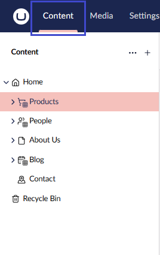
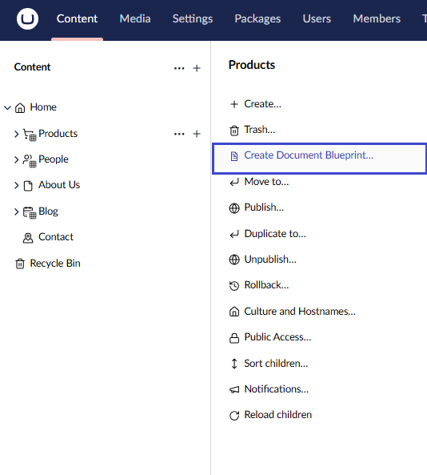
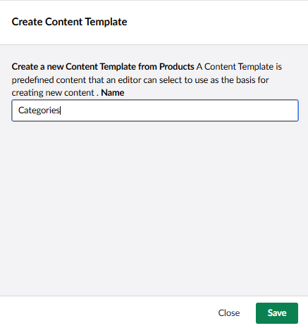
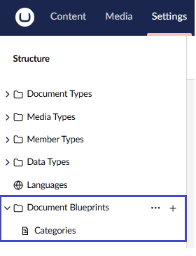
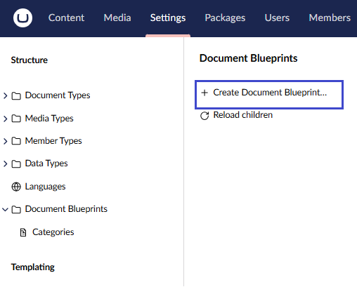
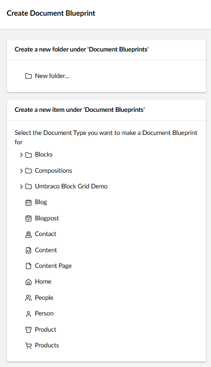
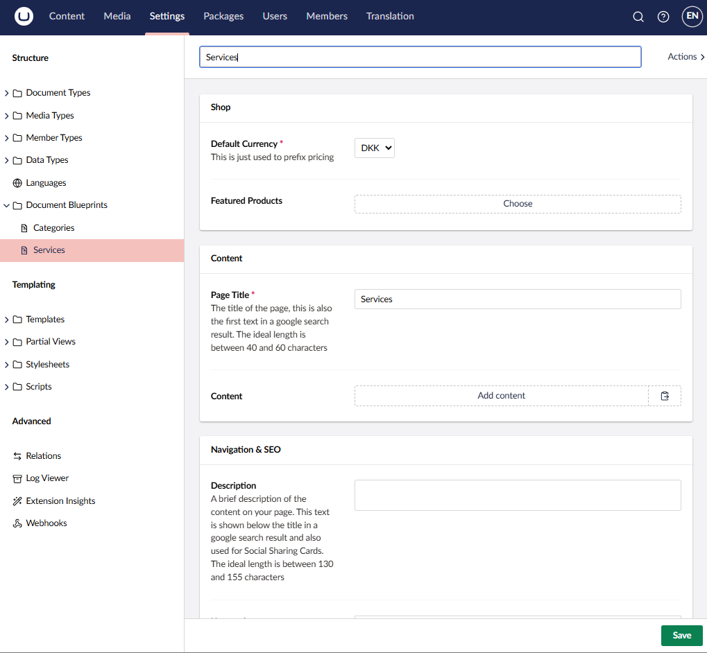
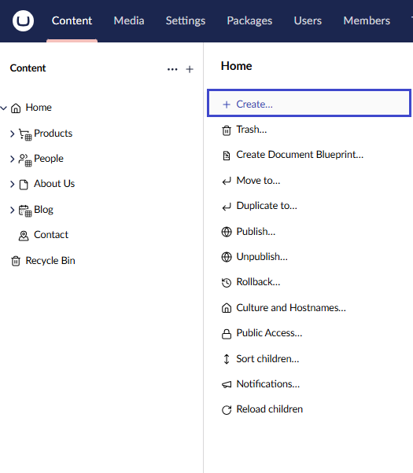
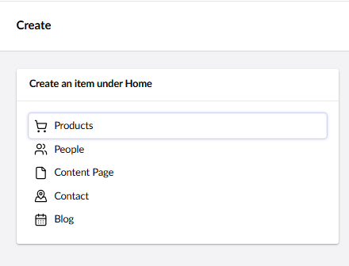
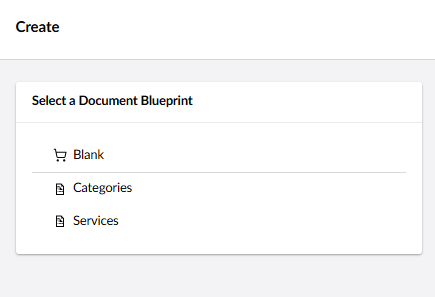

# Document Blueprints


Document Blueprints were previously called Content Templates.


## Document Blueprints Overview

A Document Blueprint allows editors to preconfigure a content node. It serves as a reusable starting point when creating new content.

### Create a Document Blueprint (Method 1 – From Content)


Before using this method, make sure you have already [created some content](../data/defining-content/README.md#3-creating-the-content).


1. Go to the **Content** section and select an existing content node.

2. Click the **...** menu next to the node and choose **Create Document Blueprint**.

3. Enter a **Name** for the new blueprint.

4. Click **Save**.

The new blueprint will appear under the **Document Blueprints** folder in the **Settings** section.


If you don’t see the new blueprint, try refreshing your browser.


### Create a Document Blueprint (Method 2 – From Settings)

1. Go to the **Settings** section.

2. Click the **...** menu next to the **Document Blueprints** tree and select **Create Document Blueprint**.

3. Choose the Document Type you want to base the blueprint on.


You can only create Document Blueprints from **Document Types** or **Document Types with Templates**.


4. Enter a **Name** for the blueprint and click **Save**.

The new blueprint will be created under the **Document Blueprints** folder in the **Settings** tree.

### Edit a Document Blueprint

To edit an existing document blueprint, follow these steps:

1. Go to the **Settings** section.
2. Open the **Document Blueprints** folder and select the blueprint you want to edit.
3. Make your changes and click **Save**.

### Use a Document Blueprint

Once you have created a document blueprint, you can use it to create new content nodes.

To use a document blueprint, follow these steps:

1. Go to the **Content** section.
2. Click the **...** menu next to the root node and select **Create**.

2. Select the **Document Type** that has an associated blueprint.

3. Choose how to create the new content:

  * Use the Document Blueprint

  * Start with a blank node

