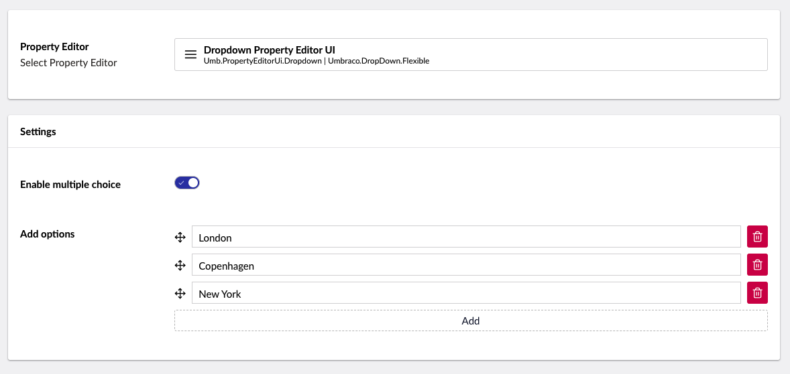

# Dropdown

`Schema alias: Umbraco.DropDown.Flexible`

`UI Alias: Umb.PropertyEditorUi.Dropdown`

`Returns: String` or `IEnumerable<string>`

Displays a list of preset values. Either a single value or multiple values (formatted as a collection of strings) can be returned.

## Settings

### Enable multiple choice

If enabled, editors will be able to select multiple values from the dropdown otherwise only a single value can be selected.

### Add options

Options are the values which are shown in the dropdown list. You can add, edit, or remove values here.


You can use dictionary items to translate the options in a Dropdown property editor in a multilingual setup. For more details, see the [Creating a Multilingual Site](../../../../../tutorials/multilanguage-setup.md#translating-multi-value-property-editors) article.


## Data Type Definition Example



## Content Example

### Single Value


### Multiple Values


## MVC View Example

### Single item - without Modelsbuilder

```csharp
@if (Model.HasValue("category"))
{
    <p>@(Model.Value<string>("category"))</p>
}
```

### Multiple items - without Modelsbuilder

```csharp
@if (Model.HasValue("categories"))
{
    var categories = Model.Value<IEnumerable<string>>("categories");
    <ul>
        @foreach (var category in categories)
        {
            <li>@category</li>
        }
    </ul>
}
```

### Single item - with Modelsbuilder

```csharp
@if (!Model.HasValue(Model.Category))
{
   <p>@Model.Category</p>
}
```

### Multiple items - with Modelsbuilder

```csharp
@if (Model.Categories.Any())
{
    <ul>
        @foreach (var category in Model.Categories)
        {
            <li>@category</li>
        }
    </ul>
}
```

## Add values programmatically

See the example below to see how a value can be added or changed programmatically. To update a value of a property editor you need the [Content Service](https://apidocs.umbraco.com/v14/csharp/api/Umbraco.Cms.Core.Services.ContentService.html).


The example below demonstrates how to add values programmatically using a Razor view. However, this is used for illustrative purposes only and is not the recommended method for production environments.


```csharp
@using Umbraco.Cms.Core.Services;
@inject IContentService Services;
@using Umbraco.Cms.Core.Serialization
@inject IJsonSerializer Serializer;
@{
    // Get access to ContentService
    var contentService = Services;

    // Create a variable for the GUID of the page you want to update
    var guid = Guid.Parse("32e60db4-1283-4caa-9645-f2153f9888ef");

    // Get the page using the GUID you've defined
    var content = contentService.GetById(guid); // ID of your page

    // Set the value of the property with alias 'categories'. 
    content.SetValue("categories", Serializer.Serialize(new[] { "News" }));

    // Save the change
    contentService.Save(content);
}
```

Although the use of a GUID is preferable, you can also use the numeric ID to get the page:

```csharp
@{
    // Get the page using it's id
    var content = contentService.GetById(1234); 
}
```

If Modelsbuilder is enabled you can get the alias of the desired property without using a magic string:



```csharp
@using Umbraco.Cms.Core.PublishedCache;
@inject IPublishedSnapshotAccessor _publishedSnapshotAccessor;
@{
    // Set the value of the property with alias 'categories'
    content.SetValue(Home.GetModelPropertyType(_publishedSnapshotAccessor, x => x.Categories).Alias, Serializer.Serialize(new[] { "News" }));
}
```
