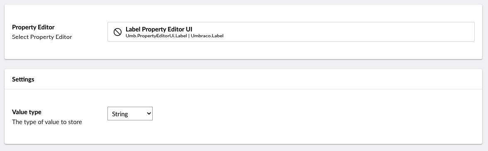

# Label

`Alias: Umbraco.Label`

`Returns: String`

Label is a non-editable control and can only be used to display a pre-set value.

## Data Type Definition Example



### Value type

If you want to set a value other than a String, you can define the data using one of the other available Data Types. These include Decimal, Date/time, Time, Integer, and Big integer.

There is also a Value Type: Long string if you need to set a long string value for your Label.

## Content Example


## MVC View Example

### Without ModelsBuilder

```csharp
@{
    if (Model.HasValue("pageLabel")){
        <p>@(Model.Value("pageLabel"))</p>
    }
}
```

### With ModelsBuilder

```csharp
@{
    if (!string.IsNullOrEmpty(Model.PageLabel))
    {
        <p>@Model.PageLabel</p>
    }
}
```

## Add values programmatically

See the example below to see how a value can be added or changed programmatically. To update a value of a property editor you need the [Content Service](https://apidocs.umbraco.com/v15/csharp/api/Umbraco.Cms.Core.Services.ContentService.html).


The example below demonstrates how to add values programmatically using a Razor view. However, this is used for illustrative purposes only and is not the recommended method for production environments.


```csharp
@{
    @inject IContentService Services;
    
 // Get access to ContentService
 var contentService = Services;

 // Create a variable for the GUID of the page you want to update
 var guid = Guid.Parse("32e60db4-1283-4caa-9645-f2153f9888ef");

 // Get the page using the GUID you've defined
 var content = contentService.GetById(guid); // ID of your page

 // Set the value of the property with alias 'pageLabel'. 
 content.SetValue("pageLabel", "A pre-set string value");

 // Save the change
 contentService.Save(content);
}
```

Although the use of a GUID is preferable, you can also use the numeric ID to get the page:

```csharp
@{
    // Get the page using it's id
    var content = contentService.GetById(1234); 
}
```

If Modelsbuilder is enabled you can get the alias of the desired property without using a magic string:



```csharp
@{
    @inject IPublishedSnapshotAccessor _publishedSnapshotAccessor

    // Set the value of the property with alias 'pageLabel'
     content.SetValue(Home.GetModelPropertyType(_publishedSnapshotAccessor, x => x.MyLabel).Alias, "A Preset string");
}
```
