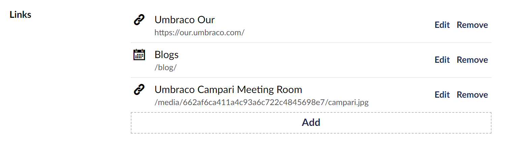

# Multi Url Picker

`Schema Alias: Umbraco.MultiUrlPicker`

`UI Alias: Umb.PropertyEditorUi.MultiUrlPicker`

`Returns: IEnumerable<Link> or Link`

Multi Url Picker allows an editor to pick and sort multiple urls. This property editor returns a single item if the "Maximum number of items" Data Type setting is set to 1 or a collection if it is 0. These can either be internal, external or media.

## Data Type Definition Example


## Content Example



## MVC View Example - value converters enabled

## Typed

```csharp
@using Umbraco.Cms.Core.Models
@{
    var links = Model.Value<IEnumerable<Link>>("footerLinks");
    if (links.Any())
    {
        <ul>
            @foreach (var link in links)
            {
                <li><a href="@link.Url" target="@link.Target">@link.Name</a></li>
            }
        </ul>
    }
}
```

If `Max number of items` is configured to `1`

```csharp
@using Umbraco.Cms.Core.Models
@{
    var link = Model.Value<Link>("link");
    if (link != null)
    {
        <a href="@link.Url" target="@link.Target">@link.Name</a>
    }
}
```

## Add values programmatically

See the example below to see how a value can be added or changed programmatically. To update a value of a property editor you need the [Content Service](https://apidocs.umbraco.com/v14/csharp/api/Umbraco.Cms.Core.Services.ContentService.html).


The example below demonstrates how to add values programmatically using a Razor view. However, this is used for illustrative purposes only and is not the recommended method for production environments.


```csharp
@using Umbraco.Cms.Core;
@using Umbraco.Cms.Core.Serialization
@using Umbraco.Cms.Core.Services;
@using Umbraco.Cms.Core.Models;
@inject IContentService Services;
@inject IJsonSerializer Serializer;
@{
    // Get access to ContentService
    var contentService = Services;

    // Create a variable for the GUID of the page you want to update
    var guid = Guid.Parse("32e60db4-1283-4caa-9645-f2153f9888ef");

    // Get the page using the GUID you've defined
    var content = contentService.GetById(guid); // ID of your page

    // Get the media you want to assign to the footer links property 
    var media = Umbraco.Media("bca8d5fa-de0a-4f2b-9520-02118d8329a8");

    // Create an Udi of the media
    var mediaUdi = Udi.Create(Constants.UdiEntityType.Media, media.Key);

    // Get the content you want to assign to the footer links property 
    var contentPage = Umbraco.Content("665d7368-e43e-4a83-b1d4-43853860dc45");

    // Create an Udi of the Content
    var contentPageUdi = Udi.Create(Constants.UdiEntityType.Document, contentPage.Key);

    // Create a list with different link types
    var externalLinks = new List<Link>
    {
        // External Link
        new Link
        {
            Target = "_blank",
            Name = "Our Umbraco",
            Url = "https://our.umbraco.com/",
            Type = LinkType.External
        },
        // Media 
        new Link
        {
            Target = "_self",
            Name = media.Name,
            Url = media.MediaUrl(),
            Type = LinkType.Media,
            Udi = mediaUdi
        }, 
        // Content 
        new Link
        {
            Target = "_self",
            Name = contentPage.Name,
            Url = contentPage.Url(),
            Type = LinkType.Content,
            Udi = contentPageUdi
        }
    };

    // Serialize the list with links to JSON
    var links = Serializer.Serialize(externalLinks);


    // Set the value of the property with alias 'footerLinks'. 
    content.SetValue("footerLinks", links);

    // Save the change
    contentService.Save(content);
}
```

Although the use of a GUID is preferable, you can also use the numeric ID to get the page:

```csharp
@{
    // Get the page using it's id
    var content = contentService.GetById(1234); 
}
```

If Modelsbuilder is enabled you can get the alias of the desired property without using a magic string:



```csharp
@using Umbraco.Cms.Core.PublishedCache;
@inject IPublishedSnapshotAccessor _publishedSnapshotAccessor;
@{
    // Set the value of the property with alias 'footerLinks'
    content.SetValue(Home.GetModelPropertyType(_publishedSnapshotAccessor, x => x.FooterLinks).Alias, links);
}
```
