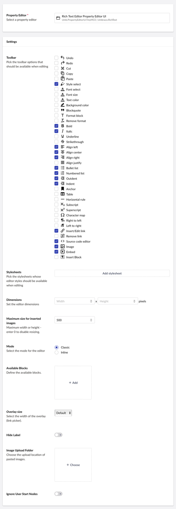
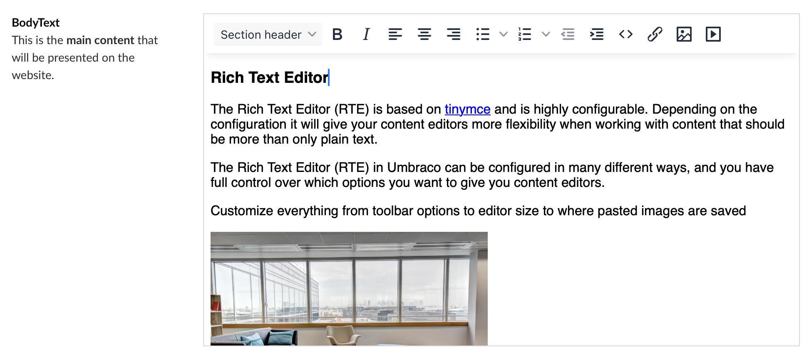

# Rich Text Editor TinyMce

`Schema Alias: Umbraco.RichText`

`UI Alias: Umb.PropertyEditorUi.TinyMCE`

`Returns: HTML`


In Umbraco 15, the Rich Text Editor has a new default property editor UI that introduces Tiptap as an alternative.

You can continue to use the TinyMCE UI for the Rich Text Editor, but this UI will be removed in Umbraco 16.


The Rich Text Editor (RTE) is highly configurable and based on [TinyMCE](https://www.tinymce.com/). Depending on the configuration, it will give your content editors more flexibility when working with content that should be more than plain text.


**Are you using custom configurations or plugins with TinyMCE?**

In Umbraco 11 the TinyMCE version supported was upgraded from version 4 to version 6. You need to migrate to the latest version if you are using TinyMCE plugins or custom configuration.

If your site is upgraded from an older version, follow the migration guides below to upgrade the TinyMCE version as well.

* [Migrate from version 4 to version 5](https://www.tiny.cloud/docs/tinymce/5/migration-from-4x/)
* [Migrate from version 5 to version 6](https://www.tiny.cloud/docs/tinymce/6/migration-from-5x/)


## [Configuration options](configuration.md)

Customize everything, from toolbar options and editor size to where pasted images are saved.

## [Styles](styles.md)

Use CSS to define specific editor styles and add them as formatting options of the Rich Text Editor.

## [Blocks](blocks.md)

Use Blocks to define specific parts that can be added as part of the markup of the Rich Text Editor.

## [Plugins](plugins.md)

Extend the functionality of the Rich Text Editor with plugins.

## Data Type Definition Example



## Content Example



## MVC View Example

### Without Models Builder

```csharp
@{
    if (Model.HasValue("richText")){
        <p>@(Model.Value("richText"))</p>
    }
}
```

### With Models Builder

```csharp
@{
    if (!string.IsNullOrEmpty(Model.RichText.ToString()))
    {
        <p>@Model.RichText</p>
    }
}
```

## Add values programmatically

See the example below to see how a value can be added or changed programmatically. To update a value of a property editor you need the [Content Service](https://apidocs.umbraco.com/v15/csharp/api/Umbraco.Cms.Core.Services.ContentService.html).


The example below demonstrates how to add values programmatically using a Razor view. However, this is used for illustrative purposes only and is not the recommended method for production environments.


```csharp
@using Umbraco.Cms.Core.Services
@inject IContentService ContentService
@{
    // Create a variable for the GUID of the page you want to update
    var guid = Guid.Parse("32e60db4-1283-4caa-9645-f2153f9888ef");

    // Get the page using the GUID you've defined
    var content = ContentService.GetById(guid); // ID of your page

    // Create a variable for the desired value
    var htmlValue = new HtmlString("Add some text <strong>here</strong>");

    // Set the value of the property with alias 'richText'.
    content.SetValue("richText", htmlValue);

    // Save the change
    ContentService.Save(content);
}
```

If Models Builder is enabled you can get the alias of the desired property without using a magic string.

```csharp
@using Umbraco.Cms.Core.PublishedCache
@inject IPublishedContentTypeCache PublishedContentTypeCache
@{
    // Set the value of the property with alias 'richText'
    content.SetValue(Home.GetModelPropertyType(PublishedContentTypeCache, x => x.RichText).Alias, htmlValue);
}
```
