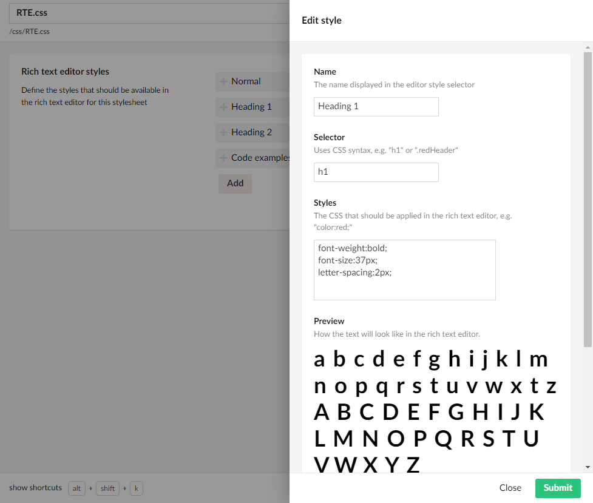
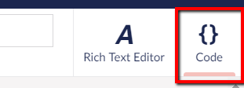
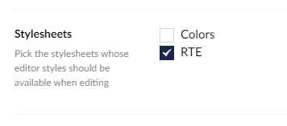

# Styles

It is possible to define specific styles and fonts for the Rich Text Editor (RTE). Once you have defined the styles, and enabled them on the RTE Data Type, the styles can be accessed directly in the Content section.

## Creating RTE Styles

The RTE styles are created and managed in the Umbraco backoffice.

* Find the **Stylesheets** folder in the Settings section.
* Click **...** next to the **Stylesheets** folder and select **Create...**.
* Choose _New Rich Text Editor style sheet file_.
* Give the new stylesheet a name and **Save** it.

This will generate an empty CSS file in your project.

At this point, you can start adding specific styles, that your editors can then use in the Content section when creating and writing new content.

The image above is an example of how an RTE style can be configured. When working with these styles, the **Preview** feature will show you how the style will look when applied.

Every style you add, will automatically be added to the CSS file. The file will be placed in the same location as the rest of your CSS files. It is possible to edit the file directly from the backoffice as well. Access it from the **Code** tab in the top-right corner.

## Using RTE Styles

In order for your editors to be able to use the styles when working with content, two things needs to be done.

### 1. Enable "Style select"

The styles will be accessed by the editors using the "Formats" dropdown in the toolbar of the RTE. In order the enable the dropdown, the "Style select" toolbar option needs to be checked.

This can be done by accessing the RTE Data Type directly from the "Info" tab on the Content. You can also find the RTE Data Type in the Settings section of the backoffice and make the changes from there. Learn more about the configuration options in the [RTE Config](configuration.md) article.

### 2. Select the styles

You can have as many different styles for your RTEs as you want. You might want to have different styles for different RTE Data Types.

When configuring your RTE Data Types, you can select which stylesheets your content editors should be able to use.

