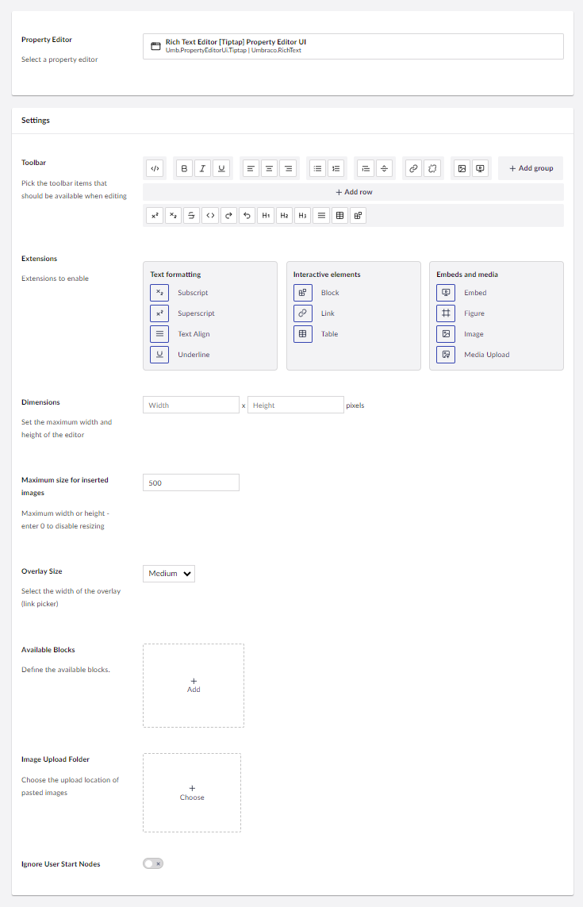

# Rich Text Editor Tiptap

`Alias: Umbraco.RichText`

`Returns: HTML`


In Umbraco 15 the Rich Text Editor has gotten an alternative that introduces Tiptap as a new property editor UI.

This article will evolve as more features are added to the implementation in the coming versions of Umbraco CMS.


The Rich Text Editor (RTE) Tiptap property editor is based on Tiptap and is highly configurable. Dependening on the configuration set up, it gives your editors a lot of flexibility when working with content.

## Data Type Definition Example

## Content Example

## MVC View Example
