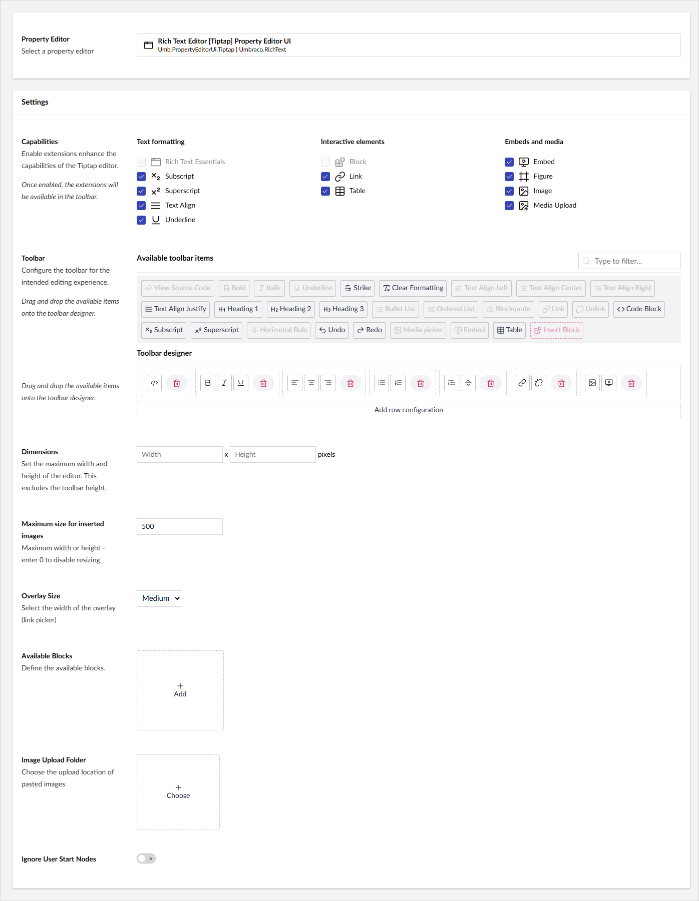
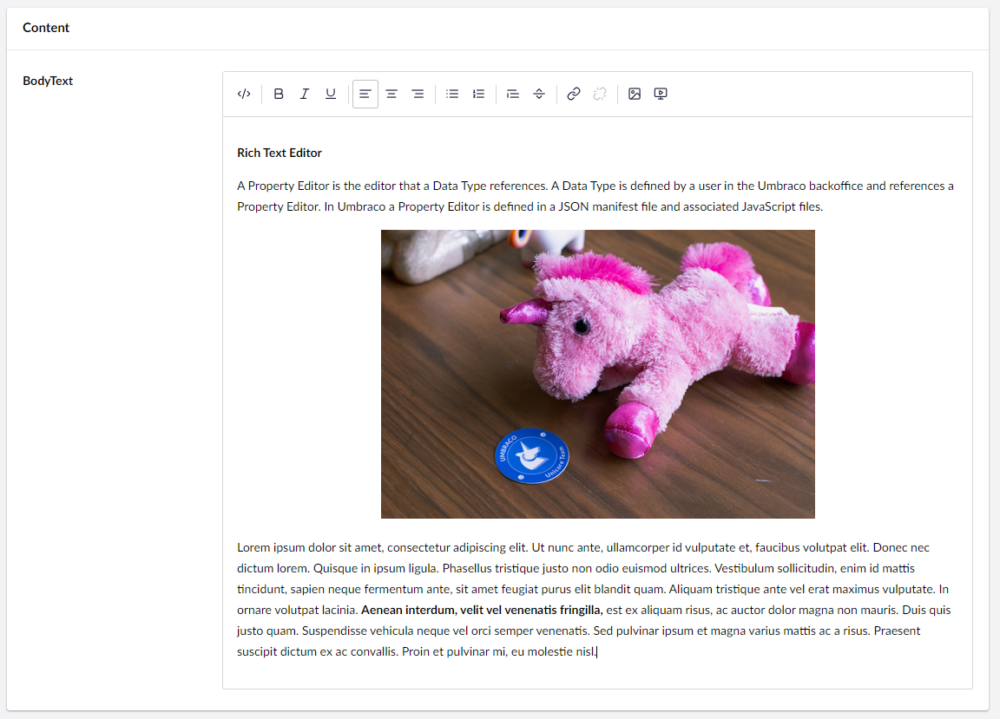

# Rich Text Editor

`Schema Alias: Umbraco.RichText` `UI Alias: Umb.PropertyEditorUi.TipTap`

`Returns: HTML`


In Umbraco 15, the Rich Text Editor has a new default property editor UI that introduces Tiptap as an alternative.

You can continue to use the [TinyMCE UI for the Rich Text Editor](../rich-text-editor-tinymce/). This UI will be removed in Umbraco 16.

**Current limitations**

The Tiptap UI currently does not support using custom styles for your rich text.


The Rich Text Editor (RTE) Tiptap property editor is highly configurable and based on [Tiptap](https://tiptap.dev/). Depending on the configuration setup, it provides editors a lot of flexibility when working with content.

## [Configuration options](configuration.md)

Customize everything from toolbar options to editor size to where pasted images are saved.

## [Blocks](blocks.md)

Use Blocks to define specific parts that can be added as part of the markup of the Rich Text Editor.

## [Plugins](plugins.md)

Extend the functionality of the Rich Text Editor with plugins.

## Data Type Definition Example



## Content Example



## MVC View Example

### With Modelsbuilder

```csharp
@{
    if (!string.IsNullOrEmpty(Model.RichText.ToString()))
    {
        <p>@Model.RichText</p>
    }
}
```

### Without Modelsbuilder

```csharp
@{
    if (Model.HasValue("richText")){
        <p>@(Model.Value("richText"))</p>
    }
}
```

## Add values programmatically

See the example below to see how a value can be added or changed programmatically. To update a value of a property editor you need the [Content Service](https://apidocs.umbraco.com/v14/csharp/api/Umbraco.Cms.Core.Services.ContentService.html).


The example below demonstrates how to add values programmatically using a Razor view. However, this is used for illustrative purposes only and is not the recommended method for production environments.


```csharp
@using Umbraco.Cms.Core.Services;
@inject IContentService Services;
@{
    // Get access to ContentService
    var contentService = Services;

    // Create a variable for the GUID of the page you want to update
    var guid = Guid.Parse("32e60db4-1283-4caa-9645-f2153f9888ef");

    // Get the page using the GUID you've defined
    var content = contentService.GetById(guid); // ID of your page

    // Create a variable for the desired value
    var htmlValue = new HtmlString("Add some text <strong>here</strong>");

    // Set the value of the property with alias 'richText'.
    content.SetValue("richText", htmlValue);

    // Save the change
    contentService.Save(content);
}
```

Although the use of a GUID is preferable, you can also use the numeric ID to get the page:

```csharp
@{
    // Get the page using it's id
    var content = contentService.GetById(1234);
}
```

If Modelsbuilder is enabled you can get the alias of the desired property without using a magic string.

```csharp
@using Umbraco.Cms.Core.PublishedCache;
@inject IPublishedSnapshotAccessor _publishedSnapshotAccessor;
@{
    // Set the value of the property with alias 'richText'
        content.SetValue(Home.GetModelPropertyType(_publishedSnapshotAccessor, x => x.RichText).Alias, "Add some text <strong>here</strong>");
}
```
