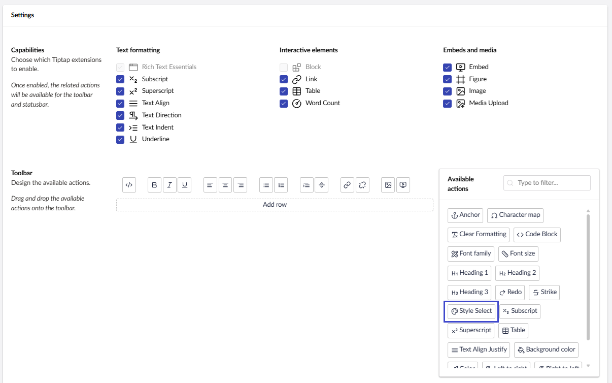

# Style Select Menu

A Style Select Menu is a configurable extension that adds a cascading menu to the toolbar for applying text styles and formatting.



Any custom stylesheets associated with the Rich Text Editor will not auto generate a style select menu in the toolbar.


## Adding Style Select to Rich Text Editor

To add Style Select to the Rich Text Editor:

1. Go to **Settings**.
2. Navigate to **Data Types**.
3. Select the relevant Data Type.
4. Drag **Style Select** from **Available Actions** into the **Toolbar** section.
5. Click **Save**.

Alternatively, while configuring an editor on a Document Type, you can drag **Style Select** from **Available Actions** into the **Toolbar** section.



## Creating a Style Select Menu

In this article, you can find an example of how to set up a Style Select Menu using an [Umbraco Package Manifest](../../../../../customizing/umbraco-package.md) file.


```json
{
    "name": "Name of your package",
    "alias": "My.Package",
    "extensions": [
        {
            "type": "tiptapToolbarExtension",
            "kind": "styleMenu",
            "alias": "MyCustom.Tiptap.StyleMenu",
            "name": "My Custom Tiptap Style Menu",
            "meta": {
                "alias": "myCustomStyleMenu",
                "icon": "icon-palette",
                "label": "My custom styles"
            },
            "items": [
                {
                    "label": "Headings",
                    "items": [
                        {
                            "label": "Heading 2",
                            "data": { "tag": "h2" },
                            "appearance": { "icon": "icon-heading-2" }
                        },
                        {
                            "label": "Heading 3",
                            "data": { "tag": "h3" },
                            "appearance": { "style": "font-size: large;" }
                        },
                        {
                            "label": "Heading 4",
                            "data": { "tag": "h4" }
                        }
                    ]
                },
                {
                    "label": "Attributes",
                    "items": [
                        {
                            "label": "Classes",
                            "data": { "class": "foo" }
                        },
                        { 
                            "label": "IDs",
                            "data": { "id": "bar" }
                        },
                        {
                            "label": "Mixed",
                            "data": { "tag": "span", "class": "foo", "id": "bar" }
                        }
                    ]
                }
            ]
        }
    ]
}
```


The `items` property defines the structure of the style select menu. Each menu item has the following options:

- `label`: _(required)_ The label of the menu item. This supports localization keys.
- `appearance`: This defines the appearance of the menu item. The value has 2 optional properties:
  - `icon`: To prefix an icon to the menu item.
  - `style`: To apply CSS rules to the menu item.
- `data`: To configure the function of the style select menu item. The value has 3 optional properties:
  - `tag`: A [supported HTML tag](#supported-html-tags) name. This will be applied to the selected text.
  - `class`: Applies a class attribute with the defined class name to the containing tag of the selected text.
  - `id`: Applies an ID attribute with the defined ID value to the containing tag of the selected text.
- `separatorAfter`: When `true`, it will add a line separator after the menu item.
- `items`: To enable a cascading menu, an array of nested menu items may be added.

Once configured, all custom style select menus will appear in the Rich Text Editor toolbar options, as described in the [Rich Text Editor Configuration](configuration.md) article.

### Supported HTML tags

Due to Tiptap’s strict rich-text schema, only supported HTML tags are allowed in the style select menu, _(arbitrary markup will be excluded)._ The following HTML tag names are supported:

- `h1`
- `h2`
- `h3`
- `h4`
- `h5`
- `h6`
- `p`
- `blockquote`
- `code`
- `codeBlock`
- `div`
- `em` (italic)
- `ol`
- `strong` (bold)
- `s` (strike-through)
- `span`
- `u` (underline)
- `ul`
