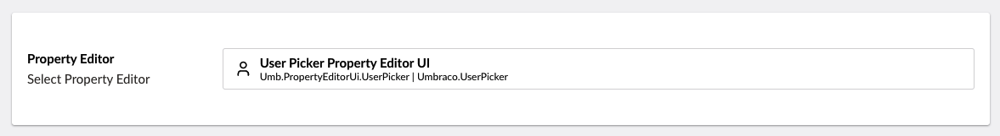
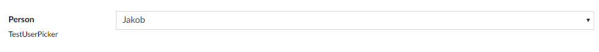

# User Picker

`Alias: Umbraco.UserPicker`

`Returns: IPublishedContent`

The user picker opens a panel to pick a specific user from the Users section. The value saved is of type IPublishedContent.

## Data Type Definition Example



## Content Example



## MVC View Example


Getting the Value of the property will return the user ID - properties of the User can be accessed by referencing UserService.


### Without Modelsbuilder

```csharp
@using Umbraco.Cms.Core.Services;
@inject IUserService UserService;
@{
    
    if (Model.Value("userPicker") != null)
    {
        var us = UserService;
        var username = us.GetUserById(Model.Value<int>("userPicker")).Name;

        <p>This is the chosen person: @username</p>
        <p>This returns the id value of chosen person: @Model.Value("userPicker")</p>
    }
}
```

### With Modelsbuilder

```csharp
@using Umbraco.Cms.Core.Services;
@inject IUserService UserService;
@{
    if (Model.UserPicker != null)
    {

        var us = UserService;
        var user = us.GetUserById((int)Model.UserPicker);

        <p>This is the chosen person: @user.Name</p>
        <p>This returns the id value of chosen person: @user.Id)</p>
    }
}
```

## Add values programmatically

See the example below to see how a value can be added or changed programmatically. To update a value of a property editor you need the [Content Service](https://apidocs.umbraco.com/v14/csharp/api/Umbraco.Cms.Core.Services.ContentService.html).


The example below demonstrates how to add values programmatically using a Razor view. However, this is used for illustrative purposes only and is not the recommended method for production environments.


```csharp
@inject IContentService Services;
@{
    // Get access to ContentService
    var contentService = Services;

    // Create a variable for the GUID of the page you want to update
    var guid = new Guid("796a8d5c-b7bb-46d9-bc57-ab834d0d1248");
    
    // Get the page using the GUID you've defined
    var content = contentService.GetById(guid); // ID of your page

    // Set the value of the property with alias 'userPicker'. The value is the specific ID of the user
    content.SetValue("userPicker", -1);
            
    // Save the change
    contentService.Save(content);
}
```

Although the use of a GUID is preferable, you can also use the numeric ID to get the page:

```csharp
@{
    // Get the page using it's id
    var content = contentService.GetById(1234); 
}
```

If Modelsbuilder is enabled you can get the alias of the desired property without using a magic string:



```csharp
@inject IPublishedSnapshotAccessor _publishedSnapshotAccessor;
@{
    // Set the value of the property with alias 'userPicker'
    content.SetValue(Home.GetModelPropertyType(_publishedSnapshotAccessor, x => x.UserPicker).Alias, "Umbraco Demo");
}
```
