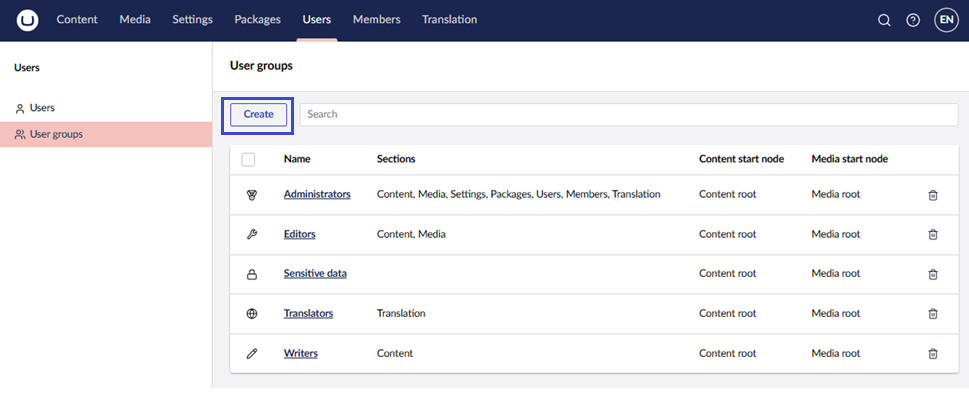

# Users

Users are people who have access to the Umbraco backoffice (not to be confused with [Members](../members.md)). These could include Content Editors, Translators, Web Designers, and Developers.

This guide will walk you through how to create and invite users, manage user profiles, work with User Groups and permissions in the backoffice.

## Creating a user

To create or invite a User:

1. Go to the **Users** section in the backoffice.
2. Select **Create -> User** or **Invite...**.
3. Enter the **Name** and **Email** for the new user.
4. Select which **User group** the new user should be added to.
5. *[Optional]* Enter a **Message** for the invitation.
6. Click **Create user** or **Send invite**.

Once you have created the user, the new user will receive a system-generated password for their initial login. This password needs to be used to access the account.

### Manage a User Profile

Open a user’s profile from the **Users** section to update:

* Profile photo.
* Update the email for the user.
* Language (sets the backoffice language of the user account).
* User Group (determines the scope of access in the backoffice).
* Start nodes for both Content and Media sections to limit access.

## Default User Groups

By default, the User Groups available to new users are **Administrators**, **Writers**, **Editors**, **Translators,** and **Sensitive Data**.

* **Administrator**: Can do anything when editing nodes in the content section (has all permissions).
* **Editor**: Allowed to create and publish content items or nodes on the website without approval from others or restrictions (has permissions to **Public Access**, **Rollback**, **Browse Node**, **Create Content Template**, **Delete**, **Create**, **Publish**, **Unpublish**, **Update**, **Copy**, **Move** and **Sort**).
* **Writer**: Allowed to browse nodes, create nodes, and request for publication of items. Not allowed to publish directly without someone else's approval like an Editor (has permissions to **Browse Node**, **Create**, **Send to Publish,** and **Update**).
* **Translator**: These are used for translating your website. Translators are allowed to browse and update nodes as well as grant dashboard access. Translations of site pages must be reviewed by others before publication (has permissions to **Browse Node** and **Update**).
* **Sensitive data**: Any users added to this User group will have access to view any data marked as sensitive. Learn more about this feature in the [Sensitive Data](../../../reference/security/sensitive-data-on-members.md) article.

## Creating a User Group

You can also create your own custom User Groups and add properties and tabs as you would with Document Types and Member Types.

1. Go to the **Users** section.
2. Select **User Groups**.
3. Click **Create**.

### User Group Parameters

Enter the information about the User Group and settings for custom properties:

* **Name**: The name of the User Group.
* **Alias**: Used to reference the User Group in code - the alias will be auto-generated based on the name.
* **Assign access**: Define which sections and languages the users will have access to. Also, if the users should have access to only some or all content and media.
* **Default Permissions**: Select the default permissions granted to users of the User Group.
* **Granular permissions**: Define a specific node the users in the group should have access to.

## User Permissions

Depending on which User Group a user is added to, each user has a set of permissions associated with their accounts. These permissions either enable or disable a user's ability to perform their associated function.

The available user Permissions are defined under **Default Permissions** in the User group.

## Granular Permissions

As an addition to the Default Permissions, it is also possible to add more granular permissions on a User Group level.

With the **Documents** permission, you can define granular permissions on specific documents. This is useful when a User Group should only have limited access to a certain page on the website. Clicking **Add** opens a dialog where you can choose between documents from the Content section.

With the **Document Property Values** permission, you can define both read and write permissions for individual properties on a Document Type. This is useful if a User Group should have limited access to edit the content on a specific type of document. Clicking **Add** opens a dialog where you select a Document Type, choose a Property, and, finally, set the read and write permissions.

### Setting User Permissions

When a new user is created, you can set specific permissions for that user on different domains and subdomains. You can also set permissions on different User Groups, even for the default types.

## Technical

As a developer, you are only able to leverage your website from the backoffice when you build on the Users section of Umbraco. This is because the Users section is restricted to the Umbraco backoffice.

## [Managing Forms Security](https://docs.umbraco.com/umbraco-forms/developer/security)

Umbraco Forms has a backoffice security model integrated with Umbraco Users. You can manage the details in the **Users** section of the backoffice, within a tree named **Forms Security**.
