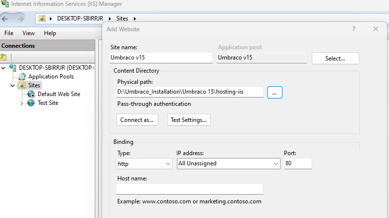

# Hosting Umbraco in IIS

## Install .NET Core Runtime

* Download the .NET Core Runtime from the [Download .NET page](https://dotnet.microsoft.com/en-us/download/dotnet/).
* Ensure you download the version that matches your project’s requirements, which can be found in the [requirements](../requirements.md) article.

## Install the Hosting Bundle

Download the ASP.NET Core Runtime **Hosting Bundle** to enable IIS to run ASP.NET Core applications.

## Restart IIS

After installing .NET Core Runtime, restart IIS to ensure the changes are applied.

1. Open Command Prompt as Administrator.
2. Run the following commands:

```bash
net stop was /y
net start w3svc
```

## Create the Site in IIS

Next, create a new site in IIS for hosting Umbraco.

### Set Application Pool

1. Open IIS Manager.
2. Right-click on **Application Pools** in the **Connections** panel.
3. Select **Add Application Pool**.
4. Enter the Name.
5. Ensure the .NET Common Language Runtime (CLR) version is set to **No Managed Code**.
6. Click **Ok**.


### Create a Site

1. Open IIS Manager.
2. Right-click on **Sites** in the **Connections** panel.
3. Select **Add Website**.
4. Fill in the **Site Name**, **Physical Path** (to your Umbraco installation), and the **Port**.
5. Click **Ok**.



### Publish the Website

You can either use the dotnet CLI or Visual Studio to publish your Umbraco website.

#### Option 1: Use dotnet CLI for Manual Deployment

1. Open the Command Prompt in the directory of your Umbraco project.
2. Run the following command:

```bash
dotnet publish -o ../deployment-artefacts -f net9.0
```


Make sure to replace net9.0 with the version of .NET you are using.



#### Option 2: Use Visual Studio to Deploy

1. Open your project in Visual Studio.
2. Right-click on the Umbraco project in Solution Explorer.
3. Select **Publish...**.



To deploy Umbraco to IIS via Azure DevOps, you can use the [IIS Release task in Azure DevOps](https://learn.microsoft.com/en-us/azure/devops/pipelines/release/deploy-webdeploy-iis-deploygroups). This task is a wrapper for `MSDeploy.exe` and can be configured as preferred.


### Configure Environment Variables

In IIS, you can configure environment variables for Umbraco to store sensitive data such as your connection string.

#### Configure Environment Variables in IIS

1. Open IIS Manager and select your Umbraco site.
2. Double-click **Configuration Editor** in the **Management** section.


3. Select `system.webServer/aspNetCore` in the **Section** dropdown.
4. Select `ApplicationHost.config <location path='[YOUR-SITENAME]'>` in the **From** dropdown.

This ensures your settings will be stored in a machine specific file. The configuration files might end in a public repository and should not contain sensitive data like Connection Strings or Simple Mail Transfer Protocol (SMTP) configuration with username and password. Additionally, by default the configuration file will be overwritten during each publish processes.

5. Locate the **environmentVariables** line and open the dialog to add environment variables.
6. Enter the values for `ASPNETCORE_ENVIRONMENT` and `ConnectionStrings__umbracoDbDSN`.


* Variable names need to change the object structure form JSON by combining the segments with double underscore `__` For example: `ConnectionStrings__umbracoDbDSN`
* Escaped backslashes `\\`  For example: `serverName\\databaseInstanceName` are replaced by single backslash `\` (`DATABASESERVER123\SQL2017`)


7. Click **Add**.
8. Click **Apply**.


9. Restart IIS to apply the changes after updating the environment variables.

### IIS Hosting Models

IIS can host .NET applications using two different hosting models: In-process (default) and Out-of-process.

#### In-process Hosting (Default)

* [In-process hosting](https://docs.microsoft.com/en-us/aspnet/core/host-and-deploy/iis/in-process-hosting) runs the .NET application within the same process as the IIS worker process.
* This is the default hosting model and is more efficient, as there is no inter-process communication between IIS and the application.

#### Default Configuration

No changes are required to your application configuration for in-process hosting. It works automatically with the default IIS settings.

#### Out-of-process Hosting

* [Out-of-process hosting](https://docs.microsoft.com/en-us/aspnet/core/host-and-deploy/iis/out-of-process-hosting) allows the .NET application to run separately from the IIS worker process. IIS acts as a reverse proxy to the Kestrel server, which hosts the .NET application.
* This model is useful when you need to run a .NET application in a separate process, for example, when the application requires more isolated resources or needs to scale independently from IIS.

#### Configuration

To enable out-of-process hosting:

1. Open your Umbraco project.
2. Locate the `.csproj` file.
3. Add the following line:

```xml
<PropertyGroup>
  <AspNetCoreHostingModel>OutOfProcess</AspNetCoreHostingModel>
</PropertyGroup>
```

4. Save the `.csproj` file.
5. Rebuild your application.

### Troubleshooting: Handling WebDAV Module Interference

**Issue:** A 405 error may occur when attempting to save content items in Umbraco, due to the WebDAV module blocking PUT requests.

**Solution:** If you encounter this issue, it may be because the WebDAV module in IIS is blocking the necessary PUT requests. This issue is not present on all IIS setups, but if you do have WebDAV installed, try disabling the WebDAV module.

**Workaround:**

1. Open the `web.config` file.
2. Add the following code to remove the WebDAV module:

```xml
<modules runAllManagedModulesForAllRequests="false">
    <remove name="WebDAVModule" />
</modules>
```

3. Restart IIS.
