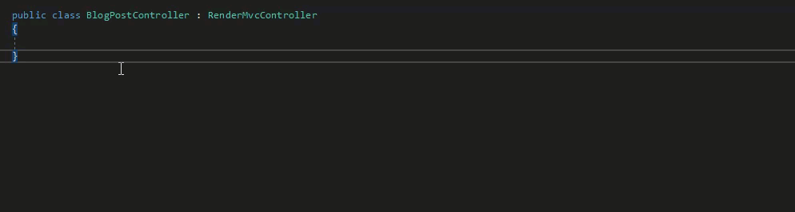

# Services and Helpers

Umbraco has a range of 'Core' Services and Helpers that act as a 'gateway' to Umbraco data and functionality to use when extending or implementing an Umbraco site.

The general rule of thumb is that management Services provide access to allow the modification of Umbraco data (and therefore aren't optimised for displaying data). Helpers on the other hand provide access to readonly data with performance of displaying data taken into consideration.


Although there is a management Service named the `IContentService` - only use this to modify content - do not use the `IContentService` in a View/Template to pull back data to display, this will make requests to the database and be slow - here instead inject the `IPublishedContentQueryAccessor` interface and get the `IPublishedContentQuery` that operate against a cache of published content items, and are significantly quicker.


The management Services and Helpers are all registered with Umbraco's underlying DI framework. This article aims to show examples of gaining access to utilise these resources in multiple different scenarios. There are subtle differences to be aware of depending on what part of Umbraco is being extended.

This article will also suggest how to follow a similar pattern to encapsulate custom 'site specific' implementation logic, in similar services and helpers, registered with the underlying DI contain. This would be to avoid repetition and promote consistency and readability within an Umbraco site solution.

## Accessing Management Services and Helpers in a Template/View

Inside a view/template or partial view, access is also provided by the DI framework, by using the `@inject` keyword.

```csharp
@inherits Umbraco.Cms.Web.Common.Views.UmbracoViewPage<ContentModels.Root>
@using ContentModels = Umbraco.Cms.Web.Common.PublishedModels;
@using Umbraco.Cms.Core.Services;
@using Umbraco.Cms.Web.Common;

@* it is really 'unlikely' to need to use a management Service in a view: *@
@inject IRelationService RelationService
@inject UmbracoHelper Umbraco

@{
    Layout = null;

    // retrieve an item from Umbraco's published cache with id 123
    IPublishedContent publishedContentItem = Umbraco.Content(123);
}
```

## Accessing Core Services and Helpers in a Controller

Inside a [custom Controller](../../reference/routing/custom-controllers.md) access is provided to Services via the `Services` property ([ServiceContext](../../reference/management/)) and the `UmbracoHelper` via the `Umbraco` property ([UmbracoHelper](../../reference/querying/umbracohelper.md)).

```csharp
using Microsoft.AspNetCore.Mvc;
using Microsoft.AspNetCore.Mvc.ViewEngines;
using Microsoft.Extensions.Logging;
using Umbraco.Cms.Core;
using Umbraco.Cms.Core.Models.PublishedContent;
using Umbraco.Cms.Core.Services;
using Umbraco.Cms.Core.Web;
using Umbraco.Cms.Web.Common.Controllers;

namespace Umbraco9.Controllers;

public class BlogPostController : RenderController
{
    private readonly ILogger<BlogPostController> _logger;
    private readonly IPublishedContentQuery _publishedContentQuery;
    private readonly IRelationService _relationService;

    public BlogPostController(
        ILogger<BlogPostController> logger,
        ICompositeViewEngine compositeViewEngine,
        IUmbracoContextAccessor umbracoContextAccessor,
        IPublishedContentQuery publishedContentQuery,
        IRelationService relationService)
        : base(logger, compositeViewEngine, umbracoContextAccessor)
    {
        _logger = logger;
        _publishedContentQuery = publishedContentQuery;
        _relationService = relationService;
    }

    public override IActionResult Index()
    {
        // write helpful messages to the Umbraco logs to aid with debugging
        _logger.LogInformation("Using core logger implementation");
        // retrieve an item from Umbraco's published cache with id 123
        IPublishedContent publishedContentItem = _publishedContentQuery.Content(123);
        // it is unlikely to use a management service when rendering content from a custom controller
        //(when using relationService like this you would want to provide a layer of caching)
        var allRelatedUmbracoItems = _relationService.GetByParentId(CurrentPage.Id);

        return base.Index();
    }
}
```

## Accessing core Services and Helpers when there is no 'UmbracoContext' eg in a Component or C# Class

Controllers and Views can access an `IUmbracoContext` by injecting the `IUmbracoContextAccessor`, however this is not always the case 'everywhere in Umbraco', for example common extension points: Components,ContentFinders or Custom C# Classes.


IUmbracoContext, UmbracoHelper, IPublishedContentQuery - are all based on an HttpRequest - their lifetime is controlled by an HttpRequest. So if you are not operating within an actual request, you cannot inject these parameters and if you try to ... Umbraco will report an error on startup.


### Injecting Services into a Component

It's possible to inject management Services that do not rely on the `UmbracoContext` into the constructor of a component. This example shows injecting the `IMediaService` in a Notification Handler to create a corresponding Media Folder for every 'landing page' that is saved in the Content Section, by subscribing to the 'Content Saved' notification.

```csharp
using System.Linq;
using Umbraco.Cms.Core.Composing;
using Umbraco.Cms.Core.DependencyInjection;
using Umbraco.Cms.Core.Events;
using Umbraco.Cms.Core.Models;
using Umbraco.Cms.Core.Notifications;
using Umbraco.Cms.Core.Services;

namespace Umbraco9.Components;

public class SubscribeToContentSavedEventComposer : IComposer
{
    public void Compose(IUmbracoBuilder builder)
    {
        builder.AddNotificationHandler<ContentSavedNotification, SubscribeToContentSavedNotification>();
    }
}
public class SubscribeToContentSavedNotification: INotificationHandler<ContentSavedNotification>
{
    private readonly IMediaService _mediaService;

    public SubscribeToContentSavedNotification(IMediaService mediaService)
    {
        _mediaService = mediaService;
    }

    public void Handle(ContentSavedNotification notification)
    {
        foreach (var contentItem in notification.SavedEntities)
        {
            // if this is a new landing page create a folder for associated media in the media section
            if (contentItem.ContentType.Alias == "landingPage")
            {
                // we have injected in the mediaService in the constructor for the component see above.
                bool hasExistingFolder = _mediaService.GetByLevel(1).Any(f => f.Name == contentItem.Name);
                if (!hasExistingFolder)
                {
                    // let's create one (-1 indicates the root of the media section)
                    IMedia newFolder = _mediaService.CreateMedia(contentItem.Name, -1, "Folder");
                    _mediaService.Save(newFolder);
                }
            }
        }
    }
}
```

See documentation on [Composing](../composing.md) for further examples and information on Components and Composition.

### Accessing Published Content outside of a Http Request

Trying to inject types that are based on an Http Request such as `UmbracoHelper` or `IPublishedContentQuery` into classes that are not based on an Http Request will trigger an error. However, there is a technique that allows the querying of the Umbraco Published Content, using the `UmbracoContextFactory` and calling `EnsureUmbracoContext()`.

In this example, when a page is unpublished, instead of a 404 occurring for the content when the url is requested in the future, we might want to serve a 410 'page gone' status code instead. We handle the Unpublishing notification of the ContentService, access the Published Content Cache, determine it's 'published url' and then store for later use in any 'serving the 410' mechanism.

An [IContentFinder](../../reference/routing/request-pipeline/icontentfinder.md) could be placed in the ContentFinder ordered collection, right before a 404 is served. This could be done to lookup the incoming request against the stored location of 410 urls, and serve the 410 status request code if a match is found for the previously published item.

```csharp
using System;
using Umbraco.Cms.Core;
using Umbraco.Cms.Core.Composing;
using Umbraco.Cms.Core.DependencyInjection;
using Umbraco.Cms.Core.Events;
using Umbraco.Cms.Core.Models.PublishedContent;
using Umbraco.Cms.Core.Notifications;
using Umbraco.Cms.Core.PublishedCache;
using Umbraco.Cms.Core.Web;
using Umbraco.Extensions;

namespace Umbraco9.Components;

public class HandleUnPublishingEventComposer : IComposer
{
    public void Compose(IUmbracoBuilder builder)
    {
        builder.AddNotificationHandler<ContentUnpublishedNotification, HandleUnPublishingHandler>();
    }
}

public class HandleUnPublishingHandler : INotificationHandler<ContentUnpublishedNotification>
{
    private readonly IUmbracoContextFactory _umbracoContextFactory;

    public HandleUnPublishingHandler(IUmbracoContextFactory umbracoContextFactory)
    {
        _umbracoContextFactory = umbracoContextFactory;
    }

    public void Handle(ContentUnpublishedNotification notification)
    {
        // for each unpublished item, we want to find the url that it was previously 'published under' and store in a database table or similar
        using (UmbracoContextReference umbracoContextReference = _umbracoContextFactory.EnsureUmbracoContext())
        {
            // the UmbracoContextReference provides access to the ContentCache
            IPublishedContentCache contentCache = umbracoContextReference.UmbracoContext.Content;

            foreach (var item in notification.UnpublishedEntities)
            {
                if (item.ContentType.Alias == "blogpost")
                {
                    // item being unpublished will still be in the cache, as unpublishing event fires before the cache is updated.
                    IPublishedContent soonToBeUnPublishedItem = contentCache.GetById(item.Id);

                    if (soonToBeUnPublishedItem != null)
                    {
                        string previouslyPublishedUrl = soonToBeUnPublishedItem.Url();

                        if (!string.IsNullOrEmpty(previouslyPublishedUrl) && previouslyPublishedUrl != "#")
                        {
                            _customFourTenService.InsertFourTenUrl(previouslyPublishedUrl, DateTime.UtcNow);
                        }
                    }
                }
            }
        }
    }
}
```

#### Accessing the Published Content Cache via IPublishedContentQuery

When you need to fetch multiple content items by ID, using UmbracoContext.Content is limited because it only allows retrieving one content item at a time. To query multiple items efficiently, you can use IPublishedContentQuery. For more details, see the [IPublishedContentQuery](../../reference/querying/ipublishedcontentquery.md) article.

#### Accessing the Published Content Cache from a Content Finder / UrlProvider

Inside a ContentFinder access to the content cache is possible by injecting `IUmbracoContextAccessor` into the constructor and provided via the PublishedRequest object:

```csharp
public Task<bool> TryFindContent(IPublishedRequestBuilder request)
{
    if (!UmbracoContextAccessor.TryGetUmbracoContext(out var umbracoContext))
    {
        return false;
    }
    var someContent = umbracoContext.Content.GetById(1234);

    // ...
}
```

And inside an `IPublishedUrlProvider` injection of `IUmbracoContextAccessor` into the constructor is also possible.

```csharp
private readonly IUmbracoContextAccessor _umbracoContextAccessor;

public MyCustomUrlProvider(IUmbracoContextAccessor umbracoContextAccessor)
{
    _umbracoContextAccessor = umbracoContextAccessor ?? throw new ArgumentNullException(nameof(umbracoContextAccessor));
}

public override UrlInfo GetUrl(IPublishedContent content, UrlMode mode = UrlMode.Default, string culture = null, Uri current = null)
{

    var umbracoContext = _umbracoContextAccessor.GetRequiredUmbracoContext();
    var someContent = umbracoContext.Content.GetById(1234);

    // ...
}
```


It is still possible to inject services into IContentFinder's. IContentFinders are singletons, but the example is showing you do not 'need to' in order to access the Published Content Cache.


## Customizing Services and Helpers

When implementing an Umbraco site, it is likely to have to execute similar code that accesses or operates on Umbraco data, in multiple places, perhaps using the core management Services or Umbraco Helpers.

For example; Getting a list of the latest News Articles, or building a link to the site's News Section or Contact Us page. Repeating this kind of logic in multiple places, Views, Partial Views / Controllers etc, is possible, but it's generally considered good practice to consolidate this logic into a single place.

### Extension methods

One option is to add 'Extension Methods' to the `UmbracoHelper` class or `IPublishedContentQuery` interface.

```csharp
using System.Linq;
using Umbraco.Cms.Core;
using Umbraco.Cms.Core.Models.PublishedContent;
using Umbraco.Extensions;

namespace Umbraco9.Components;

public static class PublishedContentQueryExtensions
{
    public static IPublishedContent GetNewsSection(this IPublishedContentQuery publishedContentQuery)
    {
        // assuming a single site with a single News Section at the top level
        IPublishedContent siteRoot = publishedContentQuery.ContentAtRoot().FirstOrDefault();
        // make sure siteRoot isn't null, then locate first child content item with alias 'newsSection'
        return siteRoot?.FirstChild(f => f.ContentType.Alias == "newsSection") ?? null;
    }
}
```

Anywhere there is reference to the `UmbracoHelper` or `IPublishedContentQuery` and a reference is added to the namespace the extension belongs to, it is possible to call the method by writing `_publishedContentQuery.GetNewsSection()`.

### Custom Services and Helpers

Another option, is to make use of the underlying DI framework, and create custom Services and Helpers, that in turn can have the 'core' management Services and Umbraco Helpers injected into them.

This approach enables the grouping together of similar methods within a suitably named service, and promotes the possibility of testing this custom logic outside of Controllers and Views.


Depending on where the custom service will be utilised, we will dictate the best practice approach to accessing the 'Published Content Cache'. If it is 100% guaranteed that the service will only be called from a place with an UmbracoContext, eg a controller or view, then it is safe to inject `IPublishedContentQuery` etc for simplicity. However if the custom service is called in a location without UmbracoContext (eg an notification handler) it will fail. Therefore the approach of accessing the Published Content Cache via injecting IUmbracoContextFactory and calling `EnsureUmbracoContext()` will provide consistency across any custom services no matter where they are utilised.


In this example, we create a custom service, that's responsible for finding key pages within a site, eg the News Section or the Contact Us page. These methods will commonly be called in different places throughout the site, and it's great to encapsulate the logic to retrieve them in a single place - we'll call this service `SiteService`.

Create an interface to define the service:

```csharp
using Umbraco.Cms.Core.Models.PublishedContent;

namespace Umbraco9.Services;

public interface ISiteService
{
    IPublishedContent GetNewsSection();
    IPublishedContent GetContactUsPage();
}
```

Create the concrete service class that implements the interface:

```csharp
using System;
using Umbraco.Cms.Core.Models.PublishedContent;

namespace Umbraco9.Services;

public class SiteService : ISiteService
{
    public IPublishedContent GetNewsSection()
    {
        // TODO: implement this!
        throw new NotImplementedException();
    }

    public IPublishedContent GetContactUsPage()
    {
        // TODO: implement this!
        throw new NotImplementedException();
    }
}
```

Register the custom service with Umbraco's underlying DI container using an `IComposer`:

```csharp
using Microsoft.Extensions.DependencyInjection;
using Umbraco.Cms.Core.Composing;
using Umbraco.Cms.Core.DependencyInjection;

namespace Umbraco9.Services;

public class RegisterSiteServiceComposer : IComposer
{
    public void Compose(IUmbracoBuilder builder)
    {
        builder.Services.AddSingleton<ISiteService, SiteService>();
    }
}
```

#### Lifetimes

**"Transient"** services can be injected into "Transient" and below ⤵. (i.e. "Transient" services can be injected anywhere)

* "Transient" means that anytime this type is needed a brand new instance of this type will be created.

**"Scope"** services can be injected into "Request"/"Scope" based lifetimes only

* "Scope" means that a single instance of this type will be created for the duration of the current HttpRequest. The instance will be disposed of at the end of the current HttpRequest.

**"Singleton"** services can be injected into "Singletons" and below ⤵.

* "Singleton" means that only a single instance of this type will ever be created for the lifetime of the application.

#### Implementing the service

**1 - The service will ONLY be used during a request like in a Controller or View**

You can avoid repeating common implementation logic in multiple controllers and views. This is done by consolidating these implementations into a custom service. If you are very familiar with IPublishedContentQuery injecting this into the custom service is straight forward, but the caveat is you can only use this service in a controller/view.

For example, locating the 'special' pages in the site using the familiar syntax of the `IPublishedContentQuery`:

```csharp
using System.Linq;
using Umbraco.Cms.Core;
using Umbraco.Cms.Core.Models.PublishedContent;
using Umbraco.Extensions;

namespace Umbraco9.Services;

public class SiteService : ISiteService
{
    private readonly IPublishedContentQuery _contentQuery;
    public SiteService(IPublishedContentQuery contentQuery)
    {
        _contentQuery = contentQuery;
    }
    public IPublishedContent GetNewsSection()
    {
        var siteRoot = _contentQuery.ContentAtRoot().FirstOrDefault();
        var newsSection = siteRoot?.FirstChild(f => f.ContentType.Alias == "newsSection") ?? null;
        return newsSection;
    }
    public IPublishedContent GetContactUsPage()
    {
        var siteRoot = _contentQuery.ContentAtRoot().FirstOrDefault();
        var contactUs = siteRoot?.FirstChild(f => f.ContentType.Alias == "contactUs") ?? null;
        return contactUs;
    }
}
```

**2 - The service can be used within or outside of a web request**

```csharp
using System.Linq;
using Umbraco.Cms.Core.Models.PublishedContent;
using Umbraco.Cms.Core.Web;
using Umbraco.Extensions;

namespace Umbraco9.Services;

public class SiteService : ISiteService
{
    private readonly IUmbracoContextFactory _umbracoContextFactory;

    public SiteService(IUmbracoContextFactory umbracoContextFactory)
    {
        _umbracoContextFactory = umbracoContextFactory;
    }
    public IPublishedContent GetNewsSection()
    {
        using var umbracoContextReference = _umbracoContextFactory.EnsureUmbracoContext();
        var contentQuery = umbracoContextReference.UmbracoContext.Content;
        var siteRoot = contentQuery.GetAtRoot().FirstOrDefault();
        var newsSection = siteRoot?.FirstChild(f => f.ContentType.Alias == "newsSection") ?? null;
        return newsSection;
    }
    public IPublishedContent GetContactUsPage()
    {
        using var umbracoContextReference = _umbracoContextFactory.EnsureUmbracoContext();
        var contentQuery = umbracoContextReference.UmbracoContext.Content;
        var siteRoot = contentQuery.GetAtRoot().FirstOrDefault();
        var contactUs = siteRoot?.FirstChild(f => f.ContentType.Alias == "contactUs") ?? null;
        return contactUs;
    }
}
```

The second approach can seem 'different' or more complex at first glance, but it is the syntax and method names that are slightly different... it enables the registering of the service in Singleton Scope, and its use outside of controllers and views.


Occasionally, you may face a situation where Umbraco fails to boot, due to a circular dependency on `IUmbracoContextFactory`. This can happen if your service interacts with third party code that also depends on an `IUmbracoContextFactory` instance (e.g. an Umbraco package).

See the [Circular Dependencies](circular-dependencies.md) article for an example on how to get around this.


**Aside: What is the IUmbracoContextAccessor then?**

The `IUmbracoContextFactory` will obtain an `UmbracoContext` by first checking to see if one exists on the current thread using the `IUmbracoContextAccessor`. This is a singleton that can be injected anywhere and whose function is to provide access to the current UmbracoContext. On a 'non request' thread the IUmbracoContextAccessor's TryGetUmbracoContext method will return false and the IUmbracoContextFactory will create a new instance of the UmbracoContext.

If you need to know whether the UmbracoContext has been obtained from an existing thread, or whether it has been freshly created, you can 'inject' `IUmbracoContextAccessor` yourself. This will check if the UmbracoContext is null using the TryGetUmbracoContext method, indicating whether you are in a 'non request' thread or not. You will still need to inject and use an IUmbracoContextFactory if you subsequently want to obtain an UmbracoContext in a non-request thread.

```csharp
using System.Linq;
using Umbraco.Core.Models.PublishedContent;
using Umbraco.Web;
using Umbraco.Web.PublishedCache;

namespace Umbraco9.Services;

public class SiteService : ISiteService
{
    private readonly IUmbracoContextAccessor _umbracoContextAccessor;
    private readonly IUmbracoContextFactory _umbracoContextFactory;

    public SiteService(IUmbracoContextAccessor umbracoContextAccessor, IUmbracoContextFactory umbracoContextFactory)
    {
        _umbracoContextAccessor = umbracoContextAccessor;
        _umbracoContextFactory = umbracoContextFactory;
        bool hasUmbracoContext = _umbracoContextAccessor.TryGetUmbracoContext(out _);
    }
}
```

NB: With the `IUmbracoContextAccessor` and `IUmbracoContextFactory` you should NEVER have to inject the UmbracoContext itself directly into any of your constructors.

#### Using the custom SiteService inside a Controller

Because we've registered the SiteService with Umbraco's underlying DI framework we can inject the service into our controller's constructor, in the same way as 'core' Services and Helpers.

```csharp
using Microsoft.AspNetCore.Mvc;
using Microsoft.AspNetCore.Mvc.ViewEngines;
using Microsoft.Extensions.Logging;
using Umbraco.Cms.Core.Web;
using Umbraco.Cms.Web.Common.Controllers;
using Umbraco9.Services;

namespace Umbraco9.Controllers;

public class BlogPostController : RenderController
{
    private readonly ISiteService _siteService;

    public BlogPostController(
        ILogger<RenderController> logger,
        ICompositeViewEngine compositeViewEngine,
        IUmbracoContextAccessor umbracoContextAccessor,
        ISiteService siteService)
        : base(logger, compositeViewEngine, umbracoContextAccessor)
    {
        _siteService = siteService;
    }
    public override IActionResult Index()
    {
        var newsSection = _siteService.GetNewsSection();
        var blogPostViewModel = new BlogPostViewModel(CurrentPage);
        blogPostViewModel.HasNewsSection = false;
        if (newsSection != null)
        {
            blogPostViewModel.HasNewsSection = true;
            blogPostViewModel.NewsSection = newsSection;
        }

        // etc
        // Do other stuff here!, then return the custom viewmodel to the template view.
        return CurrentTemplate(blogPostViewModel);
    }
}
```

You can generate this ctor in Visual Studio by using either ctrl + . or alt + enter when your cursor is on the base class:

<figure><figcaption></figcaption></figure>

#### Using the SiteService inside a View

If strictly following the paradigm of MVC, calling custom Services from Views might feel like an anti-pattern. However there isn't necessarily one single 'best practice' approach to working with Umbraco. A lot depends on circumstance, expertise and pragmatism. Allowing Umbraco to handle the flow of incoming requests to a particular page + template, and writing implementation logic in Views/Templates, is still a very common approach. There are circumstances, where the custom implementation logic shared is very 'View' specific. Custom logic for constructing 'Alternative Text' for images or different crop urls for img srcsets can be neatly handled in a custom Helper/Service without having to create a hijacked MVC route for the request and build a complex ViewModel. Custom Services called from Views, can help separate the concerns, even if the 'plumbing' isn't pure MVC.

To access the service directly from the view you would need to use the Razor `@inject` keyword to get a reference to the concrete implementation of the service registered with DI:

```csharp
@using Umbraco9.Services

@inject ISiteService SiteService
@inherits UmbracoViewPage
@{

    IPublishedContent newsSection = SiteService.GetNewsSection();
}
<section class="section">
    <div class="container">
        <article>
```

### Handle routes as server-side requests

Sometimes you might want to request, for example "/sitemap.xml" from your server. Since this has a file extension it will be treated as a client-side request and will not work. You can configure routes to be handled as server-side requests in your program.cs.

**For a single route:**

```csharp
...
WebApplication app = builder.Build();
builder.Services.Configure<UmbracoRequestOptions>(options =>
{
    options.HandleAsServerSideRequest = httpRequest =>
    {
        return httpRequest.Path.StartsWithSegments("/sitemap.xml");
    };
});
```

**For multiple routes:**

```csharp
services.Configure<UmbracoRequestOptions>(options =>
{
    string[] allowList = new[] {"/sitemap.xml", "robots.txt", ...};
    options.HandleAsServerSideRequest = httpRequest =>
    {
        foreach (string route in allowList)
        {
            if (httpRequest.Path.StartsWithSegments(route))
            {
                return true;
            }
        }

        return false;
    };
});
```
