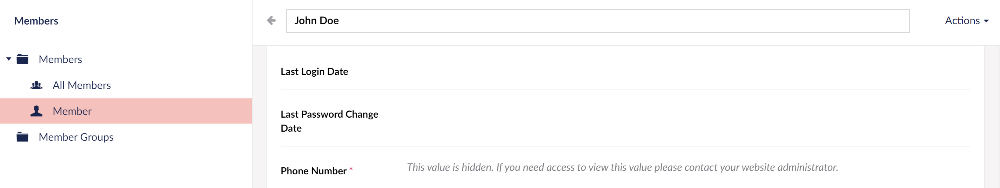
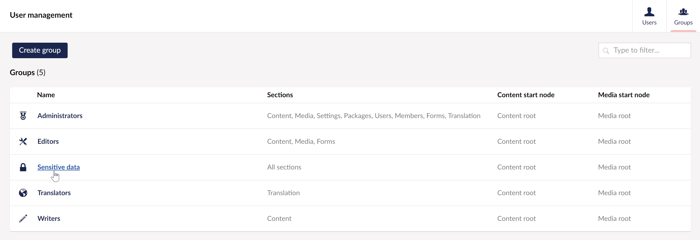
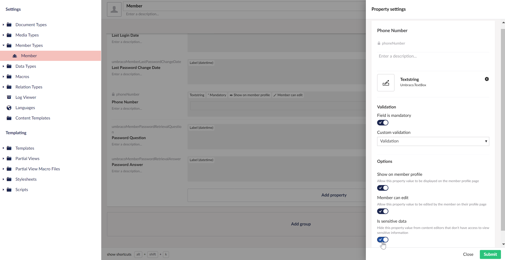

# Sensitive data

In this article, you will get an overview of how you can grant and/or deny your users access to sensitive data as well as how to mark data as sensitive.

## Grant or deny access to sensitive data

Every new Umbraco installation ships with a default set of User Groups. One of them is the **Sensitive data User Group**. To give users in the backoffice access to view and work with sensitive data, they need to be part of the Sensitive Data User Group.

Any users who are not part of the Sensitive Data User Group, will not be able to see the data in the properties that are marked as sensitive. Instead, they will see a generic message: "_This value is hidden. If you need access to view this value please contact your website administrator._"

While not part of the Sensitive Data User Group it is also not possible to export members or member data.

Follow these steps in order to grant a user access to sensitive data:

1. Navigate to the **Users** section in the Umbraco backoffice.
2. Ensure that **Users** are selected from the Users tree.
3. Select the **Groups** menu in the top-right corner.
4. Choose the **Sensitive data** group.

5. Click **Add** in the **Users** box on the right.
6. Select the users you want to give access to the sensitive data.
7. Click **Submit**.
8. **Save** the User Group.

The users you have added to the Sensitive Data User Group will now be able to:

* See member data that has been marked as sensitive,
* Mark data and properties on Member Types as sensitive, and
* Export members and member data.

## Marking data as sensitive

Once your user is added to the Sensitive Data User Group, you have access to add and configure member properties containing sensitive data.

Follow the steps below to mark data as sensitive.&#x20;

1. Navigate to the **Settings** section in the Umbraco backoffice.
2. Open the **Member Types** in the **Settings** tree.
3. Select the Member Type you wish to edit.
4. **Add** a property or configure an existing property.
5. Locate the **Is sensitive data** option at the bottom of the **Property settings** dialog.
6. Click to enable.
7. Click **Submit** to update the property configuration.
8. Click **Save** to save the changes on the Member Type.

When the **Is sensitive data** option is enabled, the value and data in the property will only be visible to the users with access to sensitive data.

