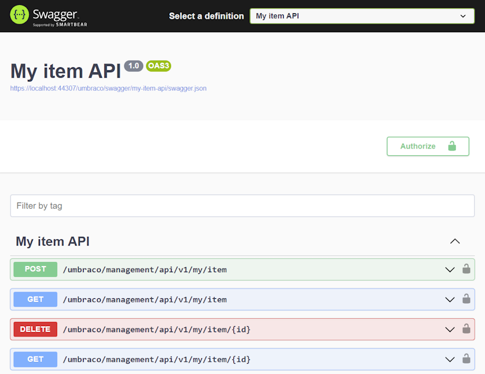

---
description: Adding a custom Swagger document for a custom Management API
---

# Adding a custom Swagger document

By default, all controllers based on ManagementApiControllerBase will be included in the default Management API Swagger document.

When building custom Management API controllers, sometimes it's preferable to have a dedicated Swagger document for them. Doing so is a three-step process:

1. Register the Swagger document with Swagger UI.
2. Instruct Swagger UI to utilize Umbraco authentication for the Swagger document.
3. Move the controllers to the Swagger document.

The following code exemplifies how to achieve the first two steps;


```csharp
using Microsoft.Extensions.Options;
using Microsoft.OpenApi.Models;
using Swashbuckle.AspNetCore.SwaggerGen;
using Umbraco.Cms.Api.Management.OpenApi;
using Umbraco.Cms.Core.Composing;

namespace UmbracoDocs.Samples;

public class MyItemApiComposer : IComposer
{
    public void Compose(IUmbracoBuilder builder)
    {
        builder.Services.ConfigureOptions<MyItemApiSwaggerGenOptions>();
    }
}

public class MyItemApiSwaggerGenOptions : IConfigureOptions<SwaggerGenOptions>
{
    public void Configure(SwaggerGenOptions options)
    {
        // register the custom Swagger document "my-item-api"
        options.SwaggerDoc(
            "my-item-api",
            new OpenApiInfo { Title = "My item API", Version = "1.0" }
        );

        // enable Umbraco authentication for the "my-item-api" Swagger document
        options.OperationFilter<MyItemApiOperationSecurityFilter>();
    }
}

public class MyItemApiOperationSecurityFilter : BackOfficeSecurityRequirementsOperationFilterBase
{
    protected override string ApiName => "my-item-api";
}
```


With this in place, the last step is to annotate the relevant API controllers with the MapToApi attribute:


```csharp
[MapToApi("my-item-api")]
public class MyItemApiController : ManagementApiControllerBase
```


Now when we visit the Swagger UI, "My item API" has its own Swagger document:




Swagger UI sometimes has persistent caching, which can prevent the new definition from appearing immediately. If this happens, it's best to use the developer tools to disable caching.
