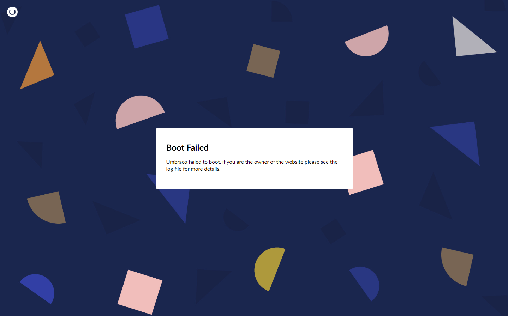

# Implement Custom Error Pages

Umbraco is built on Microsoft's .NET Framework and uses ASP.NET. This provides different options when setting up custom error pages on your website.

Implementing custom error handling can make your site look more on-brand and minimize the impact that errors have on user experience. For example, a custom 404 page with helpful links or a search function can add extra value to your site.

## In-code error page handling

In Umbraco, in-code error page handling refers to managing and displaying custom error pages directly through code. This method provides greater flexibility and control over how errors are handled and presented to users, especially within the context of an Umbraco site.

This article contains guides on how to create custom error pages for the most common scenarios:

* [404 Errors ("Page not found")](#id-404-errors)
* [500 Errors ("Internal Server Error")](#id-500-errors)
* [Boot Failed Errors](#boot-failed-errors)


**Are you looking for a guide to create a custom maintenance page?**

This has been moved to a separate article: [Create a custom maintenance page](create-a-custom-maintenance-page.md).


## 404 Errors

A 404 error occurs when a requested page cannot be found, usually due to deleted content, a changed URL, or an invalid path. In Umbraco, you can create and configure custom 404 pages using content from the backoffice.

### Create a 404 page in the backoffice

1. Go to the **Settings** section in the Umbraco backoffice.
2. Create a new **Document Type with Template**.
3. Name the Document Type *ErrorPage404*.
4. [Optional] Add any custom properties you want — though most 404 pages are static.
5. Click **Save**.
6. Go to the **Templates** folder.
7. Add your custom markup and design for the error page in the template. In this case, *ErrorPage404*.
8. Click **Save**.

### Create a Container for Status Code Pages

1. Create a new **Document Type**.
2. Name it **Statuscodes**.
3. Go to the **Structure** Workspace view.
    * Enable **Allow at root**.
    * Add the *ErrorPage404* Document Type as an **Allowed child node types**.
    * Click **Choose**.
4. Click **Save**.

### Add the Content

1. Go to the **Content** section.
2. Create a new content node based on the **Statuscodes** Document Type and name it **Statuscodes**.
3. Click **Save** or **Save and Publish**.
4. Under it, create a child node using the *ErrorPage404* Document Type.
5. Name it *Page 404 Not Found* or similar.
    * This will be the content shown when a 404 error occurs.
6. Click **Save** or **Save and Publish**.

### Configure the Error Page in `appsettings.json` file

After publishing the 404 page, you’ll need to connect it in your configuration.

1. Go to the **Info** tab of your *Page 404 Not Found* content item in the Backoffice.
2. Copy the **Id** of the page (for example: 9c2b5196-30cd-4416-ae30-94ac2afb1011).
3. Go to your project's `appsettings.json` file.
4. Add the `Error404Collection` setting to `Umbraco:CMS:Content`, like shown below:

```json
{
    "Umbraco": {
        "CMS": {
            "Content": {
                "Error404Collection": [
                    {
                        "Culture": "default",
                        "ContentKey": "9c2b5196-30cd-4416-ae30-94ac2afb1011"
                    }
                ]
            }
        }
    }
}
```

Replace the value for `ContentKey` with the ID of your own 404 page.

#### Support for Multilingual Sites

You can define different 404 pages for each language or culture (such as `en-us`, `da-dk`, and so on):

```json
"Error404Collection": [
  {
    "Culture": "en-us",
    "ContentKey": "guid-for-english-404"
  },
  {
    "Culture": "da-dk",
    "ContentKey": "guid-for-danish-404"
  }
]
```

Each entry maps a culture to its specific 404 page using the content’s GUID.

### Set a custom 404 page using IContentLastChanceFinder

It is also possible to set up a 404 error page programmatically using `IContentLastChanceFinder`. To learn more about `IContentLastChanceFinder`, read the [Custom Routing](../implementation/custom-routing/) article.

Before following this example, follow the [Create a 404 page in the backoffice](custom-error-page.md#create-a-404-page-in-the-backoffice) part. The example below will use the *errorPage404* alias of the Document Type to find and display the error page.

1. Create a new `.cs` file called *Error404Page* at the root of the project.
2. Add the following code to the newly created class:


```csharp
using Umbraco.Cms.Core.Composing;
using Umbraco.Cms.Core.Routing;
using Umbraco.Cms.Core.Web;

namespace YourProjectNamespace;

public class Error404Page : IContentLastChanceFinder
{
 private readonly IUmbracoContextAccessor _contextAccessor;

 public Error404Page(IUmbracoContextAccessor contextAccessor)
 {
  _contextAccessor = contextAccessor;
 }

 public Task<bool> TryFindContent(IPublishedRequestBuilder request)
 {
  // In the rare case that an umbracoContext cannot be built from the request,
  // we will not be able to find the page
  if (_contextAccessor.TryGetUmbracoContext(out var umbracoContext) == false)
  {
   return Task.FromResult(false);
  }

  // Find the first notFound page at the root level through the published content cache by its documentTypeAlias
  // You can make this search as complex as you want, you can return different pages based on anything in the original request
  var notFoundPage = umbracoContext.Content?.GetAtRoot().FirstOrDefault(c => c.ContentType.Alias == "errorPage404");
  if (notFoundPage == null)
  {
   return Task.FromResult(false);
  }

  //Set the content on the request and mark our search as successful
  request.SetPublishedContent(notFoundPage);
  request.SetResponseStatus(404);
  return Task.FromResult(true);
 }
}

// ContentFinders need to be registered into the DI container through a composer
public class Mycomposer : IComposer
{
 public void Compose(IUmbracoBuilder builder)
 {
  builder.SetContentLastChanceFinder<Error404Page>();
 }
}

```


## 500 Errors

This section guides you in setting up a custom page for handling internal server errors (500 errors) in your Umbraco site.  This setup works when:

* A template throws an error.
* A controller throws an unhandled exception.
* A request hits the application, but something fails during rendering or processing.

### Create a 500 error page in the Backoffice

1. Go to the **Settings** section in the Umbraco backoffice.
2. Create a new **Document Type with Template** called *ErrorPage500*.
3. [Optional] Add any relevant properties to the Document Type.
4. Click **Save**.
5. Go to the **Templates** folder.
6. Add your custom markup and design for the error page in the template. In this case, *ErrorPage500*.
7. Click **Save**.

### Create a Container for Status Code Pages

1. Create a new **Document Type**.
2. Name it **Statuscodes**.
3. Go to the **Structure** Workspace view.
    * Enable **Allow at root**.
    * Add the *ErrorPage500* Document Type as an **Allowed child node types**.
    * Click **Choose**.
4. Click **Save**.

### Add the Content

1. Go to the **Content** section.
2. Create a new content node based on the **Statuscodes** Document Type and name it **Statuscodes**.
3. Click **Save** or **Save and Publish**.
4. Under it, create a child node using the *ErrorPage500* Document Type.
5. Name it *Page 500* or similar.
    * This will be the content shown when a 500 error occurs.

### Configure the 500 Error Page Programmatically

To ensure that the 500 page is shown during server errors, you’ll need to configure a custom error controller and route handling.

1. Create a folder called `Controllers` in the root of your Umbraco project.
2. Add a new file called `ErrorController.cs` in the `Controllers` folder.
3. Add the following code to the file:



```csharp
using Microsoft.AspNetCore.Mvc;

namespace YourProjectNamespace.Controllers;

public class ErrorController : Controller
{
    [Route("Error")]
    public IActionResult Index()
    {
        if (Response.StatusCode == StatusCodes.Status500InternalServerError)
        {
            return Redirect("/statuscodes/500");
        }
        else if (Response.StatusCode != StatusCodes.Status200OK)
        {
            return Redirect("/statuscodes");
        }
        return Redirect("/");
    }
}
```




Replace _YourProjectNamespace_ with the actual project namespace. In Visual Studio, you can right-click the project and select **Sync Namespaces**.


4. Add the `/error/` route to the list of reserved paths in the `appSettings.json` file:



```json
"Umbraco": {
"CMS": {
    "Global": {
    "ReservedPaths": "~/app_plugins/,~/install/,~/mini-profiler-resources/,~/umbraco/,~/error/",
    ...
    }
  }
}
```



5. Update `Program.cs` to ensure the error route is triggered by unhandled exceptions:



```csharp
WebApplication app = builder.Build();

if (builder.Environment.IsDevelopment())
{
    app.UseDeveloperExceptionPage();
}
else
{
    app.UseExceptionHandler("/error");
}
```




To test locally, replace `app.UseDeveloperExceptionPage();` with `app.UseExceptionHandler("/error");`. Otherwise, you'll get the default .NET error page during development.


### Testing Your 500 Error Page

To trigger a 500 error on your site, try introducing a rendering error:

For example, if a Document Type has a property called `test`, it is normally rendered as:

```csharp
@Model.Value("test")
```

To trigger a 500 error, modify it to:

```csharp
@Model.ValueTest("test")
```

This will generate a server-side error, allowing you to verify that your custom 500 page is displayed correctly.

### Handling app startup failures

When Umbraco fails to start, you may see a blank screen or receive a `500.30` or `502.5` error. These indicate the web application crashed or failed to initialize.

#### Why can't the app serve an error page?

During startup, Umbraco relies on the ASP.NET Core pipeline. If the app crashes before this pipeline is fully initialized, it can't handle requests or serve custom error pages. That's why you can't rely on Umbraco or ASP.NET Core routing to show error content at this point as it has already failed. For more information, see the [Handle errors in ASP.NET Core](https://learn.microsoft.com/en-us/aspnet/core/fundamentals/error-handling) documentation.

Instead, the web server itself (IIS, NGINX, Apache, and so on) must serve a static fallback 500 page. This page is independent of the application and helps communicate the issue to users when the site is down.

To handle these types of issues:

* Configure your web server (IIS, NGINX, Apache) to serve a static HTML 500 page when the app fails to respond.
* Use uptime monitoring to catch failed starts.
* Check Umbraco logs in `App_Data/Logs` for startup errors.

## Boot Failed Errors

Sometimes you might experience issues with booting up your Umbraco project. This could be a brand new project, or it could be an existing project after an upgrade.

You will be presented with a generic error page when there is an error during boot.



You can replace the default BootFailed page with a custom static `BootFailed.html`. Follow the steps below to set it up:

1. Open your project files.
2. Navigate to `wwwroot/config/errors`
   1. If this folder does not exist already, create it.
3. Add a new file called *BootFailed.html*.
4. Add your custom markup to the file.

The `BootFailed.html` page will only be shown if debugging is disabled in the `appsettings.json` file. Debugging is handled using the **Debug** key under `Umbraco:CMS:Hosting`:


```json
{
    "Umbraco": {
        "CMS": {
            "Hosting": {
                "Debug": false
            }
        }
    }
}
```



The full error can always be found in the log file.


## Are the error pages not working?

If you set up everything correctly and the error pages are not showing correctly, make sure that you are not using

* Custom [ContentFinders](../reference/routing/request-pipeline/icontentfinder.md) in your solution,
* Any packages that allow you to customize redirects, or
* Rewrite rules that might interfere with custom error handling.


If your code or any packages configure a custom `IContentLastChanceFinder`, the settings in `appSettings.json` will not be used.


## Handling errors in ASP.NET Core

For common approaches to handling errors in ASP.NET Core web apps, see the [Handle errors in ASP.NET Core](https://docs.microsoft.com/en-us/aspnet/core/fundamentals/error-handling) article in the Microsoft Documentation.
