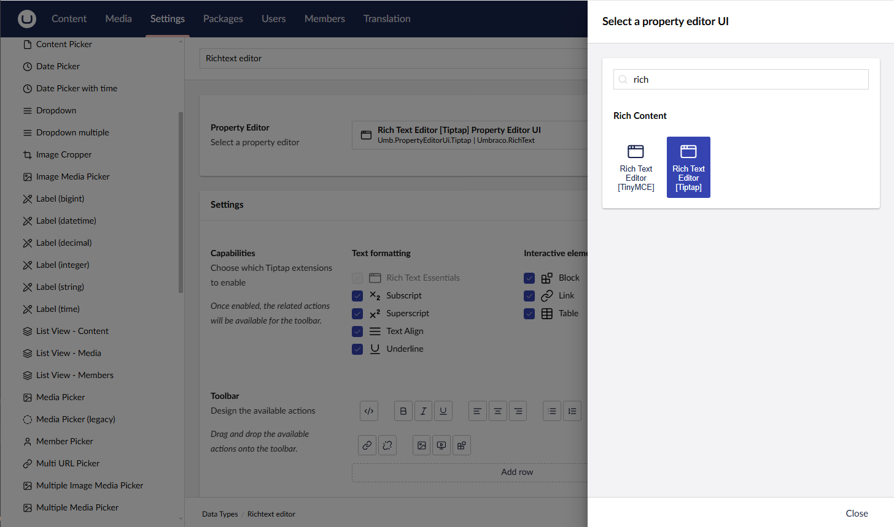
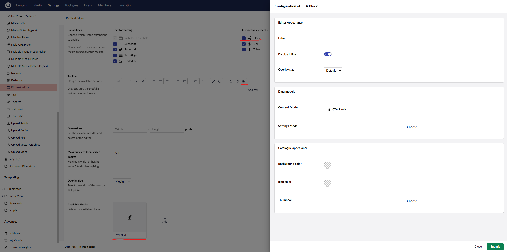

# Introduction
As with many things in Umbraco, there are a multitude of ways on how to migrate away from macros and use the blocks in the RTE instead. In this article we will be showcasing a solution that lets you scan and then fix each macro one by one (or in batch). This solution will most likely not be used in a production setup, but we hope it can serve as an inspiration on how you can build your own solution specific your current setup. At the end of the article we will discuss a few other ways of running a larger migration.

In this article we will be doing a one on one conversion from macro to block with each paramater matching the same named properties on an element document type. We are also keeping it relatively simple and are using pure text as values. If your migration deals with more complex types, we advice you to create an instance of the new data format and compare the old value against the new as there might have been more differences between the paramater type on the macro and the propertyEditor/datatype on the element document type.

Because most people will be dealing with this kind of migrations when they move between LTS version from 13 to 15, we chose to do just that in this article. More precisly from 13.7.2 to 15.2.3

# Macro setup
If you are reading this you most likely have experience with macros and know what needs to be configured to make them work but lets go over it just in case.
You need to
- Define a macro and its parameters
- Have a macro partial view that is used to render the macro in the frontoffice. It is also used in the backoffice rendering if enabled in the macro settings.
- Enable the Richtext editor (TinyMce) to allow the insertion of macros

Below you can find the relevant items setup for our example

###### Macro definition


###### Backoffice macro editing


###### TinyMce macro configuration


###### MacoPartialView (/Views/MacroPartials/CtaButtonMacro.cshtml)
```csharp
@inherits Umbraco.Cms.Web.Common.Macros.PartialViewMacroPage
<div class="Button">
    <a href="https://www.youtube.com/watch?v=@Model.MacroParameters["youtubeVideoId"]">@Model.MacroParameters["title"]</a>
</div>
```

# Block setup
The block setup is similar but with a few changes
- As off this writing the inline rendering of blocks is not working for tinyMce and tinyMce support will be removed from the core in the near future. So we switch the propertyEditorView of the Richtext property from TinyMce to Tiptap
- Setup an element Doctype with the same properties as the macro parameters
- Allow the tiptap editor to insert blocks and configure our newly created block to be one of the options
- Transform the macroview into a webcomponent for the backofice custom view
- Register the webcomponent
- Transform the macroview in to a richtext block view

Below you can find the relevant items setup for our example

###### Richtext propertyeditor configuration


###### Element definition


###### TipTap block configuration


###### Backoffice block editing


###### Backoffice custom view (/app_plugins/CustomBlockViews/ctaBlock.js)
```js

import { html, customElement, LitElement } from '@umbraco-cms/backoffice/external/lit';
export class ExampleBlockCustomView extends LitElement {

    static properties = {
        mode: { type: Object },
        content: { attribute: false },
    };

    render() {
        return html`
            <div class="Button">
                <a href="https://www.youtube.com/watch?v=${this.content?.youtubeVideoId}">${this.content?.title}</a>
            </div>
		`;
    }
}
export default ExampleBlockCustomView;
window.customElements.define('custom-view', ExampleBlockCustomView);
```
###### Backoffice custom view registration (/app_plugins/CustomBlockViews/umbraco-package.json)
```json
{
  "$schema": "../../umbraco-package-schema.json",
  "name": "My.CustomViewPackage",
  "version": "0.1.0",
  "extensions": [
    {
      "type": "blockEditorCustomView",
      "alias": "my.blockEditorCustomView.ctaBlock",
      "name": "Custom ctaBlock view",
      "element": "/App_Plugins/CustomBlockViews/ctaBlock.js",
      "forContentTypeAlias": "ctaBlock"
    }
  ]
}
```

###### Richtext component view (/Views/Partials/richtext/Components/ctaBlock.cshtml)
```csharp
@inherits Umbraco.Cms.Web.Common.Views.UmbracoViewPage<Umbraco.Cms.Core.Models.Blocks.RichTextBlockItem>
@{
    var blockValue = Model.Content as CtaBlock;
}
<div class="Button">
    <a href="https://www.youtube.com/watch?v=@blockValue.YoutubeVideoId">@blockValue.Title</a>
</div>
```

# The core conversion
No matter how you go about retrieving the relevant data or when, eventually you will end up with a raw string or a `RichTextEditorValue` that you need to convert. Let's have a look at a sample value.
###### MacroValue
```json
{
    "blocks": {
        "contentData": [
        ],
        "settingsData": [
        ]
    },
    "markup": "<p>Text before macro</p>\n<p>&nbsp;</p>\n<?UMBRACO_MACRO macroAlias=\"ctaButtonMacro\" title=\"CLICK HERE\" youtubeVideoId=\"xvFZjo5PgG0\" />\n<p>&nbsp;</p>\n<p>Text After Macro</p>"
}
```
Let's break this down. The value holds json with
- Empty block information
- The markup with the actual RTE value and the inline macro data
- The macro consists off
  - The tag used as a placeholder where to render its output
  - An alias to find the correct render/update logic
  - Two paramaters with values entered by the user

The first step in transforming the data is taking the json value and deserializing it into a `RichTextEditorValue`. This way we have a nice class to work with to store the updated data in.
You deserialize it yourself, or you can use the `RichTextPropertyEditorHelper` to do the juob for you as it will also try to catch non json values that have not been migrated to the new format.

###### Usage of RichtextPropertyEditorHelper
```csharp
RichTextPropertyEditorHelper.TryParseRichTextEditorValue(originalValue, _jsonSerializer, _logger, out var richTextEditorValue);
```

Next is to get all (relevant) macro tags out of the markup. One way of doing this is trough regex. Do not that the sample regex does not take into account that the order of parameters might be different from tag to tag. One way of dealing with this is to not take out the paramaters in the first match, but to move each paramater to a seperate regex that runs on the first match.

###### Example regex
```csharp
// this regex does not take into account that the paramaters might be in a different order.
private static readonly Regex MacroTagRegex = new(
    @"<\?UMBRACO_MACRO\s+macroAlias=['""](?<macroAlias>.+)['""]\s+title=['""](?<title>.+)['""]\s+youtubeVideoId=['""](?<youtubeVideoId>.+)['""]\s*/>",
    RegexOptions.IgnoreCase | RegexOptions.IgnorePatternWhitespace | RegexOptions.Multiline);
```

Since every macro conversion will be different based on which paramaters get matched to which properties on the block we advice you to have a converter per macro that deals with the specific data handling. 

Now that we have extracted the relevant information, let's have a look at what we want the data to look like.

```json
{
  "markup" : "<p>Text before macro</p>\n<p>&nbsp;</p>\n<umb-rte-block-inline data-content-key=\"958ab4b7-213c-4576-a4d7-30b31e3e5e83\"></umb-rte-block-inline>\n<p>&nbsp;</p>\n<p>Text After Macro</p>",
  "blocks" : {
    "contentData" : [ {
      "contentTypeKey" : "190f8990-3720-4a00-bd48-4e10dde08a5b",
      "udi" : null,
      "key" : "958ab4b7-213c-4576-a4d7-30b31e3e5e83",
      "values" : [ {
        "editorAlias" : "Umbraco.TextBox",
        "culture" : null,
        "segment" : null,
        "alias" : "title",
        "value" : "CLICK HERE"
      }, {
        "editorAlias" : "Umbraco.TextBox",
        "culture" : null,
        "segment" : null,
        "alias" : "youtubeVideoId",
        "value" : "xvFZjo5PgG0"
      } ]
    } ],
    "settingsData" : [ ],
    "expose" : [ {
      "contentKey" : "958ab4b7-213c-4576-a4d7-30b31e3e5e83",
      "culture" : null,
      "segment" : null
    } ],
    "Layout" : {
      "Umbraco.RichText" : [ {
        "contentUdi" : null,
        "settingsUdi" : null,
        "contentKey" : "958ab4b7-213c-4576-a4d7-30b31e3e5e83",
        "settingsKey" : null
      } ]
    }
  }
}
```
Note that
- The markup still contains a tag placeholder but this time with only the data-content-key
- That key references an item inside the blocks contentData that holds the values of the properties and a reference to the element contentType we setup earlier.
- The same key is add to the expose list and the Richtext layout list
- This means that if we have multiple blocks in the same value, we will be adding more contentData items in the blocks list and referencing them in the expose and Layout accordingly.

The example below shows the full handling of an invariant macro to an invariant block. Do note that this migrator starts and ends with a raw (serialized) string. If you chose to go any of the other ways in the next steps, you might have to change the code to work with the supplied value types instead.


###### CtaButtonMacroMigrator (/MacroMigrator/CtaButtonMacroMigrator.cs)
```csharp
using System.Text.RegularExpressions;
using Umbraco.Cms.Core;
using Umbraco.Cms.Core.Models;
using Umbraco.Cms.Core.Models.Blocks;
using Umbraco.Cms.Core.PropertyEditors;
using Umbraco.Cms.Core.Serialization;
using Umbraco.Cms.Core.Services;
using Umbraco.Cms.Core.Strings;

namespace macrosthirtheenToFifteen.MacroMigrator;

public class CtaButtonMacroMigrator : IMacroMigrator
{
    private readonly IJsonSerializer _jsonSerializer;
    private readonly ILogger<CtaButtonMacroMigrator> _logger;
    private readonly IShortStringHelper _shortStringHelper;
    private readonly IContentTypeService _contentTypeService;
    private const string BlockContentTypeAlias = "ctaBlock";
    
    private Guid? _blockContentTypeKey = null;

    // Lets "cache" the contentTypeKey based on the BlockContentTypeAlias as it should not change between the first and subsequent uses.
    public Guid TargetBlockContentTypeKey
    {
        get
        {
            _blockContentTypeKey ??= _contentTypeService.Get(BlockContentTypeAlias)?.Key ?? Guid.Empty;
            return _blockContentTypeKey.Value;
        }
    }

    public string MacroAlias => "ctaButtonMacro";
    
    // this regex does not take into account that the parameters might be in a different order.
    private static readonly Regex MacroTagRegex = new(
        @"<\?UMBRACO_MACRO\s+macroAlias=['""](?<macroAlias>.+)['""]\s+title=['""](?<title>.+)['""]\s+youtubeVideoId=['""](?<youtubeVideoId>.+)['""]\s*/>",
        RegexOptions.IgnoreCase | RegexOptions.IgnorePatternWhitespace | RegexOptions.Multiline);

    public CtaButtonMacroMigrator(
        IJsonSerializer jsonSerializer,
        ILogger<CtaButtonMacroMigrator> logger,
        IShortStringHelper shortStringHelper,
        IContentTypeService contentTypeService)
    {
        _jsonSerializer = jsonSerializer;
        _logger = logger;
        _shortStringHelper = shortStringHelper;
        _contentTypeService = contentTypeService;
    }
    
    public string Process(string originalValue)
    {
        if (TargetBlockContentTypeKey == Guid.Empty)
        {
            // can't process as the doctype is not present
            return originalValue;
        }
        
        // this migrator assumes that the conversion from old RTE values to new (markup being wrapped in json) has already been completed.
        RichTextPropertyEditorHelper.TryParseRichTextEditorValue(originalValue, _jsonSerializer, _logger,
            out var richTextEditorValue);

        if (richTextEditorValue == null)
        {
            return originalValue;
        }
        
        // collect the values by using a group regex, read around possible downsides at the regex definition
        var macroMatches = MacroTagRegex.Matches(richTextEditorValue.Markup);
        foreach (Match? macroMatch in macroMatches)
        {
            if (macroMatch == null)
            {
                continue;
            }
         
            // every macro needs its values assigned to a comparable blockValue
            var blockKey = Guid.NewGuid();
            richTextEditorValue.Blocks ??= new RichTextBlockValue();
            // add the block to the inline contentData
            richTextEditorValue.Blocks.ContentData.Add(new BlockItemData
            {
                Key = blockKey,
                ContentTypeKey = TargetBlockContentTypeKey,
                ContentTypeAlias = BlockContentTypeAlias,
                Values = new List<BlockPropertyValue>
                {
                    CreateInvariantTextboxBlockPropertyValue("title", macroMatch.Groups["title"].Value),
                    CreateInvariantTextboxBlockPropertyValue("youtubeVideoId", macroMatch.Groups["youtubeVideoId"].Value)
                }
            });
            // expose the contentblock as an invariant
            richTextEditorValue.Blocks.Expose.Add(new BlockItemVariation
            {
                ContentKey = blockKey,
                Culture = null,
                Segment = null,
            });
            // setup the layout
            var layoutItem = new RichTextBlockLayoutItem(blockKey);
            var layoutList = richTextEditorValue.Blocks.Layout.ContainsKey(Constants.PropertyEditors.Aliases.RichText)
                ? richTextEditorValue.Blocks.Layout[Constants.PropertyEditors.Aliases.RichText].ToList()
                : new List<IBlockLayoutItem>();
            layoutList.Add(layoutItem);
            richTextEditorValue.Blocks.Layout[Constants.PropertyEditors.Aliases.RichText] = layoutList;
            
            // now that we have converted the data into a block, replace the macro tag by a block tag
            richTextEditorValue.Markup = richTextEditorValue.Markup.ReplaceFirst(macroMatch.Value, $"<umb-rte-block-inline data-content-key=\"{blockKey}\"></umb-rte-block-inline>");
        }
        
        return RichTextPropertyEditorHelper.SerializeRichTextEditorValue(richTextEditorValue, _jsonSerializer);
    }

    private BlockPropertyValue CreateInvariantTextboxBlockPropertyValue(string alias, string value)
        => new BlockPropertyValue
        {
            Alias = alias,
            Culture = null,
            Segment = null,
            Value = value,
            // The propertyType here is just a dummy to allow us to save the propertyEditorAlias
            PropertyType = new PropertyType(_shortStringHelper,Constants.PropertyEditors.Aliases.TextBox, ValueStorageType.Nvarchar)
        };
}
```

# Retrieving the data
In our setup, we will be retrieving the values straight from the database using custom dto's, this allows us to just get the data we need. This example does not take nested data into account. For an example on how to to do this, check out one of the alternatives at the bottom of this article.
This example also only fetches the active (draft/current) version of the affected data to reduce processing time.

# Putting the updated value back
Once we have transformed the data we need to store it. One again we have chosen to use some custom sql to perform this. If you however need to perform validation on the updated value, you will either have to use some higher level services (`IContentValidationService`/`IContentEditingService`) or use the `RichTextPropertyValueEditor.Validate()` method. Because this examples fetches the current data and overwrites the value it, the old value will not show up in the version history of the affected node. If you do need this to happen then we advice you to use the `IContentValidationService` or `IContentService` instead.

# Code time!
Now that we have a converter we need a way to call the correct one depending on the macros found in an RTE value. For this we will Create a `MacroMigrationService` that holds the following method.

```csharp
public void Migrate(IEnumerable<int> PropertyDataIds)
    {
        using IScope scope = _scopeProvider.CreateScope(autoComplete: false);
        
        // get the necessary data from the Database, just the Id and propertyValue.
        var itemsToProcess = scope.Database.Fetch<MacroPropertyDto>(@"
select pd.id as propertyDataTypeId,
       pd.textValue as PropertyValue
from umbracoPropertyData pd
where pd.id in (@0)",PropertyDataIds);

        foreach (var item in itemsToProcess)
        {
            // a value might have multiple values
            var macroMatches = MacroTagRegex.Matches(item.PropertyValue);
            foreach (Match macroMatch in macroMatches)
            {
                // for every macro find a matching migrator and run it
                var migrator = _migrators.FirstOrDefault(m => m.MacroAlias == macroMatch.Groups["macroAlias"].Value);
                if (migrator == null)
                {
                    continue;
                }
                item.PropertyValue = migrator.Process(item.PropertyValue);
            }
            
            // save the value back to the Database
            scope.Database.Execute(@"
update umbracoPropertyData
set textValue = @0
where id = @1"
                ,item.PropertyValue, item.PropertyDataTypeId);
        }

        scope.Complete();
    }
}
```
Note that the method above takes in an IEnumerable<int> we will get to determining how to get those a bit later. For now let's talk about the method.

To access the database, we need a scope, so we will get one from the scopeProvider. 
Next, we access fetch the value from the database using our custom `MacroPropertyDto` and a custom sql query.

For each of the items found, we run a simpler regex that just matches on the tag and alias.
Next we look in our list of migrators (more on that later) to find the correct one based on the alias found in the match and we run in.

When all macros have been converted for a given property, we save the updated value in the database.

So how do we get all the propertyIds? We use the following Report method that returns a paginated report of all items that need to be migrated along with relevant document data and which migrator will run. This allows you easily test run/debug specific values/migrators.

```csharp
public MacroMigrationReport Report(int page, int pageSize)
    {
        using IScope scope = _scopeProvider.CreateScope(autoComplete: true);
        
        // page query all propertyValues in DB that are of type Umbraco.RichText with the textValue like '%<?UMBRACO_MACRO%/>%'
        var count = scope.Database.ExecuteScalar<int>(CountQuery);
        var pagedItems = scope.Database.Fetch<MacroPropertyDto>(page, pageSize, FetchQuery);

        var report = new MacroMigrationReport
        {
            Page = page,
            PageSize = pageSize,
            TotalItems = count,
        };
        
        // for the paged items
        foreach (var macroPropertyDto in pagedItems)
        {
            var reportItem = new MacroMigrationReportItem
            {
                PropertyDataId = macroPropertyDto.PropertyDataTypeId,
                ContentName = macroPropertyDto.ContentName,
                ContentType = macroPropertyDto.ContentTypeAlias,
                PropertyAlias = macroPropertyDto.propertyTypeAlias,
            };
            
            // add converterInformation, create an entry for each occurance of the UMBRACO_MACRO tag
            var macroMatches = MacroTagRegex.Matches(macroPropertyDto.PropertyValue);
            foreach (Match macroMatch in macroMatches)
            {
                var macroInfo = new MacroInfo
                {
                    MacroAlias = macroMatch.Groups["macroAlias"].Value
                };
                var migrator = _migrators.FirstOrDefault(m => m.MacroAlias == macroInfo.MacroAlias);
                macroInfo.MacroConverter = migrator?.GetType().Name;
                macroInfo.TargetBlockContentTypeKey = migrator?.TargetBlockContentTypeKey == Guid.Empty 
                    ? null : 
                    migrator?.TargetBlockContentTypeKey;
                reportItem.FoundMacros.Add(macroInfo);
            }
            report.Items.Add(reportItem);
        }
        return report;
    }
```

The last steps are to register the services and their interfaces into the DI container using a composer and creating a management api like controller to call the service. A full list of files including the full version of the `MacroMigrationService` and its dependencies can be found below. Once all of this is in place you should have some swagger docs availabe at `/umbraco/swagger/index.html?urls.primaryName=Macro+Migrations+Api+v1` to test the migrators.

<details>

<summary>Full MacroMigrator System</summary>

###### CtaButtonMacroMigrator.cs
```csharp
using System.Text.RegularExpressions;
using Umbraco.Cms.Core;
using Umbraco.Cms.Core.Models;
using Umbraco.Cms.Core.Models.Blocks;
using Umbraco.Cms.Core.PropertyEditors;
using Umbraco.Cms.Core.Serialization;
using Umbraco.Cms.Core.Services;
using Umbraco.Cms.Core.Strings;

namespace macrosthirtheenToFifteen.MacroMigrator;

public class CtaButtonMacroMigrator : IMacroMigrator
{
    private readonly IJsonSerializer _jsonSerializer;
    private readonly ILogger<CtaButtonMacroMigrator> _logger;
    private readonly IShortStringHelper _shortStringHelper;
    private readonly IContentTypeService _contentTypeService;
    private const string BlockContentTypeAlias = "ctaBlock";
    
    private Guid? _blockContentTypeKey = null;

    // Lets "cache" the contentTypeKey based on the BlockContentTypeAlias as it should not change between the first and subsequent uses.
    public Guid TargetBlockContentTypeKey
    {
        get
        {
            _blockContentTypeKey ??= _contentTypeService.Get(BlockContentTypeAlias)?.Key ?? Guid.Empty;
            return _blockContentTypeKey.Value;
        }
    }

    public string MacroAlias => "ctaButtonMacro";
    
    // this regex does not take into account that the parameters might be in a different order.
    private static readonly Regex MacroTagRegex = new(
        @"<\?UMBRACO_MACRO\s+macroAlias=['""](?<macroAlias>.+)['""]\s+title=['""](?<title>.+)['""]\s+youtubeVideoId=['""](?<youtubeVideoId>.+)['""]\s*/>",
        RegexOptions.IgnoreCase | RegexOptions.IgnorePatternWhitespace | RegexOptions.Multiline);

    public CtaButtonMacroMigrator(
        IJsonSerializer jsonSerializer,
        ILogger<CtaButtonMacroMigrator> logger,
        IShortStringHelper shortStringHelper,
        IContentTypeService contentTypeService)
    {
        _jsonSerializer = jsonSerializer;
        _logger = logger;
        _shortStringHelper = shortStringHelper;
        _contentTypeService = contentTypeService;
    }
    
    public string Process(string originalValue)
    {
        if (TargetBlockContentTypeKey == Guid.Empty)
        {
            // can't process as the doctype is not present
            return originalValue;
        }
        
        // this migrator assumes that the conversion from old RTE values to new (markup being wrapped in json) has already been completed.
        RichTextPropertyEditorHelper.TryParseRichTextEditorValue(originalValue, _jsonSerializer, _logger,
            out var richTextEditorValue);

        if (richTextEditorValue == null)
        {
            return originalValue;
        }
        
        // collect the values by using a group regex, read around possible downsides at the regex definition
        var macroMatches = MacroTagRegex.Matches(richTextEditorValue.Markup);
        foreach (Match? macroMatch in macroMatches)
        {
            if (macroMatch == null)
            {
                continue;
            }
         
            // every macro needs its values assigned to a comparable blockValue
            var blockKey = Guid.NewGuid();
            richTextEditorValue.Blocks ??= new RichTextBlockValue();
            // add the block to the inline contentData
            richTextEditorValue.Blocks.ContentData.Add(new BlockItemData
            {
                Key = blockKey,
                ContentTypeKey = TargetBlockContentTypeKey,
                ContentTypeAlias = BlockContentTypeAlias,
                Values = new List<BlockPropertyValue>
                {
                    CreateInvariantTextboxBlockPropertyValue("title", macroMatch.Groups["title"].Value),
                    CreateInvariantTextboxBlockPropertyValue("youtubeVideoId", macroMatch.Groups["youtubeVideoId"].Value)
                }
            });
            // expose the contentblock as an invariant
            richTextEditorValue.Blocks.Expose.Add(new BlockItemVariation
            {
                ContentKey = blockKey,
                Culture = null,
                Segment = null,
            });
            // setup the layout
            var layoutItem = new RichTextBlockLayoutItem(blockKey);
            var layoutList = richTextEditorValue.Blocks.Layout.ContainsKey(Constants.PropertyEditors.Aliases.RichText)
                ? richTextEditorValue.Blocks.Layout[Constants.PropertyEditors.Aliases.RichText].ToList()
                : new List<IBlockLayoutItem>();
            layoutList.Add(layoutItem);
            richTextEditorValue.Blocks.Layout[Constants.PropertyEditors.Aliases.RichText] = layoutList;
            
            // now that we have converted the data into a block, replace the macro tag by a block tag
            richTextEditorValue.Markup = richTextEditorValue.Markup.ReplaceFirst(macroMatch.Value, $"<umb-rte-block-inline data-content-key=\"{blockKey}\"></umb-rte-block-inline>");
        }
        
        return _jsonSerializer.Serialize(richTextEditorValue);
    }

    private BlockPropertyValue CreateInvariantTextboxBlockPropertyValue(string alias, string value)
        => new BlockPropertyValue
        {
            Alias = alias,
            Culture = null,
            Segment = null,
            Value = value,
            // The propertyType here is just a dummy to allow us to save the propertyEditorAlias
            PropertyType = new PropertyType(_shortStringHelper,Constants.PropertyEditors.Aliases.TextBox, ValueStorageType.Nvarchar)
        };
}
```

###### IMacroMigrationService.cs
```csharp
namespace macrosthirtheenToFifteen.MacroMigrator;

public interface IMacroMigrationService
{
    /// <summary>
    /// Reports which Current Property values for umbraco.richtext editors contain a macro tag
    /// The summary will also report whether a compatible migrator is available
    /// </summary>
    /// <param name="page"></param>
    /// <param name="pageSize"></param>
    /// <returns></returns>
    MacroMigrationReport Report(int page, int pageSize);
    
    /// <summary>
    /// Runs compatible IMacroMigrators on the requested Property values
    /// </summary>
    /// <param name="PropertyDataIds"></param>
    void Migrate(IEnumerable<int> PropertyDataIds);
}
```

###### IMacroMigrator.cs
```csharp
namespace macrosthirtheenToFifteen.MacroMigrator;

public interface IMacroMigrator
{
    /// <summary>
    /// Used to match a migrator to a certain type of macro
    /// </summary>
    string MacroAlias { get; }
    
    Guid TargetBlockContentTypeKey { get; }
    
    /// <summary>
    /// Migrates parts of the original value that contains a compatible macro tag into a block tag and block content
    /// </summary>
    /// <param name="originalValue">The value to migrate</param>
    /// <returns></returns>
    string Process(string originalValue);
}
```

###### MacroController.cs
```csharp
using Asp.Versioning;
using Microsoft.AspNetCore.Authorization;
using Microsoft.AspNetCore.Mvc;
using Microsoft.Extensions.Options;
using Microsoft.OpenApi.Models;
using Swashbuckle.AspNetCore.SwaggerGen;
using Umbraco.Cms.Api.Common.Attributes;
using Umbraco.Cms.Api.Common.Filters;
using Umbraco.Cms.Api.Management.Controllers;
using Umbraco.Cms.Api.Management.OpenApi;
using Umbraco.Cms.Core;
using Umbraco.Cms.Web.Common.Authorization;

namespace macrosthirtheenToFifteen.MacroMigrator;

[ApiController]
[ApiVersion("1.0")]
[MapToApi("macro-migrations-api-v1")]
[Authorize(Policy = AuthorizationPolicies.BackOfficeAccess)]
[JsonOptionsName(Constants.JsonOptionsNames.BackOffice)]
[Route("api/v{version:apiVersion}/macro-migrations")]
public class MacroController : ManagementApiControllerBase
{
    private readonly IMacroMigrationService _macroMigrationService;

    public MacroController(IMacroMigrationService macroMigrationService)
    {
        _macroMigrationService = macroMigrationService;
    }
    
    [HttpGet]
    public IActionResult Overview(int page = 1, int pageSize = 10)
    {
        return Ok(_macroMigrationService.Report(page, pageSize));
    }

    [HttpPost]
    public IActionResult Process(List<int> propertyValueIds)
    {
        _macroMigrationService.Migrate(propertyValueIds);
        return Ok();
    }
}

public class MacroMigrationsSecurityRequirementsOperationFilter : BackOfficeSecurityRequirementsOperationFilterBase
{
    protected override string ApiName => "macro-migrations-api-v1";
}

public class MacroMigrationsConfigureSwaggerGenOptions : IConfigureOptions<SwaggerGenOptions>
{
    public void Configure(SwaggerGenOptions options)
    {
        options.SwaggerDoc("macro-migrations-api-v1", new OpenApiInfo { Title = "Macro Migrations Api v1", Version = "1.0" });
        options.OperationFilter<MacroMigrationsSecurityRequirementsOperationFilter>();
    }
}
```

###### MacroMigrationComposer.cs
```csharp
using Umbraco.Cms.Core.Composing;

namespace macrosthirtheenToFifteen.MacroMigrator;

public class MacroMigrationComposer : IComposer
{
    public void Compose(IUmbracoBuilder builder)
    {
        builder.Services.ConfigureOptions<MacroMigrationsConfigureSwaggerGenOptions>();
        builder.Services.AddUnique<IMacroMigrationService, MacroMigrationService>();
        builder.Services.AddSingleton<IMacroMigrator, CtaButtonMacroMigrator>();

        builder.Services.AddTransient<IList<IMacroMigrator>>(p => p.GetServices<IMacroMigrator>().ToList());
    }
}
```

###### MacroMigrationService.cs
```csharp
using System.Text.RegularExpressions;
using Umbraco.Cms.Infrastructure.Scoping;


namespace macrosthirtheenToFifteen.MacroMigrator;

public class MacroMigrationService : IMacroMigrationService
{
    private readonly IScopeProvider _scopeProvider;
    private readonly IList<IMacroMigrator> _migrators;

    private static readonly Regex MacroTagRegex = new(
        @"<\?UMBRACO_MACRO\s+macroAlias=\\""(?<macroAlias>[a-zA-Z0-9]+)\\"".+/>",
        RegexOptions.IgnoreCase | RegexOptions.IgnorePatternWhitespace | RegexOptions.Singleline);

    private const string ReportBaseQuery = @"
from umbracoPropertyData pd
inner join cmsPropertyType pt on pt.id = pd.propertyTypeId
inner join cmsContentType ct on ct.nodeId = pt.contentTypeId
inner join umbracoContentVersion cv on cv.id = pd.versionId
inner join umbracoDataType dt on dt.nodeId = pt.dataTypeId
where
    cv.current = 1 
  AND pd.textValue like '%<?UMBRACO_MACRO%/>%' 
  AND dt.propertyEditorAlias = 'Umbraco.RichText'
ORDER BY pd.id";

    private readonly string FetchQuery = @"
select pd.id as propertyDataTypeId,
       pt.Alias as propertyTypeAlias,
       ct.alias as contentTypeAlias,
       cv.text as contentName,
       pd.textValue as propertyValue,
       dt.propertyEditorAlias as editorAlias,
       pt.* 
" + ReportBaseQuery;
    
    private readonly string CountQuery = @"
select Count(*)
" + ReportBaseQuery;
    
    public MacroMigrationService(
        IScopeProvider scopeProvider,
        IList<IMacroMigrator> migrators)
    {
        _scopeProvider = scopeProvider;
        _migrators = migrators;
    }
    
    public MacroMigrationReport Report(int page, int pageSize)
    {
        using IScope scope = _scopeProvider.CreateScope(autoComplete: true);
        
        // page query all propertyValues in DB that are of type Umbraco.RichText with the textValue like '%<?UMBRACO_MACRO%/>%'
        var count = scope.Database.ExecuteScalar<int>(CountQuery);
        var pagedItems = scope.Database.Fetch<MacroPropertyDto>(page, pageSize, FetchQuery);

        var report = new MacroMigrationReport
        {
            Page = page,
            PageSize = pageSize,
            TotalItems = count,
        };
        
        // for the paged items
        foreach (var macroPropertyDto in pagedItems)
        {
            var reportItem = new MacroMigrationReportItem
            {
                PropertyDataId = macroPropertyDto.PropertyDataTypeId,
                ContentName = macroPropertyDto.ContentName,
                ContentType = macroPropertyDto.ContentTypeAlias,
                PropertyAlias = macroPropertyDto.propertyTypeAlias,
            };
            
            // add converterInformation, create an entry for each occurance of the UMBRACO_MACRO tag
            var macroMatches = MacroTagRegex.Matches(macroPropertyDto.PropertyValue);
            foreach (Match macroMatch in macroMatches)
            {
                var macroInfo = new MacroInfo
                {
                    MacroAlias = macroMatch.Groups["macroAlias"].Value
                };
                var migrator = _migrators.FirstOrDefault(m => m.MacroAlias == macroInfo.MacroAlias);
                macroInfo.MacroConverter = migrator?.GetType().Name;
                macroInfo.TargetBlockContentTypeKey = migrator?.TargetBlockContentTypeKey == Guid.Empty 
                    ? null : 
                    migrator?.TargetBlockContentTypeKey;
                reportItem.FoundMacros.Add(macroInfo);
            }
            report.Items.Add(reportItem);
        }
        return report;
    }

    public void Migrate(IEnumerable<int> PropertyDataIds)
    {
        using IScope scope = _scopeProvider.CreateScope(autoComplete: true);
        
        // get the necessary data from the Database, just the Id and propertyValue.
        var itemsToProcess = scope.Database.Fetch<MacroPropertyDto>(@"
select pd.id as propertyDataTypeId,
       pd.textValue as PropertyValue
from umbracoPropertyData pd
where pd.id in (@0)",PropertyDataIds);

        foreach (var item in itemsToProcess)
        {
            // a value might have multiple values
            var macroMatches = MacroTagRegex.Matches(item.PropertyValue);
            foreach (Match macroMatch in macroMatches)
            {
                // for every macro find a matching migrator and run it
                var migrator = _migrators.FirstOrDefault(m => m.MacroAlias == macroMatch.Groups["macroAlias"].Value);
                if (migrator == null)
                {
                    continue;
                }
                item.PropertyValue = migrator.Process(item.PropertyValue);
            }
            
            // save the value back to the Database
            scope.Database.Execute(@"
update umbracoPropertyData
set textValue = @0
where id = @1"
                ,item.PropertyValue, item.PropertyDataTypeId);
        }
    }
}

public class MacroMigrationReport()
{
    public int Page { get; set; }
    public int PageSize { get; set; }
    public int TotalItems { get; set; }
    public ICollection<MacroMigrationReportItem> Items { get; set; } = new List<MacroMigrationReportItem>();
}

public class MacroMigrationReportItem
{
    public int PropertyDataId { get; set; }
    public string ContentName { get; set; }
    public string ContentType { get; set; }
    public string PropertyAlias { get; set; }
    public ICollection<MacroInfo> FoundMacros { get; set; } = new List<MacroInfo>();
}

public class MacroInfo
{
    public string MacroAlias { get; set; }
    public string? MacroConverter { get; set; }

    public Guid? TargetBlockContentTypeKey { get; set; }
}

public class MacroPropertyDto
{
    public int PropertyDataTypeId { get; set; }
    public string ContentName { get; set; }
    public string ContentTypeAlias { get; set; }
    public string propertyTypeAlias { get; set; }
    public string PropertyValue { get; set; }
}

public class PropertyValueDto
{
    public int PropertyDataTypeId { get; set; }
    public string PropertyValue { get; set; }
}
```

</details>

# Alternatives
###### Using Umbraco migrations.
If you want the conversion to happen automatically as you upgrade, you can define a [custom migration](https://docs.umbraco.com/umbraco-cms/extending/database)

For an example that takes into account RTE values inside of block properties, have a look at our [localLinksMigration](https://github.com/umbraco/Umbraco-CMS/blob/release/15.3/src/Umbraco.Infrastructure/Migrations/Upgrade/V_15_0_0/ConvertLocalLinks.cs) and its related [processors](https://github.com/umbraco/Umbraco-CMS/tree/release/15.3/src/Umbraco.Infrastructure/Migrations/Upgrade/V_15_0_0/LocalLinks)

The proposed conversion logic should be adaptable to the system used in the localLinksMigration

###### Using Deploy
If you are using Umbraco.Deploy in your solution, you can use its infrastructure to run the migration logic defined above.

To make this work, we first have to update the alias of the Richtexteditor to something else so that on import, a migration is triggered see the [Prevalue example](https://github.com/umbraco/Umbraco.Deploy.Contrib/blob/v15/dev/src/Umbraco.Deploy.Contrib/Migrators/Legacy/Content/PrevalueArtifactMigrator.cs) in the Contrib package

Next we create a migrator to take handle any value that is of the special alias and converts them into a property with normal alias and updated value. For an example see the matching [Prevalue](https://github.com/umbraco/Umbraco.Deploy.Contrib/blob/v15/dev/src/Umbraco.Deploy.Contrib/Migrators/Legacy/Content/PrevaluePropertyTypeMigratorBase.cs) in the Contrib package