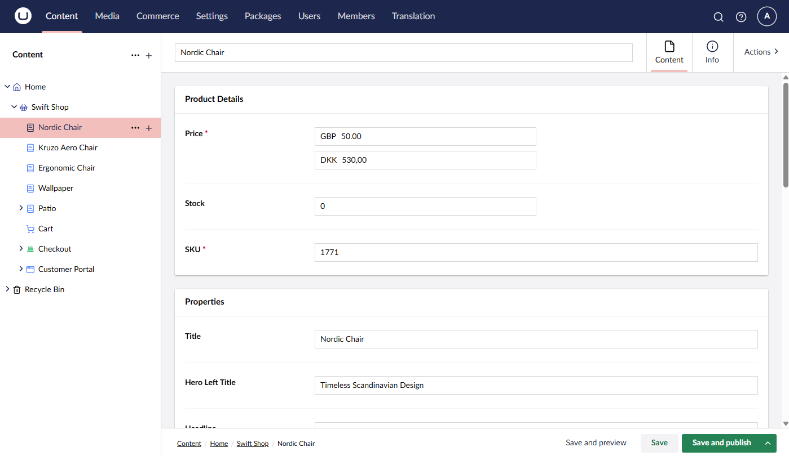
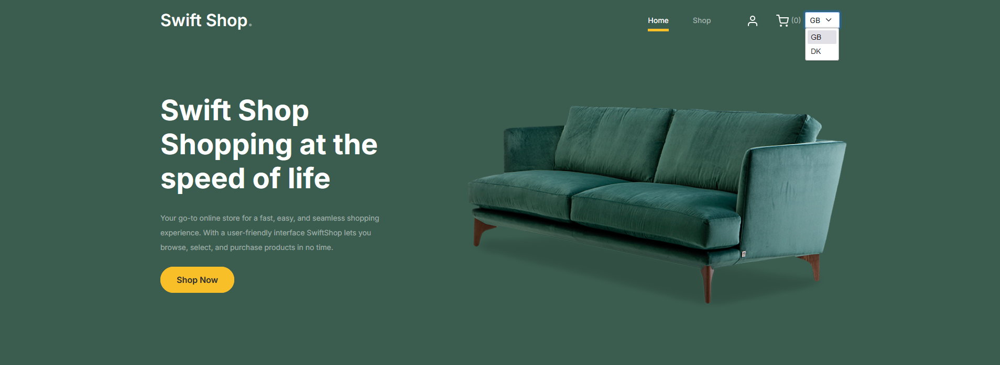

# Implementing a Currency Switcher

In a globalized world, it is essential to provide users with the ability to switch between different currencies. This feature is especially important for e-commerce websites that cater to customers from different countries.

In this guide, we will show you how to implement a currency switcher in Umbraco Commerce.


In this guide we've assumed that each country has a single currency. If your store supports multiple currencies per country, you will need to adjust the implementation accordingly.


## Configure Countries and Currencies

In the Umbraco backoffice, define the countries and currencies you want to support.


Then in the content section, populate the product prices for each currency.



## Create a Currency Switcher Component

On our website's frontend we will be using a partial view to allow users to toggle between existing currencies.



With the following implementation:

````csharp
@using Umbraco.Commerce.Core.Api;
@using Umbraco.Commerce.SwiftShop.Extensions;
@inject IUmbracoCommerceApi UmbracoCommerceApi
@inherits Umbraco.Cms.Web.Common.Views.UmbracoViewPage

@{
    var store = Model.GetStore();
    var countries = await UmbracoCommerceApi.GetCountriesAsync(store.Id);
    var currencies = await UmbracoCommerceApi.GetCurrenciesAsync(store.Id);
    var currentCountry = await UmbracoCommerceApi.GetDefaultShippingCountryAsync(store.Id);
}

@if (countries.Count() > 1)
{
    @using (Html.BeginUmbracoForm("ChangeCountry", "Culture", FormMethod.Post, new { @name = "changeCountryForm" }))
    {
        @Html.DropDownList("countryIsoCode", countries.Select(x 
            => new SelectListItem(currencies.First(y => y.Id == x.DefaultCurrencyId!.Value).Code, x.Code, x.Code == currentCountry.Code)),
        new
        {
            @class = "form-select form-select-sm",
            @onchange = "document.forms['changeCountryForm'].submit()"
        })
    }
}
````

## Handle Switching Currencies

Switching the culture will be handled by a Surface controller. We will create a new Surface controller called `CultureSurfaceController`.

````csharp
public class CultureSurfaceController : SurfaceController
{
    private readonly IUmbracoCommerceApi _commerceApi;

    public CultureSurfaceController(
        IUmbracoContextAccessor umbracoContextAccessor, 
        IUmbracoDatabaseFactory databaseFactory, 
        ServiceContext services, 
        AppCaches appCaches, 
        IProfilingLogger profilingLogger, 
        IPublishedUrlProvider publishedUrlProvider,
        IUmbracoCommerceApi commerceApi) 
        : base(umbracoContextAccessor, databaseFactory, services, appCaches, profilingLogger, publishedUrlProvider)
    {
        _commerceApi = commerceApi;
    }
    
    [HttpPost]
    public async Task<IActionResult> ChangeCountry(ChangeCountryDto changeCountryDto)
    {
        var store = CurrentPage.GetStore();
        var country = await _commerceApi.GetCountryAsync(store.Id, changeCountryDto.CountryIsoCode);
        var currency = await _commerceApi.GetCurrencyAsync(country.DefaultCurrencyId.Value);
    
        await _commerceApi.SetDefaultPaymentCountryAsync(store.Id, country);
        await _commerceApi.SetDefaultShippingCountryAsync(store.Id, country);
        await _commerceApi.SetDefaultCurrencyAsync(store.Id, currency);
    
        var currentOrder = await _commerceApi.GetCurrentOrderAsync(store.Id);
        if (currentOrder != null)
        {
            await _commerceApi.Uow.ExecuteAsync(async uow =>
            {
                var writableOrder = await currentOrder.AsWritableAsync(uow)
                    .ClearPaymentCountryRegionAsync()
                    .ClearShippingCountryRegionAsync()
                    .SetCurrencyAsync(currency.Id);
    
                await _commerceApi.SaveOrderAsync(writableOrder);
    
                uow.Complete();
            });
        }
    
        return RedirectToCurrentUmbracoPage();
    }
}
````
The `ChangeCountryDto` class is used to bind the country ISO code from the form.

````csharp
public class ChangeCountryDto
{
    public string CountryIsoCode { get; set; }
}
````

## Result

With the currency switcher implemented, users can now switch between different countries/currencies on your website.

The changes will reflect on the product details pages


